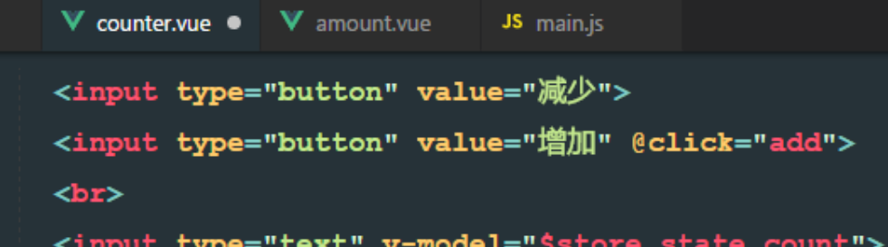
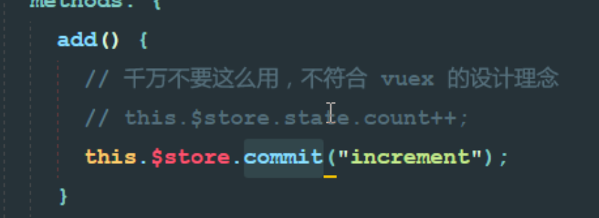

# 1、商品详情

## 1.1、参考MUI的card示例


```html
<div>
    <!-- 商品轮播图区域 -->
    <div class="mui-card">
      <div class="mui-card-content">
        <div class="mui-card-content-inner">这是一个最简单的卡片视图控件；卡片视图常用来显示完整独立的一段信息，比如一篇文章的预览图、作者信息、点赞数量等</div>
      </div>
    </div>

    <!-- 商品购买区域 -->
    <div class="mui-card">
      <div class="mui-card-header">页眉</div>
      <div class="mui-card-content">
        <div class="mui-card-content-inner">包含页眉页脚的卡片，页眉常用来显示面板标题，页脚用来显示额外信息或支持的操作（比如点赞、评论等）</div>
      </div>
    </div>

    <!-- 商品参数区域 -->
    <div class="mui-card">
      <div class="mui-card-header">页眉</div>
      <div class="mui-card-content">
        <div class="mui-card-content-inner">包含页眉页脚的卡片，页眉常用来显示面板标题，页脚用来显示额外信息或支持的操作（比如点赞、评论等）</div>
      </div>
      <div class="mui-card-footer">页脚</div>
    </div>
  </div>
```


## 1.2、调整卡片样式

### 1.2.1、添加背景色


### 1.2.2、处理margin


## 1.3、轮播图

### 1.3.1、获取数据


### 1.3.2、抽取轮播图组件


```html
<template>
  <div>
    <mt-swipe :auto="4000">
      <!-- 由于使用本地数据，无法动态加载，所以使用固定代码 -->
      <!-- 调用者需要传递lunbotuList参数 -->
      <!-- lunbotuList由父组件给子组件 -->
      <mt-swipe-item v-for="item in lunbotuList" :key="item.id">
        
      </mt-swipe-item>
    </mt-swipe>
  </div>
</template>

<script>
export default {
  props: ["lunbotuList"]
};
</script>

<style lang="scss" scoped>
.mint-swipe {
  height: 200px;
  // .mint-swipe-item:nth-child(1) {
  //   background-color: red;
  // }
  // .mint-swipe-item:nth-child(2) {
  //   background-color: green;
  // }
  // .mint-swipe-item:nth-child(3) {
  //   background-color: salmon;
  // }
  .mint-swipe-item {
    &:nth-child(1) {
      background-color: red;
    }
    &:nth-child(2) {
      background-color: cyan;
    }
    &:nth-child(3) {
      background-color: gray;
    }
    img {
      width: 100%;
      height: 100%;
    }
  }
}
</style>

```

### 1.3.3、引用轮播图组件


### 1.3.4、解决轮播图宽高问题

> 1、首页中轮播图的宽高使用了100%的设置。
>
> 2、商品详情里面，如果也使用100%的宽高，则页面不好看。
>
> 3、高度使用100%，宽度自适应。
>
> 4、经过分析，得到问题原因：首页中和详情页面中，图片的宽度是100%还是自适应。
>
> 5、两个轮播图只是宽度存在问题，定义一个属性，让调用者手动指定为100%还是自适应。


> vue设置样式


## 1.4、商品购买区域

### 1.4.1、基础信息


### 1.4.2、MUI——numbox


### 1.4.3、引用numbox组件


### 1.4.4、解决无法点击的问题

> 初始化numbox


## 1.5、商品参数

### 1.5.1、基础信息


### 1.5.2、纵向排列


### 1.5.3、获取数据


## 1.6、图文介绍

### 1.6.1、编程式导航


### 1.6.2、图文介绍


## 1.7、商品评论


## 1.8、小球动画

### 1.8.1、定义小球


### 1.8.2、设置小球样式


### 1.8.3、设置小球动画


### 1.8.4、触发动画


### 1.8.5、小球动画优化

> 1、导致动画不准确的原因：小球位移的位置，已经限制在了某一分辨率下。
>
> 2、只要分辨率，或者页面滚动，将导致问题。
>
> 3、因此，不能将位置的横纵坐标写死，应该动态计算坐标值。
>
> 4、计算两个坐标点的相对位置即可获得相关相对距离。
>
> 5、domObject.getBoundingRect()。

 getClientRects 和 getBoundingClientRect 的用法和区别https://blog.csdn.net/freshlover/article/details/8985887

> 通过操作dom获取购物车的位置


> 注意：vue不希望操作DOM，但是获取一些DOM元素还是可以的


> 完美的适配了不同的分辨率以及不同的滚动条位置

## 1.9、同步购物车数据

### 1.9.1、分析如何拿到购买数量


>如何实现加入购物车的时候，拿到选择的数量
>
>1、分析发现：按钮属于goodsinfo页面，数字属于numberbox组件
>
>2、由于涉及到了父子组件的嵌套，所以无法直接从goodsinfo页面中获取到 选中的商品数量值
>
>3、解决思路：涉及到子组件向父组件传值，事件调用机制
>
>4、事件调用的本质：父组件向子组件传递方法，子组件调用这个方法，同时把数据当中参数传递给这个方法

### 1.9.2、父子组件传值


### 1.9.3、子组件给父组件传值


> 注意：是点击 + - 或者修改输入框的值的时候就给父组件传值了

### 1.9.4、父组件给子组件传递库存数据


> 注意：quantity没有生效。


> 异步请求，父组件给子组件传值的时候，父组件还没有拿到商品信息
>
> 问题：我们无法确定何时拿到库存值。但是，总归有一刻会拿到数据
>
> 思路：使用watch属性监听，监听父组件传递过来的库存值quantity，不管watch被触发几次，但是，最后一次肯定是合法的quantity数据


> 监听父组件传递过来的数据变化


# 2、vuex

## 2.1、概念

> Vuex 是一个专为 Vue.js 应用程序开发的**状态管理模式**。它采用集中式存储管理应用的所有组件的状态，并以相应的规则保证状态以一种可预测的方式发生变化。Vuex 也集成到 Vue 的官方调试工具 [devtools extension](https://github.com/vuejs/vue-devtools)，提供了诸如零配置的 time-travel 调试、状态快照导入导出等高级调试功能。

## 2.2、状态管理模式


## 2.3、总结

> Vuex是为了保存组件之间共享数据而诞生的，如果组件之间有要共享的数据，可以直接挂载到Vuex中，而不必通过父子组件传值。
>
> 如果组件数据不需要共享，此时这些不需要共享的私有数据，没有必要放到vuex中
>
> 只要共享的数据，才有权利放到Vuex中
>
> 组件内部私有的数据，只要放到组件的data中即可
>
> props、data和vuex的区别：

> 根据上述描述，我们可以得出一个结论
>
> vuex是一个全局的共享数据存储区域，就相当于是一个数据的仓库

## 2.4、vuex基本概念

### 2.4.1、网页上直接引用


### 2.4.2、使用npm安装


### 2.4.3、创建store实例


### 2.4.5、npm install vuex -S


### 2.4.6、注册vuex

> 配置vuex的步骤
>
> 1、npm install vuex -S
>
> 2、main.js导入包
>
> 3、创建new Vuex.store()实例，得到一个数据仓储对象
>
> 4、在vm中注册store


> 在vm中注册全局vuex

### 2.4.7、访问store中的数据


> this.$store.state.***


> 只要将store挂在到vm上面，任何组件都能使用store来存取数据

### 2.4.8、使用mutations操作数据




> 虽然可以实现数据的增加，但是不推荐，不符合vuex的设计理念

> 如果要操作store中的state值，只能通过调用mutations提供的方法，才能操作对应的数据，不推荐直接操作state中的数据，因为万一导致了数据紊乱，不能快速的定位到错误的原因，因为每个组件都可能有操作数据的方法

> 注意：如果组件想要调用mutations中的方法，只能调用this.$store.commit('方法名')
>
> 这种调用mutations方法的格式，和this.$emit('父组件中的方法名')类似




### 2.4.9、移除功能


### 2.4.10、mutations传递参数


> 传递一个参数
>
> 注意：mutations中函数的第一个参数固定为state

### 2.4.11、最多传递一个参数


### 2.4.12、通过传递对象实现传递多个参数


## 2.5、getters包装数据


> 组件中的computed对象


> 类似于组件中的computed对象
>
> 注意：这里的getters只负责获取数据，不负责修改数据
>
> 如果想要修改state中的数据，请调用mutations中的方法


## 2.6、vuex总结

> 1、state中的数据不能直接修改，如果要修改，请通过mutations修改。
>
> 2、如果组件想要直接从state上获取数据：需要this.$store.state.***
>
> 3、如果组件想要修改数据，必须使用mutations提供的方法，通过:this.$store.commit('方法名',唯一的一个参数)
>
> 4、如果store中state上的数据，在地外提供数据的时候，需要进行加工，那么推荐使用getters，如果需要使用getters，则用this.$store.getters.***


