# 1、简介

## 1.1、MyBatisPlus介绍

​	**MyBatis-Plus(**简称 **MP),**是一个 **MyBatis** 的增强工具包，只做增强不做改变**.** 发工作、提高生产率而生

​	我们的愿景是成为 **Mybatis** 最好的搭档，就像 魂斗罗 中的 **1P**、**2P**，基友搭配，效率翻倍。


## 1.2、代码以及文档地址

​	官方地址：http://mp.baomidou.com

​	代码发布地址

​	Github:[ https://github.com/baomidou/mybatis-plus](https://github.com/baomidou/mybatis-plus) 

​	文档发布地址: [ http://mp.baomidou.com/#/?id=%E7%AE%80%E4%BB%8B](http://mp.baomidou.com/%23/?id=%E7%AE%80%E4%BB%8B)

## 1.3、前置知识

​	MyBatis、Spring、Maven

# 2、集成MP

## 2.1、创建测试表

```shell
-- 创建库
CREATE DATABASE mp;
-- 使用库
USE mp;
-- 创建表
CREATE TABLE tbl_employee(
id INT(11) PRIMARY KEY AUTO_INCREMENT,
last_name VARCHAR(50), email VARCHAR(50),
gender CHAR(1), age int
);

INSERT INTO tbl_employee(last_name,email,gender,age) VALUES('Tom','tom@atguigu.com',1,22); 

INSERT INTO tbl_employee(last_name,email,gender,age) VALUES('Jerry','jerry@atguigu.com',0,25); 

INSERT INTO tbl_employee(last_name,email,gender,age) VALUES('Black','black@atguigu.com',1,30); 

INSERT INTO tbl_employee(last_name,email,gender,age) VALUES('White','white@atguigu.com',0,35);

```

## 2.2、创建JavaBean

```java
/**
 * 定义JavaBean中成员变量时所使用的类型。
 *  因为基本类型都有默认值
 *      int——0
 *      boolean——false
 * 基本类型将影响mybatis判断当前字段是否为空
 */
public class Employee {
    private Integer id;
    private String lastName;
    private String email;
    private Integer gender;
    private Integer age;

    @Override
    public String toString() {
        return "Employee{" +
                "id=" + id +
                ", lastName='" + lastName + '\'' +
                ", email='" + email + '\'' +
                ", gender=" + gender +
                ", age=" + age +
                '}';
    }

    public Integer getId() {
        return id;
    }

    public void setId(Integer id) {
        this.id = id;
    }

    public String getLastName() {
        return lastName;
    }

    public void setLastName(String lastName) {
        this.lastName = lastName;
    }

    public String getEmail() {
        return email;
    }

    public void setEmail(String email) {
        this.email = email;
    }

    public Integer getGender() {
        return gender;
    }

    public void setGender(Integer gender) {
        this.gender = gender;
    }

    public Integer getAge() {
        return age;
    }

    public void setAge(Integer age) {
        this.age = age;
    }
}

```

## 2.3、依赖配置

### 2.3.1、依赖配置

​	在 pom.xml 中加入对 MP、Spring、连接池、Junit、Mysql 驱动等依赖	

```xml
<!-- mp 依赖 -->
<dependency>
	<groupId>com.baomidou</groupId>
	<artifactId>mybatis-plus</artifactId>
	<version>2.3</version>
</dependency>
<!--junit -->
<dependency>
    <groupId>junit</groupId>
    <artifactId>junit</artifactId>
    <version>4.9</version>
</dependency>
<!-- log4j -->
<dependency>
    <groupId>log4j</groupId>
    <artifactId>log4j</artifactId>
    <version>1.2.17</version>
</dependency>
<!-- c3p0 -->
<dependency>
    <groupId>com.mchange</groupId>
    <artifactId>c3p0</artifactId>
    <version>0.9.5.2</version>
</dependency>
<!-- mysql -->
<dependency>
    <groupId>mysql</groupId>
    <artifactId>mysql-connector-java</artifactId>
    <version>5.1.37</version>
</dependency>
<!-- spring -->
<dependency>
    <groupId>org.springframework</groupId>
    <artifactId>spring-context</artifactId>
    <version>4.3.10.RELEASE</version>
</dependency>
<dependency>
    <groupId>org.springframework</groupId>
    <artifactId>spring-orm</artifactId>
    <version>4.3.10.RELEASE</version>
</dependency>

```

**特别说明:   Mybatis 及  Mybatis-Spring 依赖请勿加入项目配置，以免引起版本冲突！！！**

**Mybatis-Plus 会自动帮你维护！**

### 2.3.2、加入MyBatis的全局配置文件

```xml
<?xml version="1.0" encoding="UTF-8" ?>
<!DOCTYPE configuration
PUBLIC "-//mybatis.org//DTD Config 3.0//EN" "http://mybatis.org/dtd/mybatis-3-config.dtd">
<configuration>

</configuration>
```

### 2.3.3、加入log4j.xml

```xml
<?xml version="1.0" encoding="UTF-8" ?>
<!DOCTYPE log4j:configuration SYSTEM "log4j.dtd">
<log4j:configuration xmlns:log4j="http://jakarta.apache.org/log4j/">
    <appender name="STDOUT" class="org.apache.log4j.ConsoleAppender">
        <param name="Encoding" value="UTF-8" />
        <layout class="org.apache.log4j.PatternLayout">
            <param		name="ConversionPattern"	value="%-5p	%d{MM-dd HH:mm:ss,SSS} %m	(%F:%L) \n" />
        </layout>
    </appender>
    <logger name="java.sql">
        <level value="debug" />
        </logger>
        <logger name="org.apache.ibatis">
        <level value="info" />
    </logger>
    <root>
        <level value="debug" />
        <appender-ref ref="STDOUT" />
    </root>
</log4j:configuration>
```


### 2.3.4、加入 db.properties 连接信息配置

```properties
jdbc.driver=com.mysql.jdbc.Driver
jdbc.url=jdbc:mysql://localhost:3306/mp 
jdbc.username=root
jdbc.password=1234
```

### 2.3.5、加入 spring 的配置文件applicationContext.xml

```xml
<?xml version="1.0" encoding="UTF-8"?>
<beans xmlns="http://www.springframework.org/schema/beans"
    xmlns:xsi="http://www.w3.org/2001/XMLSchema-instance"
    xmlns:context="http://www.springframework.org/schema/context" xmlns:tx="http://www.springframework.org/schema/tx"
    xmlns:mybatis-spring="http://mybatis.org/schema/mybatis-spring" xsi:schemaLocation="http://mybatis.org/schema/mybatis-spring
    http://mybatis.org/schema/mybatis-spring-1.2.xsd http://www.springframework.org/schema/beans
    http://www.springframework.org/schema/beans/spring-beans.xsd http://www.springframework.org/schema/context
    http://www.springframework.org/schema/context/spring-context-4.0.xsd http://www.springframework.org/schema/tx
    http://www.springframework.org/schema/tx/spring-tx-4.0.xsd">

    <!-- 数据源 -->
    <context:property-placeholder location="classpath:db.properties"/>
    <bean	id="dataSource"
    class="com.mchange.v2.c3p0.ComboPooledDataSource">
        <property name="driverClass" value="${jdbc.driver}"></property>
        <property name="jdbcUrl" value="${jdbc.url}"></property>
        <property name="user" value="${jdbc.username}"></property>
        <property name="password" value="${jdbc.password}"></property>
    </bean>

    <!-- 事务管理器 -->
    <bean id="dataSourceTransactionManager" 		class="org.springframework.jdbc.datasource.DataSourceTransactionManager">
    	<property name="dataSource" ref="dataSource"></property>
    </bean>
    <!-- 基于注解的事务管理 -->
    <tx:annotation-driven
    transaction-manager="dataSourceTransactionManager"/>
    <!--	配置 SqlSessionFactoryBean	-->
    <bean	id="sqlSessionFactoryBean"
    class="org.mybatis.spring.SqlSessionFactoryBean">
        <!-- 数据源 -->
        <property name="dataSource" ref="dataSource"></property>
        <property	name="configLocation"
        value="classpath:mybatis-config.xml"></property>
        <!-- 别名处理 -->
        <property
        value="com.atguigu.mp.beans"></property>
    </bean>
    <!--
    配置 mybatis 扫描 mapper 接口的路径
    -->
    <bean class="org.mybatis.spring.mapper.MapperScannerConfigurer">
        <property	name="basePackage"
        value="com.atguigu.mp.mapper"></property>
    </bean>
</beans>
```

**注意：**此时sqlSessionFactoryBean是MyBatis的，不是MyBatis Plus的

## 2.4、测试

### 2.4.1、测试 Spring-Mybatis 的环境，保证 OK

```java
private  ApplicationContext  iocContext  =  new
	ClassPathXmlApplicationContext("applicationContext.xml");

@Test
public  void  testEnvironment()  throws  Exception{
    DataSource  ds  =  iocContext.getBean("dataSource",DataSource.class); 
    Connection  conn  =  ds.getConnection();
    System.out.println(conn);
}

```

## 2.5、集成MP

### 2.5.1、方法

​	Mybatis-Plus 的集成非常简单， 对于 Spring ， 我们仅仅需要把 Mybatis 自带的MybatisSqlSessionFactoryBean 替换为 MP 自带的即可com.baomidou.mybatisplus.spring.MybatisSqlSessionFactoryBean。


### 2.5.2、修改配置

```xml
<bean id="sqlSessionFactoryBean"
	class="com.baomidou.mybatisplus.spring.MybatisSqlSessionFactoryBean">
	<!-- 数据源 -->
	<property name="dataSource" ref="dataSource"></property>
    <property name="configLocation"
    	value="classpath:mybatis-config.xml"></property>
    <!-- 别名处理 -->
    <property name="typeAliasesPackage"
    	value="com.atguigu.mp.beans"></property>
</bean>

```


**注意：**MyBatis的配置同样适用于MyBatis+，数据源、别名处理都无需处理。

# 3、入门HelloWorld

## 3.1、通用CRUD

1. 提出问题

   假设我们已存在一张 tbl_employee 表， 且已有对应的实体类 Employee ， 实现tbl_employee 表的 CRUD 操作我们需要做什么呢？

2. 实现方式

   2.1 基于 Mybatis
   需要编写 EmployeeMapper 接口，并手动编写 CRUD 方法
   提供 EmployeeMapper.xml 映射文件，并手动编写每个方法对应的 SQL 语句. 

   2.2 基于 MP
   只需要创建 EmployeeMapper 接口, 并继承 BaseMapper 接口.这就是使用 MP
   需要完成的所有操作，甚至不需要创建 SQL 映射文件。

   **注意：**在MyBatis+中无需提供相关映射文件，因为已经在BaseMapper接口中提供了。一般只是提供基本SQL片段

   

**注意：**只需要xxMapper接口继承BaseMapper接口即可。

​	泛型指定的实体类型，就是当前Mapper接口所要操作的实体类类型。

## 3.2、BaseMapper


继承BaseMapper接口后无需编码mapper.xml配置文件，也无需再mapper接口中定义基本的CRUD方法。


## 3.3、插入操作

1. Integer insert(T entity);
2. @TableName
3. 全局的 MP 配置: <property name="tablePrefix" value="tbl_"></property>
4. @TableField
5. 全局的 MP 配置: <property name="dbColumnUnderline" value="true"></property>
6. @TableId
7. 全局的 MP 配置: <property name="idType" value="0"></property>
8. 支持主键自增的数据库插入数据获取主键值
9. Mybatis: 需要通过 useGeneratedKeys 以及    keyProperty 来设置
10. MP: 自动将主键值回写到实体类中
11. Integer    insertAllColumn(T entity)

### 3.3.1、初始化


​	**初始化Spring IOC容器，并获取mapper对象**

### 3.3.2、通用插入操作


​	**插入数据后，可以获取插入记录的条数**

​	MyBatis中想获取SQL语句对数据影响的条数，需要定义返回结果的类型。MyBatis+已经自动处理好了。s


### 3.3.3、注解策略


### 3.3.4、@TableId注解


`使用注解定义表的主键`

```java
/**
 * <p>
 * 表主键标识
 * </p>
 *
 * @author hubin
 * @since 2016-01-23
 */
@Documented
@Retention(RetentionPolicy.RUNTIME)
@Target(ElementType.FIELD)
public @interface TableId {

    /**
     * <p>
     * 字段值（驼峰命名方式，该值可无）
     * </p>
     */
    String value() default "";

    /**
     * <p>
     * 主键ID
     * </p>
     * {@link IdType}
     */
    IdType type() default IdType.NONE;

}
```


**如果表中的主键和实体类中的字段不一致，则使用value来指定数据库中的主键名**


***设置主键生成策略，以及对应关系***


### 3.3.5、@TableName注解

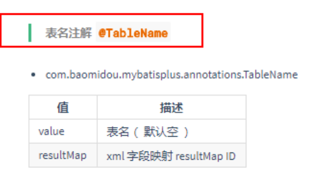

```java
/**
 * <p>
 * 数据库表相关
 * </p>
 *
 * @author hubin
 * @since 2016-01-23
 */
@Documented
@Retention(RetentionPolicy.RUNTIME)
@Target(ElementType.TYPE)
public @interface TableName {

    /**
     * <p>
     * 实体对应的表名
     * </p>
     */
    String value() default "";

    /**
     * <p>
     * 实体映射结果集
     * </p>
     */
    String resultMap() default "";

}
```


### 3.3.6、测试

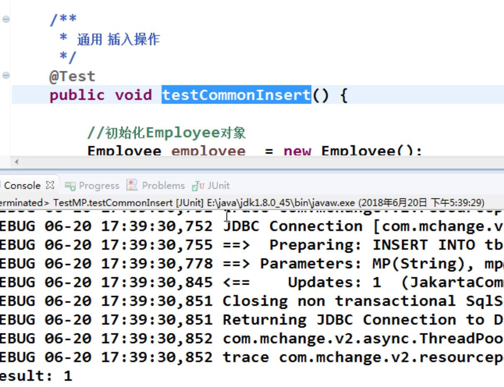

**测试通过**


## 3.4、MyBatis+全局策略配置


类似于MyBatis中的Configuration。

### 3.4.1、下划线、驼峰策略配置


### 3.4.2、全局主键策略


```java
/**
 * <p>
 * 生成ID类型枚举类
 * </p>
 *
 * @author hubin
 * @Date 2015-11-10
 */
public enum IdType {
    AUTO(0, "数据库ID自增"), INPUT(1, "用户输入ID"),

    /* 以下2种类型、只有当插入对象ID 为空，才自动填充。 */
    ID_WORKER(2, "全局唯一ID"), UUID(3, "全局唯一ID"), NONE(4, "该类型为未设置主键类型"),
    ID_WORKER_STR(5, "字符串全局唯一ID");

    /**
     * 主键
     */
    private final int key;

    /**
     * 描述
     */
    private final String desc;

    IdType(final int key, final String desc) {
        this.key = key;
        this.desc = desc;
    }

    /**
     * <p>
     * 主键策略 （默认 ID_WORKER）
     * </p>
     *
     * @param idType ID 策略类型
     * @return
     */
    public static IdType getIdType(int idType) {
        IdType[] its = IdType.values();
        for (IdType it : its) {
            if (it.getKey() == idType) {
                return it;
            }
        }
        return ID_WORKER;
    }

    public int getKey() {
        return this.key;
    }

    public String getDesc() {
        return this.desc;
    }

}
```

**注意：**注入全局策略配置


### 3.4.3、全局表前缀策略配置

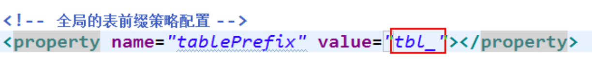


### 3.4.4、@TableField

如果下划线与驼峰匹配策略关闭，会出现匹配异常


```java
/**
 * <p>
 * 表字段标识
 * </p>
 *
 * @author hubin sjy tantan
 * @since 2016-09-09
 */
@Documented
@Retention(RetentionPolicy.RUNTIME)
@Target(ElementType.FIELD)
public @interface TableField {

    /**
     * <p>
     * 字段值（驼峰命名方式，该值可无）
     * </p>
     */
    String value() default "";

    /**
     * <p>
     * 当该Field为类对象时, 可使用#{对象.属性}来映射到数据表.
     * </p>
     * <p>
     * 支持：@TableField(el = "role, jdbcType=BIGINT)<br>
     * 支持：@TableField(el = "role, typeHandler=com.baomidou.springcloud.typehandler.PhoneTypeHandler")
     * </p>
     */
    String el() default "";

    /**
     * <p>
     * 是否为数据库表字段
     * </p>
     * <p>
     * 默认 true 存在，false 不存在
     * </p>
     */
    boolean exist() default true;

    /**
     * <p>
     * 字段 where 实体查询比较条件
     * </p>
     * <p>
     * 默认 `=` 等值
     * </p>
     */
    String condition() default SqlCondition.EQUAL;

    /**
     * <p>
     * 字段 update set 部分注入, 该注解优于 el 注解使用
     * </p>
     * <p>
     * 例如：@TableField(.. , update="%s+1") 其中 %s 会填充为字段
     * 输出 SQL 为：update 表 set 字段=字段+1 where ...
     * </p>
     * <p>
     * 例如：@TableField(.. , update="now()") 使用数据库时间
     * 输出 SQL 为：update 表 set 字段=now() where ...
     * </p>
     */
    String update() default "";

    /**
     * <p>
     * 字段验证策略
     * </p>
     * <p>
     * 默认 非 null 判断
     * </p>
     */
    FieldStrategy strategy() default FieldStrategy.NOT_NULL;

    /**
     * <p>
     * 字段自动填充策略
     * </p>
     */
    FieldFill fill() default FieldFill.DEFAULT;
}

```


**定义JavaBean与数据库列名的对应关系**


### 3.4.5、@TableField(exist=false)


**数据库不存在salary字段也不会报错，否则将报错。**


### 3.4.6、获取插入后的主键

MyBatis实现方式


MyBatis+会自动将主键设置到实体对象中，无需做任何设置、操作。


### 3.4.7、insertAllColumn()


未设置的字段将设置为null


### 3.4.8、insert小结


## 3.5、更新操作

1. Integer updateById(@Param("et") T entity);

   

   

   **注意：**对应空值属性，不会添加到SQL语句当中。

2. Integer updateAllColumnById(@Param("et") T entity)


所有字段将出现在SQL中


##  3.6、查询操作

1.  T selectById(Serializable id);

   

   **JDK中的大部分类都实现了Serializable接口，相当于Object**

   

   

   

   SQL已经做了下划线与驼峰命名格式之间的处理。

2. T selectOne(@Param("ew") T entity);

   

   

   通过对象非空属性作为参数，查询记录

   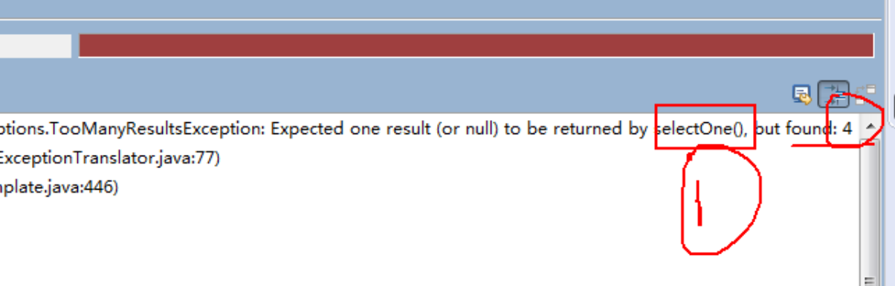

   **注意：如果不通过ID限制记录条数，可能出现异常**

3. List<T> selectBatchIds(List<? extends Serializable> idList);

   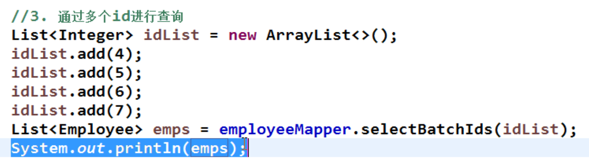

   

   

   **通过多个ID进行查询 ，使用MyBatis操作的话需要使用<foreach>循环拼接SQL。**

4. List<T> selectByMap(@Param("cm") Map<String, Object> columnMap);

   

   

   

   ***注意：***map中的key值为数据库字段名，不再是JavaBean对象的属性了。

   

   

5. List<T> selectPage(RowBounds rowBounds, @Param("ew") Wrapper<T> wrapper);

   

   

   **其实为内存分页，不能在生产环境使用**，使用Page分页类

   

   *并没有limit关键字，所以为内存分页*

   

   ### 3.6.1、RowBounds

   ```java
   /**
    * @author Clinton Begin
    */
   public class RowBounds {
   
     public static final int NO_ROW_OFFSET = 0;
     public static final int NO_ROW_LIMIT = Integer.MAX_VALUE;
     public static final RowBounds DEFAULT = new RowBounds();
   
     private final int offset;
     private final int limit;
   
     public RowBounds() {
       this.offset = NO_ROW_OFFSET;
       this.limit = NO_ROW_LIMIT;
     }
   
     public RowBounds(int offset, int limit) {
       this.offset = offset;
       this.limit = limit;
     }
   
     public int getOffset() {
       return offset;
     }
   
     public int getLimit() {
       return limit;
     }
   
   }
   ```


**MyBatis使用Page对象作为分页参数即可**


## 3.7、删除操作

1. Integer deleteById(Serializable id);

   

   

2. Integer deleteByMap(@Param("cm") Map<String, Object> columnMap);

   

   

3. Integer deleteBatchIds(List<? extends Serializable> idList);

   

   


## 3.8、MP启动注入SQL原理分析


问题: 

​	xxxMapper 继承了 BaseMapper<T>, BaseMapper 中提供了通用的 CRUD 方法, 方法来源于 BaseMapper, 有方法就必须有 SQL, 因为 MyBatis 最终还是需要通过SQL 语句操作数据.

**前置知识:MyBatis 源码中比较重要的一些对象， MyBatis 框架的执行流程**

​	Configuration

​	MappedStatement

​	……..

通过现象看到本质

A． employeeMapper 的本质  org.apache.ibatis.binding.MapperProxy


B． MapperProxy 中 sqlSession –>SqlSessionFactory


C． SqlSessionFacotry  中      → Configuration→ MappedStatements

**每一个MapperStatement都表示Mapper接口中的一个方法与Mapper映射文件中的映射文件**

**MP在启动的时候就会挨个分析xxxMapper中的方法，并且将对应的SQL语句处理好，保存到Configuration对象中的MapperStatement中**


每一个 mappedStatement 都表示 Mapper 接口中的一个方法与 Mapper 映射文件中的一个 SQL。

MP 在启动就会挨个分析 xxxMapper 中的方法，并且将对应的 SQL 语句处理好，保存到 configuration 对象中的 mappedStatements 中.


**SQLsource中包含了SQL语句**


D.本质

employeeMapper中的每一个方法对应一个MapperStatement


1. Configuration： MyBatis 或者 MP 全局配置对象

2. MappedStatement：一个 MappedStatement 对象对应 Mapper 配置文件中的一个

   select/update/insert/delete 节点，主要描述的是一条 SQL 语句

3. SqlMethod : 枚举对象  ，MP 支持的 SQL 方法


4. TableInfo：数据库表反射信息 ，可以获取到数据库表相关的信息

5. SqlSource: SQL 语句处理对象


6. MapperBuilderAssistant： 用于缓存、SQL 参数、查询方剂结果集处理等.

   通过 MapperBuilderAssistant 将每一个 mappedStatement添加到 configuration 中的 mappedstatements 中


添加到 configuration 中的 mappedstatements 中


## 3.7、通用CRUD小结

1. 以上是基本的 CRUD 操作，如您所见，我们仅仅需要继承一个 BaseMapper 即可实现大部分单表 CRUD 操作。BaseMapper 提供了多达 17 个方法给大家使用, 可以极其方便的实现单一、批量、分页等操作。极大的减少开发负担，难道这就是 MP 的强大之处了吗？

2. 提出需求:

   现有一个需求，我们需要分页查询 tbl_employee 表中，年龄在 18~50 之间性别为男且姓名为 xx 的所有用户，这时候我们该如何实现上述需求呢？

   MyBatis : 需要在 SQL 映射文件中编写带条件查询的 SQL,并基于 PageHelper 插件完成分页. 实现以上一个简单的需求，往往需要我们做很多重复单调的工作。普通的 Mapper 能够解决这类痛点吗？

   MP: 依旧不用编写 SQL 语句, MP 提供了功能强大的条件构造器 EntityWrapper


## 3.9、GlobalConfiguration

```java
/**
 * <p>
 * Mybatis全局缓存
 * </p>
 *
 * @author Caratacus
 * @since 2016-12-06
 */
public class GlobalConfiguration implements Serializable {

    /**
     * 逻辑删除全局值
     */
    private String logicDeleteValue = null;
    /**
     * 逻辑未删除全局值
     */
    private String logicNotDeleteValue = null;
    /**
     * 表前缀
     */
    private String tablePrefix;
    /**
     * 数据库类型
     */
    private DBType dbType;
    /**
     * 主键类型（默认 ID_WORKER）
     */
    private IdType idType = IdType.ID_WORKER;
    /**
     * 表名、字段名、是否使用下划线命名（默认 true: 数据库下划线命名）
     */
    private boolean dbColumnUnderline = true;
    /**
     * SQL注入器
     */
    private ISqlInjector sqlInjector;
    /**
     * 表关键词 key 生成器
     */
    private IKeyGenerator keyGenerator;
    /**
     * 元对象字段填充控制器
     */
    private MetaObjectHandler metaObjectHandler = new DefaultMetaObjectHandler();
    /**
     * 字段验证策略
     */
    private FieldStrategy fieldStrategy = FieldStrategy.NOT_NULL;
    /**
     * 是否刷新mapper
     */
    private boolean isRefresh = false;
    /**
     * 是否大写命名
     */
    private boolean isCapitalMode = false;
    /**
     * 标识符
     */
    private String identifierQuote;
    /**
     * 缓存当前Configuration的SqlSessionFactory
     */
    private SqlSessionFactory sqlSessionFactory;
    /**
     * 缓存已注入CRUD的Mapper信息
     */
    private Set<String> mapperRegistryCache = new ConcurrentSkipListSet<>();
    /**
     * 单例重用SqlSession
     */
    private SqlSession sqlSession;
    /**
     * 缓存 Sql 解析初始化
     */
    private boolean sqlParserCache = false;


    public GlobalConfiguration() {
        // 构造方法
    }


    public GlobalConfiguration(ISqlInjector sqlInjector) {
        this.sqlInjector = sqlInjector;
    }


    public IKeyGenerator getKeyGenerator() {
        return keyGenerator;
    }

    public void setKeyGenerator(IKeyGenerator keyGenerator) {
        this.keyGenerator = keyGenerator;
    }


    public String getLogicDeleteValue() {
        return logicDeleteValue;
    }

    public void setLogicDeleteValue(String logicDeleteValue) {
        this.logicDeleteValue = logicDeleteValue;
    }

    public String getLogicNotDeleteValue() {
        return logicNotDeleteValue;
    }

    public void setLogicNotDeleteValue(String logicNotDeleteValue) {
        this.logicNotDeleteValue = logicNotDeleteValue;
    }

    public DBType getDbType() {
        return dbType;
    }

    /**
     * 根据jdbcUrl设置数据库类型
     *
     * @param jdbcUrl
     */
    public void setDbTypeOfJdbcUrl(String jdbcUrl) {
        this.dbType = JdbcUtils.getDbType(jdbcUrl);
    }

    public void setDbType(String dbType) {
        this.dbType = DBType.getDBType(dbType);
    }

    public IdType getIdType() {
        return idType;
    }

    public void setIdType(int idType) {
        this.idType = IdType.getIdType(idType);
    }

    public boolean isDbColumnUnderline() {
        return dbColumnUnderline;
    }

    public void setDbColumnUnderline(boolean dbColumnUnderline) {
        this.dbColumnUnderline = dbColumnUnderline;
    }

    public ISqlInjector getSqlInjector() {
        return sqlInjector;
    }

    public void setSqlInjector(ISqlInjector sqlInjector) {
        this.sqlInjector = sqlInjector;
    }

    public MetaObjectHandler getMetaObjectHandler() {
        return metaObjectHandler;
    }

    public void setMetaObjectHandler(MetaObjectHandler metaObjectHandler) {
        this.metaObjectHandler = metaObjectHandler;
    }

    public FieldStrategy getFieldStrategy() {
        return fieldStrategy;
    }

    public void setFieldStrategy(int fieldStrategy) {
        this.fieldStrategy = FieldStrategy.getFieldStrategy(fieldStrategy);
    }

    public boolean isRefresh() {
        return isRefresh;
    }

    public void setRefresh(boolean refresh) {
        this.isRefresh = refresh;
    }

    public Set<String> getMapperRegistryCache() {
        return mapperRegistryCache;
    }

    public void setMapperRegistryCache(Set<String> mapperRegistryCache) {
        this.mapperRegistryCache = mapperRegistryCache;
    }

    public SqlSessionFactory getSqlSessionFactory() {
        return sqlSessionFactory;
    }

    public void setSqlSessionFactory(SqlSessionFactory sqlSessionFactory) {
        this.sqlSessionFactory = sqlSessionFactory;
        this.sqlSession = new MybatisSqlSessionTemplate(sqlSessionFactory);
    }

    public boolean isCapitalMode() {
        return isCapitalMode;
    }

    public void setCapitalMode(boolean isCapitalMode) {
        this.isCapitalMode = isCapitalMode;
    }

    public String getTablePrefix() {
        return tablePrefix;
    }

    public void setTablePrefix(String tablePrefix) {
        this.tablePrefix = tablePrefix;
    }

    public String getIdentifierQuote() {
        if (null == identifierQuote) {
            return dbType.getQuote();
        }
        return identifierQuote;
    }

    public void setIdentifierQuote(String identifierQuote) {
        this.identifierQuote = identifierQuote;
    }

    public void setSqlKeywords(String sqlKeywords) {
        if (StringUtils.isNotEmpty(sqlKeywords)) {
            SqlReservedWords.RESERVED_WORDS.addAll(StringUtils.splitWorker(sqlKeywords.toUpperCase(), ",", -1, false));
        }
    }

    public SqlSession getSqlSession() {
        return sqlSession;
    }

    public boolean isSqlParserCache() {
        return sqlParserCache;
    }

    public void setSqlParserCache(boolean sqlParserCache) {
        this.sqlParserCache = sqlParserCache;
    }

    /**
     * <p>
     * 标记全局设置 (统一所有入口)
     * </p>
     *
     * @param sqlSessionFactory
     * @return
     */
    public SqlSessionFactory signGlobalConfig(SqlSessionFactory sqlSessionFactory) {
        if (null != sqlSessionFactory) {
            GlobalConfigUtils.setGlobalConfig(sqlSessionFactory.getConfiguration(), this);
        }
        return sqlSessionFactory;
    }
}

```


# 4、条件构造器EntityWrapper

## 4.1、EntityWrapper简介

1. Mybatis-Plus 通过 EntityWrapper（简称 EW，MP 封装的一个查询条件构造器）或者Condition（与 EW 类似） 来让用户自由的构建查询条件，简单便捷，没有额外的负担， 能够有效提高开发效率

2. 实体包装器，主要用于处理 sql 拼接，排序，实体参数查询等

3. **注意: 使用的是数据库字段，不是 Java 属性!**

4. 条件参数说明：

   

```java
/**
 * <p>
 * Entity 对象封装操作类，定义T-SQL语法
 * </p>
 *
 * @author hubin , yanghu , Dyang , Caratacus
 * @Date 2016-11-7
 */
@SuppressWarnings("serial")
public class EntityWrapper<T> extends Wrapper<T> {

    /**
     * 数据库表映射实体类
     */
    protected T entity = null;

    public EntityWrapper() {
        /* 注意，传入查询参数 */
    }

    public EntityWrapper(T entity) {
        this.entity = entity;
    }

    public EntityWrapper(T entity, String sqlSelect) {
        this.entity = entity;
        this.sqlSelect = sqlSelect;
    }

    @Override
    public T getEntity() {
        return entity;
    }

    public void setEntity(T entity) {
        this.entity = entity;
    }

    /**
     * SQL 片段
     */
    @Override
    public String getSqlSegment() {
        /*
         * 无条件
		 */
        String sqlWhere = sql.toString();
        if (StringUtils.isEmpty(sqlWhere)) {
            return null;
        }

        /*
         * 根据当前实体判断是否需要将WHERE替换成 AND 增加实体不为空但所有属性为空的情况
		 */
        return isWhere != null ? (isWhere ? sqlWhere : sqlWhere.replaceFirst("WHERE", AND_OR)) : sqlWhere.replaceFirst("WHERE", AND_OR);
    }

}
```


## 4.2、使用 EntityWrapper 的方式打开如上需求

```java
List<Employee>  userList  =  employeeMapper.selectPage(
    new Page<Employee>(2, 3),
    new  EntityWrapper<Employee>().eq("last_name","MybatisPlus")
);	
```


## 4.3、带条件的查询

​	List<T> selectList(@Param("ew") Wrapper<T> wrapper);


## 4.4、带条件的修改

​	Integer update(@Param("et") T entity,@Param("ew") Wrapper<T> wrapper);	


## 4.5、带条件的删除

​	Integer delete(@Param("ew") Wrapper<T>  wrapper);	


## 4.6、使用 Condition的方式打开如上需求

```java
List<Employee>  userListCondition  =  employeeMapper.selectPage(
	new Page<Employee>(2,3), 
    Condition.create(). 
    eq("gender",  1). 
    eq("last_name",  "MyBatisPlus"). 
    between("age", 18, 50));
```


获取实例对象


## 4.7、排序

1. **正序**


2.  **倒序排列**


3. **手动拼接SQL**


## 4.8、小结

​	MP: EntityWrapper  Condition  条件构造器

​	MyBatis MBG :       xxxExample→Criteria : QBC( Query        By    Criteria) Hibernate 、 通用 Mapper 

# 5、ActiveRecord(活动记录)

​	Active     Record(活动记录)，是一种领域模型模式，特点是一个模型类对应关系型数据库中的一个表，而模型类的一个实例对应表中的一行记录。

 	ActiveRecord 一直广受动态语言（ PHP 、 Ruby 等）的喜爱，而 Java 作为准静态语言， 对于 ActiveRecord 往往只能感叹其优雅，所以 MP 也在 AR 道路上进行了一定的探索

## 5.1、如何使用 AR 模式

​	仅仅需要让实体类继承 Model 类且实现主键指定方法，即可开启 AR 之旅。

```java
@TableName("tbl_employee")
public class Employee extends Model<Employee>{
    //..fields
    //..getter and setter
    @Override
    protected Serializable pkVal(){
        return this.id;
    }
}
```


## 5.2、基本CURD

### 5.2.1、插入操作

​	public boolean insert()


### 5.2.2、修改操作

​	public boolean updateById()


### 5.2.3、查询操作

​	public T selectById()


​	public T selectById(Serializable id) public List<T> selectAll()

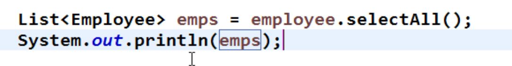

​	public List<T> selectList(Wrapper wrapper)


​	 public int selectCount(Wrapper wrapper)


### 5.2.4、删除操作

​	public boolean deleteById()

​	public boolean deleteById(Serializable id) 


​	


​	

​	public boolean delete(Wrapper wrapper)


### 5.2.5、分页复杂操作

​	public Page<T> selectPage(Page<T> page, Wrapper<T>  wrapper)	


##  5.3、AR小结

1. AR 模式提供了一种更加便捷的方式实现 CRUD 操作，其本质还是调用的 Mybatis 对应的方法，类似于语法糖

   语法糖是指计算机语言中添加的某种语法，这种语法对原本语言的功能并没有影响. 可以更方便开发者使用，可以避免出错的机会，让程序可读性更好.

2. 到此，我们简单领略了 Mybatis-Plus 的魅力与高效率，值得注意的一点是：我们提供了强大的代码生成器，可以快速生成各类代码，真正的做到了即开即用

# 6、代码生成器

1. MP 提供了大量的自定义设置，生成的代码完全能够满足各类型的需求

2. MP 的代码生成器    和        Mybatis              MBG      代 码 生 成 器 : 

   1. MP 的代码生成器都是基于 java 代码来生成。
   2. MBG 基于 xml 文件进行代码生成
   3. MyBatis 的代码生成器可生成: 实体类、Mapper 接口、Mapper 映射文件
   4. MP 的代码生成器可生成: 实体类(可以选择是否支持 AR)、Mapper 接口、Mapper 映射文件、 Service 层、Controller 层.

3. 表及字段命名策略选择

   ​	在 MP 中，我们建议数据库表名 和 表字段名采用驼峰命名方式， 如果采用下划线命名方式 请开启全局下划线开关，如果表名字段名命名方式不一致请注解指定，我们建议最好保持一致。

   ​	这么做的原因是为了避免在对应实体类时产生的性能损耗，这样字段不用做映射就能直接和实体类对应。当然如果项目里不用考虑这点性能损耗，那么你采用下滑线也是没问题的，只需要在生成代码时配置 dbColumnUnderline 属性就可以

   

## 6.1、代码生成器依赖

### 6.1.1、模板引擎

​	MP 的代码生成器默认使用的是 Apache 的 Velocity 模板，当然也可以更换为别的模板技术，例如 freemarker。此处不做过多的介绍。

​	需要加入 Apache Velocity 的依赖

```xml
<dependency>
    <groupId>org.apache.velocity</groupId>
    <artifactId>velocity-engine-core</artifactId>
    <version>2.0</version>
</dependency>

```

### 6.1.2、加入 slf4j ,查看日志输出信

```xml
<dependency>
    <groupId>org.slf4j</groupId>
    <artifactId>slf4j-api</artifactId>
    <version>1.7.7</version>
</dependency>
<dependency>
    <groupId>org.slf4j</groupId>
    <artifactId>slf4j-log4j12</artifactId>
    <version>1.7.7</version>
</dependency>

```

## 6.2、MP代码生成器示例代码


```java
@Test
public  void  testGenerator()  {
    //全局配置
    GlobalConfig config = new GlobalConfig(); 
    config.setActiveRecord(true)	//是否支持AR模式
        .setAuthor("weiyunhui")  //作者
        .setOutputDir("D:\\workspace_my\\mp03\\src\\main\\java") //生成路径
        .setFileOverride(true)//文件覆盖
        .setServiceName("%sService")	//设置生成的service接口名首字母是否为I
        .setBaseResultMap(true) //
        .setBaseColumnList(true) //
        .setIdType(IdType.AUTO)  //主键策略
    ;
    //数据源配置
    DataSourceConfig  dsConfig  =  new  DataSourceConfig();
    dsConfig.setDbType(DbType.MYSQL)
        .setUrl("jdbc:mysql://localhost:3306/javaEE_0228")
        .setDriverName("com.mysql.jdbc.Driver")
        .setUsername("root")
        .setPassword("1234");
    //策略配置
    StrategyConfig	stConfig  =  new  StrategyConfig(); 
    stConfig.setCapitalMode(true)	//  全局大写命名
        .setDbColumnUnderline(true)	//表名 字段名 是否使用下滑线命名
        .setNaming(NamingStrategy.underline_to_camel) // 数据库表映射到实体的命名策略
        .setInclude("tbl_employee")	//生成的表
        .setTablePrefix("tbl_");  //  表前缀
    //包名策略
    PackageConfig  pkConfig  =  new  PackageConfig();
    pkConfig.setParent("com.atguigu.mp")
        .setController("controller")
        .setEntity("beans")
        .setService("service"); 
    //整合配置
    AutoGenerator ag	= new AutoGenerator()
        .setGlobalConfig(config)
        .setDataSource(dsConfig)
        .setStrategy(stConfig)
        .setPackageInfo(pkConfig);
    ag.execute();
}

```


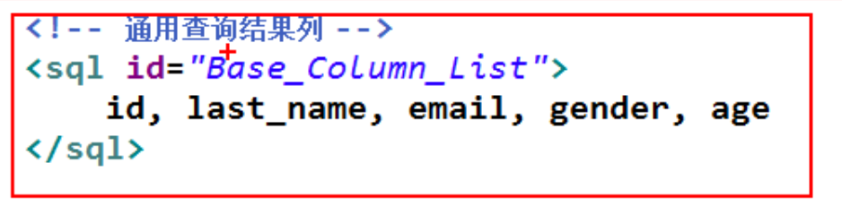


## 6.3、ServiceImpl说明

​	EmployeeServiceImpl继承了 ServiceImpl 类,mybatis-plus 通过这种方式为我们注入了 EmployeeMapper,这样可以使用 service 层默认为我们提供的很多方法,也可以调用我们自己在 dao 层编写的操作数据库的方法.	


# 7、插件扩展

## 7.1、MyBatis插件机制介绍

1. 插件机制:

   Mybatis 通过插件(Interceptor) 可以做到拦截四大对象相关方法的执行,根据需求，完成相关数据的动态改变。

   Executor

   StatementHandler 

   ParameterHandler 

   ResultSetHandler

2. 插件原理

   四大对象的每个对象在创建时，都会执行  interceptorChain.pluginAll()，会经过每个插件对象的 plugin()方法，目的是为当前的四大对象创建代理。代理对象就可以拦截到四大对象相关方法的执行，因为要执行四大对象的方法需要经过代理.


创建StatementHandler时，同时创建ParameterHandler 和ResultSetHandler


## 7.2、分页插件

​	com.baomidou.mybatisplus.plugins.PaginationInterceptor


1. 引入分页插件依赖

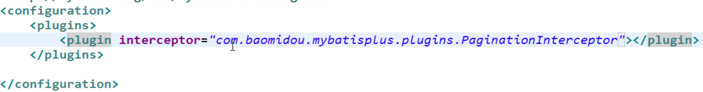

2、注入sqlSessionFactory


3、测试


1. 

## 7.3、分页后的Page对象

1. 执行分页操作后，分页对象中的属性


2. 将查询结果封装到Page对象中


## 7.4、分析插件

1. com.baomidou.mybatisplus.plugins.SqlExplainInterceptor

   

2. SQL 执行分析拦截器，只支持 MySQL5.6.3 以上版本

3. 该插件的作用是分析 DELETE       UPDATE 语句,防止小白或者恶意进行 DELETE          UPDATE 全表操作

4. 只建议在开发环境中使用，不建议在生产环境使用

5. 在插件的底层 通过 SQL 语句分析命令:Explain 分析当前的 SQL 语句， 根据结果集中的 Extra 列来断定当前是否全表操作。

   

   SQL分析：explain

   

   

   


## 7.5、性能分析插件

1. com.baomidou.mybatisplus.plugins.PerformanceInterceptor
2. 性能分析拦截器，用于输出每条 SQL 语句及其执行时间
3. SQL 性能执行分析,开发环境使用，超过指定时间，停止运行。有助于发现问题


## 7.6、乐观锁插件

1. com.baomidou.mybatisplus.plugins.OptimisticLockerInterceptor

2.  如果想实现如下需求: 当要更新一条记录的时候，希望这条记录没有被别人更新

3. 乐观锁的实现原理:

   取出记录时，获取当前 version       2

   更新时，带上这个 version     2

   执行更新时， set version = yourVersion+1 where version = yourVersion

   如果 version 不对，就更新失败

4. @Version 用于注解实体字段，必须要有。


**需要设置version值**


更新的时候多了一个version字段，且查询条件也多了version字段。


如果锁失败了，则更新条数为0


# 8、自定义全局操作

​	根据 MybatisPlus 的 AutoSqlInjector 可以自定义各种你想要的 sql ,注入到全局中，相当于自定义 Mybatisplus 自动注入的方法。

 	之前需要在 xml 中进行配置的 SQL 语句，现在通过扩展 AutoSqlInjector 在加载 mybatis 环境时就注入。

## 8.1、AutoSqlInjector

1. 在 Mapper 接口中定义相关的 CRUD 方法
2. 扩展 AutoSqlInjector    inject 方法，实现 Mapper 接口中方法要注入的 SQL
3. 在 MP 全局策略中，配置 自定义注入器


实现deleteAll方法也是在启动时加载到Configuration中，而不是在mapper.xml中配置


将自定义的SqlInjector注入到IOC容器


### 8.1.1、参考实现


### 8.1.2、测试


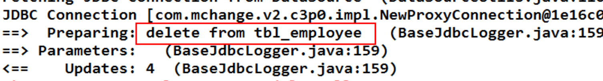

**系统启动时已经将SQL初始化到Configuration中了**


## 8.2、自定义注入器的应用之 逻辑删除

​	假删除、逻辑删除: 并不会真正的从数据库中将数据删除掉，而是将当前被删除的这条数据中的一个逻辑删除字段置为删除状态.

​	tbl_user     logic_flag = 1   →   -1

1. com.baomidou.mybatisplus.mapper.LogicSqlInjector
2. logicDeleteValue       逻辑删除全局值
3. logicNotDeleteValue     逻辑未删除全局值
4. 在 POJO 的逻辑删除字段 添加 @TableLogic 注解
5. 会在 mp 自带查询和更新方法的 sql 后面，追加『逻辑删除字段』=『LogicNotDeleteValue 默认值』 删除方法: deleteById()和其他 delete 方法, 底层 SQL 调用的是 update tbl_xxx set 『逻辑删除字段』=『logicDeleteValue 默认值』

### 8.2.1、注入逻辑删除插件


### 8.2.2、创建表


包含逻辑删除字段logic_flag


### 8.2.3、创建JavaBean


### 8.2.4、配置逻辑删除值

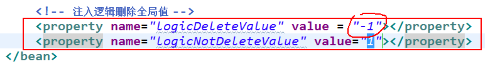

### 8.2.5、创建mapper


### 8.2.6、测试

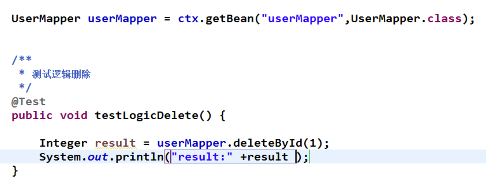

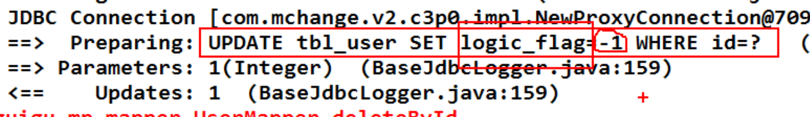

虽然执行的是delete方法，实际上的SQL是update操作。


查询的时候也会增加逻辑删除字段，所以已经被逻辑删除的数据无法查询出来。

## 8.3、逻辑删除的原理

1. 分析LogicSqlInjector继承了AutoSqlInjector

   

2. 重写了父类的InjectDeleteByIdSql方法

   

3. 逻辑删除拿到的SQL

   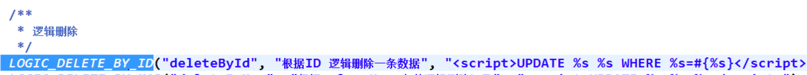

   

4. 通过SQL注入的方式将删除操作改为了更新操作


# 9、公共字段自动填充

## 9.1、元数据处理接口

​	com.baomidou.mybatisplus.mapper.MetaObjectHandler

​	insertFill(MetaObject metaObject) updateFill(MetaObject metaObject)

 	metaobject: 元对象. 是 Mybatis 提供的一个用于更加方便，更加优雅的访问对象的属性, 给对象的属性设置值 的一个对象. 还会用于包装对象. 支持对 Object 、Map、Collection 等对象进行包装

​	本质上 metaObject 获取对象的属性值或者是给对象的属性设置值，最终是要通过 Reflector 获取到属性的对应方法的 Invoker, 最终 invoke.


## 9.2、开发步骤

1. 注解填充字段    @TableField(fill = FieldFill.INSERT)         查看 FieldFill
2. 自定义公共字段填充处理器
3. MP 全局注入   自定义公共字段填充处理器

### 9.1.1、@TableField(fill = FieldFill.INSERT)


### 9.1.2、自定义公共字段填充器


### 9.1.3、全局配置


### 9.1.4、测试


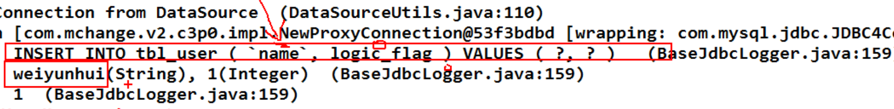


**测试修改**


# 10、Oracle注解策略

​	MySQL:    支持主键自增。 IdType.Auto 

​	Oracle:     序列(Sequence)

1. 实体类配置主键 Sequence   @KeySequence(value=”序列名”，clazz=xxx.class 主键属性类型)

2. 全局 MP 主键生成策略为 IdType.INPUT

3. 全局 MP 中配置 Oracle 主键 Sequence

   com.baomidou.mybatisplus.incrementer.OracleKeyGenerator

4. 可以将@keySequence 定义在父类中，可实现多个子类对应的多个表公用一个 Sequence


### 10.1.1、@KeySequence(value="xxxx",clazz=yyy.class)


### 10.1.2、配置Oracle主键sequence


### 10.1.3、测试


## 10.2、多个实体类使用同一个sequence


# 11、Idea快速开发插件

​	MybatisX 辅助 idea 快速开发插件，为效率而生.

​	可以实现 java 与 xml 跳转，根据 Mapper 接口中的方法自动生成 xml 结构.

​	官方安装： File -> Settings -> Plugins -> Browse Repositories.. 输入 mybatisx 安装下载

​	Jar 安装：  File -> Settings -> Plugins -> Install plugin from disk.. 选中 mybatisx..jar 安装


直接跳转到mapper.xml


直接跳转到mapper.java

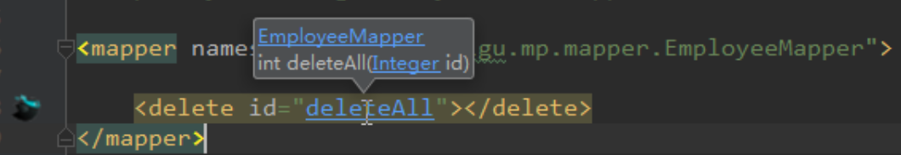


