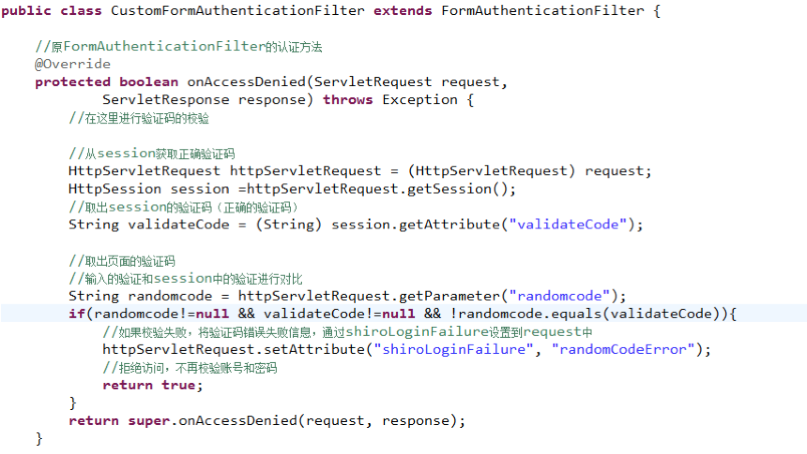
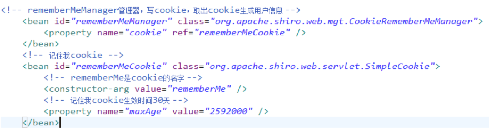
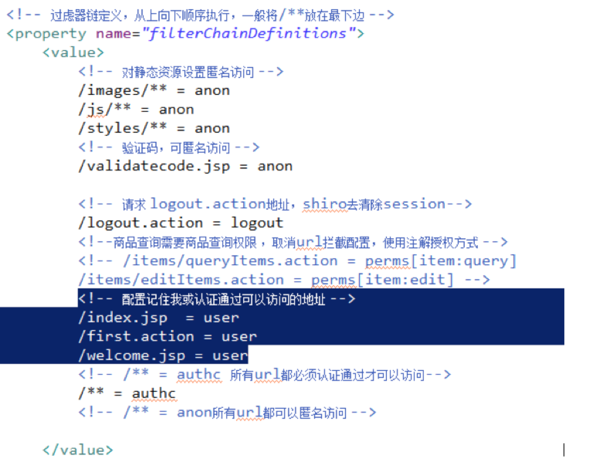

# 1、权限管理原理知识

## 1.1、什么是权限管理

​           只要有用户参与的系统一般都要有权限管理，权限管理实现对用户访问系统的控制，按照安全规则或者安全策略控制用户可以访问而且只能访问自己被授权的资源。

​           权限管理包括用户认证和授权两部分。

## 1.2、用户认证

### 1.2.1、概念

​           用户认证，用户去访问系统，系统要验证用户身份的合法性。

​	最常用的用户身份验证的方法：

​		1、用户名密码方式、

​		2、指纹打卡机、

​		3、基于证书验证方法。。

​	系统验证用户身份合法，用户方可访问系统的资源。

 

### 1.2.2、用户认证流程


### 1.2.3、关键对象 

subject：主体，理解为用户,可能是程序，都要去访问系统的资源，系统需要对subject进行身份认证。

principal：身份信息，通常是唯一的，一个主体还有多个身份信息，但是都有一个主身份信息（primary principal）

credential：凭证信息，可以是密码 、证书、指纹。

**总结：主体在进行身份认证时需要提供身份信息和凭证信息。**

## 1.3、用户授权

### 1.3.1、概念

​           用户授权，简单理解为访问控制，在用户认证通过后，系统对用户访问资源进行控制，用户具有资源的访问权限方可访问。

### 1.3.2、授权流程


### 1.3.3、关键对象

> 授权的过程理解为：who对what(which)进行how操作。

> who：主体即subject，subject在认证通过后系统进行访问控制。

> what(which)：资源(**Resource**)，subject必须具备资源的访问权限才可访问该 资源。资源比如：系统用户列表页面、商品修改菜单、商品id为001的商品信息。

​	资源分为**资源类型和资源实例**：

​	系统的用户信息就是资源类型，相当于java类。

​	系统中id为001的用户就是资源实例，相当于new的java对象。

> how：权限/许可(**permission**) ，针对资源的权限或许可，subject具有permission访问资源，如何访问/操作需要定义permission，权限比如：用户添加、用户修改、商品删除。

### 1.3.4、权限模型

​	主体（账号、密码）

​	资源（资源名称、访问地址）

​	权限（权限名称、资源id）

​	角色（角色名称）

​	角色和权限关系（角色id、权限id）

​	主体和角色关系（主体id、角色id）

 如下图：


​	通常企业开发中将资源和权限表合并为一张权限表，如下：

​		资源（资源名称、访问地址）

​		权限（权限名称、资源id）

​	合并为：

​		权限（权限名称、资源名称、资源访问地址）


​	***上图常被称为权限管理的通用模型，不过企业在开发中根据系统自身的特点还会对上图进行修改，但是用户、角色、权限、用户角色关系、角色权限关系是需要去理解的。***

### 1.3.5、分配权限

用户需要分配相应的权限才可访问相应的资源。权限是对于资源的操作许可。

通常给用户分配资源权限需要将权限信息持久化，比如存储在关系数据库中。

把用户信息、权限管理、用户分配的权限信息写到数据库（权限数据模型）


### 1.3.6、权限控制(授权核心)

#### 1.3.6.1、基于角色的访问控制

RBAC(role  based  access  control)，基于角色的访问控制。

比如：

系统角色包括 ：部门经理、总经理。。（角色针对用户来划分）

系统代码中实现：

//如果该user是部门经理则可以访问if中的代码

if(user.hasRole('部门经理')){

​           //系统资源内容

​           //用户报表查看

}

问题：

角色针对人划分的，人作为用户在系统中属于活动内容，如果该 角色可以访问的资源出现变更，需要修改你的代码了，比如：需要变更为部门经理和总经理都可以进行用户报表查看，代码改为：

if(user.hasRole('部门经理') || user.hasRole('总经理')  ){

​           //系统资源内容

​           //用户报表查看

}

基于角色的访问控制是不利于系统维护(可扩展性不强)。

#### 1.3.6.2、基于资源的访问控制

RBAC(Resource  based  access  control)，基于资源的访问控制。

资源在系统中是不变的，比如资源有：类中的方法，页面中的按钮。

对资源的访问需要具有permission权限，代码可以写为：

if(user.hasPermission ('用户报表查看（权限标识符）')){

​           //系统资源内容

​           //用户报表查看

}

上边的方法就可以解决用户角色变更不用修改上边权限控制的代码。

如果需要变更权限只需要在分配权限模块去操作，给部门经理或总经理增或删除权限。 

建议使用基于资源的访问控制实现权限管理。

# 4、权限管理解决方案

## 4.1、什么是粗粒度和细粒度权限

 

​	粗粒度权限管理，对资源类型的权限管理。资源类型比如：菜单、url连接、用户添加页面、用户信息、类方法、页面中按钮。。

​	粗粒度权限管理比如：超级管理员可以访问户添加页面、用户信息等全部页面。

​	部门管理员可以访问用户信息页面包括 页面中所有按钮。

​	细粒度权限管理，对资源实例的权限管理。资源实例就资源类型的具体化，比如：用户id为001的修改连接，1110班的用户信息、行政部的员工。

**细粒度权限管理就是数据级别的权限管理。**

​	细粒度权限管理比如：部门经理只可以访问本部门的员工信息，用户只可以看到自己的菜单，大区经理只能查看本辖区的销售订单。。

粗粒度和细粒度例子：

​	 系统有一个用户列表查询页面，对用户列表查询分权限，如果粗颗粒管理，张三和李四都有用户列表查询的权限，张三和李四都可以访问用户列表查询。

​	进一步进行细颗粒管理，张三（行政部）和李四(开发部)只可以查询自己本部门的用户信息。张三只能查看行政部 的用户信息，李四只能查看开发部门的用户信息。**细粒度权限管理就是数据级别的权限管理。**

## 4.2、如何实现粗粒度和细粒度权限管理

 如何实现粗粒度权限管理？

​	粗粒度权限管理比较容易将权限管理的代码抽取出来在系统架构级别统一处理。比如：通过springmvc的拦截器实现授权。

如何实现细粒度权限管理？

​	对细粒度权限管理在数据级别是没有共性可言，针对细粒度权限管理就是系统业务逻辑的一部分，如果在业务层去处理相对比较简单，如果将细粒度权限管理统一在系统架构级别去抽取，比较困难，即使抽取的功能可能也存在扩展不强。

建议细粒度权限管理在业务层去控制。

​	比如：部门经理只查询本部门员工信息，在service接口提供一个部门id的参数，controller中根据当前用户的信息得到该 用户属于哪个部门，调用service时将部门id传入service，实现该用户只查询本部门的员工。

## 4.3、基于url拦截的方式实现

基于url拦截的方式实现在实际开发中比较常用的一种方式。

对于web系统，通过filter过虑器实现url拦截，也可以springmvc的拦截器实现基于url的拦截。 

## 4.4、使用权限管理框架实现

对于粗粒度权限管理，建议使用优秀权限管理框架来实现，节省开发成功，提高开发效率。

shiro就是一个优秀权限管理框架。

# 5、基于url的权限管理

## 5.1、基于url权限管理流程


## 5.2、搭建环境

### 5.2.1、数据库

​	mysql5.1数据库中创建表：用户表、角色表、权限表(实质上是权限和资源的结合 )、用户角色表、角色权限表。


### 5.2.2、开发环境

​	jdk1.7.0_72

​	eclipse 3.7 indigo 

​	技术架构：springmvc+mybatis+jquery easyui

### 5.2.3、系统工程架构

​	springmvc+mybatis+jquery easyui


### 5.2.4、系统登陆

系统 登陆相当 于用户身份认证，用户成功，要在session中记录用户的身份信息.

 操作流程：

​	用户进行登陆页面

​	输入用户名和密码进行登陆

​	进行用户名和密码校验

​	如果校验通过，在session记录用户身份信息

#### 5.2.4.1、用户的身份信息

创建专门类用于记录用户身份信息。


#### 5.2.4.2、mapper

mapper接口：　根据用户账号查询用户（sys_user）信息（使用逆向工程生成的mapper）

使用逆向工程生成以下表的基础代码：


#### 5.2.4.3、service（进行用户名和密码校验）

接口功能：根据用户的身份和密码 进行认证，如果认证通过，返回用户身份信息

认证过程：

​           根据用户身份（账号）查询数据库，如果查询不到用户不存在

​           对输入的密码 和数据库密码 进行比对，如果一致，认证通过


#### 5.2.4.4、controller（记录session）


### 5.2.5、用户认证拦截器

#### 5.2.5.1、anonymousURL.properties

配置可以匿名访问的url


#### 5.2.5.2、编写认证拦截器

```java
//用于用户认证校验、用户权限校验
	@Override
	public boolean preHandle(HttpServletRequest request,
			HttpServletResponse response, Object handler) throws Exception {
		
		//得到请求的url
		String url = request.getRequestURI();
		
		//判断是否是公开 地址
		//实际开发中需要公开 地址配置在配置文件中
		//从配置中取逆名访问url
		
		List<String> open_urls = ResourcesUtil.gekeyList("anonymousURL");
		//遍历公开 地址，如果是公开 地址则放行
		for(String open_url:open_urls){
			if(url.indexOf(open_url)>=0){
				//如果是公开 地址则放行
				return true;
			}
		}
		
		
		//判断用户身份在session中是否存在
		HttpSession session = request.getSession();
		ActiveUser activeUser = (ActiveUser) session.getAttribute("activeUser");
		//如果用户身份在session中存在放行
		if(activeUser!=null){
			return true;
		}
		//执行到这里拦截，跳转到登陆页面，用户进行身份认证
		request.getRequestDispatcher("/WEB-INF/jsp/login.jsp").forward(request, response);
		
		//如果返回false表示拦截不继续执行handler，如果返回true表示放行
		return false;
	}

```

#### 5.2.5.3、配置拦截器

在springmvc.xml中配置拦截器


### 5.2.6、授权

#### 5.2.6.1、commonURL.properties

在此配置文件配置公用访问地址，公用访问地址只要通过用户认证，不需要对公用访问地址分配权限即可访问。

 

#### 5.2.6.2、获取用户权限范围的菜单

思路：

在用户认证时，认证通过，根据用户id从数据库获取用户权限范围的菜单，将菜单的集合存储在session中。


mapper接口：根据用户id查询用户权限的菜单


service接口：根据用户id查询用户权限的菜单


#### 5.2.6.3、获取用户权限范围的url

思路：

在用户认证时，认证通过，根据用户id从数据库获取用户权限范围的url，将url的集合存储在session中。


mapper接口：根据用户id查询用户权限的url


service接口：根据用户id查询用户权限的url


#### 5.2.6.4、用户认证通过取出菜单和url放入session

修改service认证代码：


#### 5.2.6.5、菜单动态显示

修改first.jsp，动态从session中取出菜单显示：


#### 5.2.6.6、授权拦截器

```java
//在执行handler之前来执行的
	//用于用户认证校验、用户权限校验
	@Override
	public boolean preHandle(HttpServletRequest request,
			HttpServletResponse response, Object handler) throws Exception {
		
		//得到请求的url
		String url = request.getRequestURI();
		
		//判断是否是公开 地址
		//实际开发中需要公开 地址配置在配置文件中
		//从配置中取逆名访问url
		
		List<String> open_urls = ResourcesUtil.gekeyList("anonymousURL");
		//遍历公开 地址，如果是公开 地址则放行
		for(String open_url:open_urls){
			if(url.indexOf(open_url)>=0){
				//如果是公开 地址则放行
				return true;
			}
		}
		
		//从配置文件中获取公共访问地址
		List<String> common_urls = ResourcesUtil.gekeyList("commonURL");
		//遍历公用 地址，如果是公用 地址则放行
		for(String common_url:common_urls){
			if(url.indexOf(common_url)>=0){
				//如果是公开 地址则放行
				return true;
			}
		}
		
		//获取session
		HttpSession session = request.getSession();
		ActiveUser activeUser = (ActiveUser) session.getAttribute("activeUser");
		//从session中取权限范围的url
		List<SysPermission> permissions = activeUser.getPermissions();
		for(SysPermission sysPermission:permissions){
			//权限的url
			String permission_url = sysPermission.getUrl();
			if(url.indexOf(permission_url)>=0){
				//如果是权限的url 地址则放行
				return true;
			}
		}
		
		//执行到这里拦截，跳转到无权访问的提示页面
		request.getRequestDispatcher("/WEB-INF/jsp/refuse.jsp").forward(request, response);
		
		//如果返回false表示拦截不继续执行handler，如果返回true表示放行
		return false;
	}

```

#### 5.2.6.7、配置授权拦截器

注意：将授权拦截器配置在用户认证拦截的下边。


## 5.3、小结

​	使用基于url拦截的权限管理方式，实现起来比较简单，不依赖框架，使用web提供filter就可以实现。

问题：

​	需要将所有的url全部配置起来，有些繁琐，不易维护，url(资源)和权限表示方式不规范。

# 6、shiro介绍 

## 6.1、什么是shiro

shiro是apache的一个开源框架，是一个权限管理的框架，实现 用户认证、用户授权。

spring中有spring security (原名Acegi)，是一个权限框架，它和spring依赖过于紧密，没有shiro使用简单。

shiro不依赖于spring，shiro不仅可以实现 web应用的权限管理，还可以实现c/s系统，分布式系统权限管理，shiro属于轻量框架，越来越多企业项目开始使用shiro。

使用shiro实现系统的权限管理，有效提高开发效率，从而降低开发成本

## 6.2、shiro架构


subject：主体，可以是用户也可以是程序，主体要访问系统，系统需要对主体进行认证、授权。

securityManager：安全管理器，主体进行认证和授权都 是通过securityManager进行。

authenticator：认证器，主体进行认证最终通过authenticator进行的。

authorizer：授权器，主体进行授权最终通过authorizer进行的。

sessionManager：web应用中一般是用web容器对session进行管理，shiro也提供一套session管理的方式。

SessionDao：  通过SessionDao管理session数据，针对个性化的session数据存储需要使用sessionDao。

cache Manager：缓存管理器，主要对session和授权数据进行缓存，比如将授权数据通过cacheManager进行缓存管理，和ehcache整合对缓存数据进行管理。

realm：域，领域，相当于数据源，通过realm存取认证、授权相关数据。

**注意：在realm中存储授权和认证的逻辑。**

cryptography：密码管理，提供了一套加密/解密的组件，方便开发。比如提供常用的散列、加/解密等功能。

比如 md5散列算法。

## 6.3、jar包

​	与其它java开源框架类似，将shiro的jar包加入项目就可以使用shiro提供的功能了。shiro-core是核心包必须选用，还提供了与web整合的shiro-web、与spring整合的shiro-spring、与任务调度quartz整合的shiro-quartz等，下边是shiro各jar包的maven坐标。

```xml
<dependency>
    <groupId>org.apache.shiro</groupId>
    <artifactId>shiro-core</artifactId>
    <version>1.2.3</version>
</dependency>
<dependency>
    <groupId>org.apache.shiro</groupId>
    <artifactId>shiro-web</artifactId>
    <version>1.2.3</version>
</dependency>
<dependency>
    <groupId>org.apache.shiro</groupId>
    <artifactId>shiro-spring</artifactId>
    <version>1.2.3</version>
</dependency>
<dependency>
    <groupId>org.apache.shiro</groupId>
    <artifactId>shiro-ehcache</artifactId>
    <version>1.2.3</version>
</dependency>
<dependency>
    <groupId>org.apache.shiro</groupId>
    <artifactId>shiro-quartz</artifactId>
    <version>1.2.3</version>
</dependency>

也可以通过引入shiro-all包括shiro所有的包：
<dependency>
    <groupId>org.apache.shiro</groupId>
    <artifactId>shiro-all</artifactId>
    <version>1.2.3</version>
</dependency>

```

参考lib目录：


# 7、shiro认证

## 7.1、shiro认证流程


## 7.2、shiro入门程序工程 环境

jar包：shiro-core.jar


工程结构：


## 7.3、shiro认证入门程序

### 7.3.1、 shiro-first.ini

通过此配置文件创建securityManager工厂。

需要修改eclipse的ini的编辑器:


配置数据：


### 7.3.2、入门程序代码

```java
// 用户登陆和退出
	@Test
	public void testLoginAndLogout() {

		// 创建securityManager工厂，通过ini配置文件创建securityManager工厂
		Factory<SecurityManager> factory = new IniSecurityManagerFactory(
				"classpath:shiro-first.ini");
		
		//创建SecurityManager
		SecurityManager securityManager = factory.getInstance();
		
		//将securityManager设置当前的运行环境中
		SecurityUtils.setSecurityManager(securityManager);
		
		//从SecurityUtils里边创建一个subject
		Subject subject = SecurityUtils.getSubject();
		
		//在认证提交前准备token（令牌）
		UsernamePasswordToken token = new UsernamePasswordToken("zhangsan", "111111");

		try {
			//执行认证提交
			subject.login(token);
		} catch (AuthenticationException e) {
			// TODO Auto-generated catch block
			e.printStackTrace();
		}
		
		//是否认证通过
		boolean isAuthenticated =  subject.isAuthenticated();
		
		System.out.println("是否认证通过：" + isAuthenticated);
		
		//退出操作
		subject.logout();
		
		//是否认证通过
		isAuthenticated =  subject.isAuthenticated();
		
		System.out.println("是否认证通过：" + isAuthenticated);
		
	}

```

### 7.3.3、执行流程

1. 通过ini配置文件创建securityManager

2. 调用subject.login方法主体提交认证，提交的token

3. securityManager进行认证，securityManager最终由ModularRealmAuthenticator进行认证。

4. ModularRealmAuthenticator调用IniRealm(给realm传入token) 去ini配置文件中查询用户信息

5. IniRealm根据输入的token（UsernamePasswordToken）从 shiro-first.ini查询用户信息，根据账号查询用户信息（账号和密码）

   如果查询到用户信息，就给ModularRealmAuthenticator返回用户信息（账号和密码）

   如果查询不到，就给ModularRealmAuthenticator返回null

6. ModularRealmAuthenticator接收IniRealm返回Authentication认证信息

   如果返回的认证信息是null，ModularRealmAuthenticator抛出异常（org.apache.shiro.authc.UnknownAccountException）

   如果返回的认证信息不是null（说明inirealm找到了用户），对IniRealm返回用户密码 （在ini文件中存在）和 token中的密码 进行对比，如果不一致抛出异常（org.apache.shiro.authc.IncorrectCredentialsException）

### 7.3.4、小结：

​	ModularRealmAuthenticator作用进行认证，需要调用realm查询用户信息（在数据库中存在用户信息）

​	ModularRealmAuthenticator进**行密码对比**（认证过程）。

​	realm：需要根据token中的身份信息去查询数据库（入门程序使用ini配置文件），如果查到用户返回认证信息，如果查询不到返回null。

## 7.4、自定义realm

将来实际开发需要realm从数据库中查询用户信息。

### 7.4.1、realm接口


### 7.4.2、自定义realm


### 7.4.3、配置realm

需要在shiro-realm.ini配置realm注入到securityManager中。


### 7.4.4、测试

同上边的入门程序，需要更改ini配置文件路径：

Factory<SecurityManager> factory = **new** IniSecurityManagerFactory(

​            "classpath:shiro-realm.ini");

 

## 7.5、散列算法

通常需要对密码 进行散列，常用的有md5、sha， 

对md5密码，如果知道散列后的值可以通过穷举算法，得到md5密码对应的明文。

建议对md5进行散列时加salt（盐），进行加密相当 于对原始密码+盐进行散列。

正常使用时散列方法：

​	在程序中对原始密码+盐进行散列，将散列值存储到数据库中，并且还要将盐也要存储在数据库中。

​	如果进行密码对比时，使用相同 方法，将原始密码+盐进行散列，进行比对。

### 7.5.1、md5散列测试程序：


### 7.5.2、自定义realm支持散列算法 

 需求：实际开发时realm要进行md5值（明文散列后的值）的对比。 

#### 7.5.2.1、新建realm(CustomRealmMd5)


#### 7.5.2.2、在realm中配置凭证匹配器


=======================第二天====================

# 1、复习

## 1.1、概念

1. 权限管理：系统的安全范畴，要求必须是合法的用户才可以访问系统（用户认证），且必须具有该 资源的访问权限才可以访问该 资源（授权）。

2. 认证：对用户合法身份的校验，要求必须是合法的用户才可以访问系统。

3. 授权：访问控制，必须具有该 资源的访问权限才可以访问该 资源。

4. 权限模型：标准权限数据模型包括 ：用户、角色、权限（包括资源和权限）、用户角色关系、角色权限关系。

5. 权限分配：通过UI界面方便给用户分配权限，对上边权限模型进行增、删、改、查操作。

权限控制：

1. 基于角色的权限控制：根据角色判断是否有操作权限，因为角色的变化 性较高，如果角色修改需要修改控制代码，系统可扩展性不强。
2. 基于资源的权限控制：根据资源权限判断是否有操作权限，因为资源较为固定，如果角色修改或角色中权限修改不需要修改控制代码，使用此方法系统可维护性很强。建议使用。

权限管理的解决方案：

1. 对于粗颗粒权限管理，建议在系统架构层面去解决，写系统架构级别统一代码（基础代码）。

   粗颗粒权限：比如对系统的url、菜单、jsp页面、页面上按钮、类方法进行权限管理，即对资源类型进行权限管理。

2. 对于细颗粒权限管理：

   细颗粒权限：比如用户id为001的用户信息（资源实例）、类型为t01的商品信息（资源实例），对资源实例进行权限管理，理解对数据级别的权限管理。

   细颗粒权限管理是系统的业务逻辑，业务逻辑代码不方便抽取统一代码，建议在系统业务层进行处理。

## 1.2、shiro认证

1. 基于url的权限管理（掌握）：

​	企业开发常用的方法，使用web应用中filter来实现，用户请求url，通过filter拦截，判断用户身份是否合法（用户认证），判断请求的地址是否是用户权限范围内的url(授权)。	

2. shiro：

​	shiro是一个权限管理框架，是apache下的开源项目。相比spring security框架更简单灵活，spring security对spring依赖较强。shiro可以实现web系统、c/s、分布式等系统 权限管理。

3. shiro认证流程：（掌握）
   1. subject(主体)请求认证，调用subject.login(token)
   2. SecurityManager (安全管理器)执行认证
   3. SecurityManager通过ModularRealmAuthenticator进行认证。
   4. ModularRealmAuthenticator将token传给realm，realm根据token中用户信息从数据库查询用户信息（包括身份和凭证）
   5. realm如果查询不到用户给ModularRealmAuthenticator返回null，ModularRealmAuthenticator抛出异常（用户不存在）
   6. realm如果查询到用户给ModularRealmAuthenticator返回AuthenticationInfo(认证信息)
   7. ModularRealmAuthenticator拿着AuthenticationInfo(认证信息)去进行凭证（密码 ）比对。如果一致则认证通过，如果不致抛出异常（凭证错误）。

 subject：主体

Authenticator：认证器（ shiro提供）

realm（一般需要自定义）：相当于数据源，认证器需要realm从数据源查询用户身份信息及权限信息。

# 2、shiro授权

## 2.1、授权流程


## 2.2、三种授权方法

Shiro 支持三种方式的授权：

1. 编程式：通过写if/else 授权代码块完成：

   Subject subject = SecurityUtils.getSubject();

   if(subject.hasRole(“admin”)) {

   ​	//有权限

   } else {

   ​	//无权限

   }

2. 注解式：通过在执行的Java方法上放置相应的注解完成：

   @RequiresRoles("admin")

   public void hello() {

   ​	//有权限

   }

3. JSP/GSP 标签：在JSP/GSP 页面通过相应的标签完成：

   <shiro:hasRole name="admin">

   <!— 有权限—>

   </shiro:hasRole>

## 2.3、shiro-permission.ini

shiro-permission.ini里边的内容相当于在数据库。

```properties
#用户
[users]
#用户zhang的密码是123，此用户具有role1和role2两个角色
zhang=123,role1,role2
wang=123,role2

#权限
[roles]
#角色role1对资源user拥有create、update权限
role1=user:create,user:update
#角色role2对资源user拥有create、delete权限
role2=user:create,user:delete
#角色role3对资源user拥有create权限
role3=user:create

```

>权限标识符号规则：资源:操作:实例(中间使用半角:分隔)

> user：create:01  表示对用户资源的01实例进行create操作。

> user:create：表示对用户资源进行create操作，相当于user:create:*，对所有用户资源实例进行create操作。

> user：*：01  表示对用户资源实例01进行所有操作。

## 2.4、编程


# 3、自定义realm进行授权

## 3.1、需求

​	上边的程序通过shiro-permission.ini对权限信息进行静态配置，实际开发中从数据库中获取权限数据。就需要自定义realm，由realm从数据库查询权限数据。

​	realm根据用户身份查询权限数据，将权限数据返回给authorizer（授权器）。

## 3.2、自定义realm

在原来自定义的realm中，修改doGetAuthorizationInfo方法。


## 3.3、shiro-realm.ini

在shiro-realm.ini中配置自定义的realm，将realm设置到securityManager中。

```properties
[main]
#自定义 realm
customRealm=cn.itcast.shiro.realm.CustomRealm
#将realm设置到securityManager，相当 于spring中注入
securityManager.realms=$customRealm

```

## 3.4、测试程序

```java
// 自定义realm进行资源授权测试
@Test
public void testAuthorizationCustomRealm() {

    // 创建SecurityManager工厂
    Factory<SecurityManager> factory = new IniSecurityManagerFactory(
        "classpath:shiro-realm.ini");

    // 创建SecurityManager
    SecurityManager securityManager = factory.getInstance();

    // 将SecurityManager设置到系统运行环境，和spring后将SecurityManager配置spring容器中，一般单例管理
    SecurityUtils.setSecurityManager(securityManager);

    // 创建subject
    Subject subject = SecurityUtils.getSubject();

    // 创建token令牌
    UsernamePasswordToken token = new UsernamePasswordToken("zhangsan",
                                                            "111111");

    // 执行认证
    try {
        subject.login(token);
    } catch (AuthenticationException e) {
        // TODO Auto-generated catch block
        e.printStackTrace();
    }

    System.out.println("认证状态：" + subject.isAuthenticated());
    // 认证通过后执行授权

    // 基于资源的授权，调用isPermitted方法会调用CustomRealm从数据库查询正确权限数据
    // isPermitted传入权限标识符，判断user:create:1是否在CustomRealm查询到权限数据之内
    boolean isPermitted = subject.isPermitted("user:create:1");
    System.out.println("单个权限判断" + isPermitted);

    boolean isPermittedAll = subject.isPermittedAll("user:create:1",
                                                    "user:create");
    System.out.println("多个权限判断" + isPermittedAll);

    // 使用check方法进行授权，如果授权不通过会抛出异常
    subject.checkPermission("items:add:1");

}

```

## 3.5、授权流程

1. 对subject进行授权，调用方法isPermitted（"permission串"）
2. SecurityManager执行授权，通过ModularRealmAuthorizer执行授权
3. ModularRealmAuthorizer执行realm（自定义的CustomRealm）从数据库查询权限数据调用realm的授权方法：doGetAuthorizationInfo
4. realm从数据库查询权限数据，返回ModularRealmAuthorizer
5. ModularRealmAuthorizer调用PermissionResolver进行权限串比对
6. 如果比对后，isPermitted中"permission串"在realm查询到权限数据中，说明用户访问permission串有权限，否则 没有权限，抛出异常。

# 4、shiro与项目整合

## 4.1、需求

ssm与shiro整合

## 4.2、创建工程、导入jar


## 4.3、web.xml中配置shiro的Filter

​	在web系统中，shiro也通过filter进行拦截。filter拦截后将操作权交给spring中配置的filterChain（过虑链儿）shiro提供很多filter。

​	在web.xml中配置filter


## 4.4、applicationContext-shiro.xml

​	在applicationContext-shiro.xml 中配置web.xml中fitler对应spring容器中的bean。


## 4.5、静态资源

对静态资源设置逆名访问：

修改applicationContext-shiro.xml:


## 4.6、登录

### 4.6.1、原理

使用FormAuthenticationFilter过虑器实现 ，原理如下：

​	将用户没有认证时，请求loginurl进行认证，用户身份和用户密码提交数据到loginurl

FormAuthenticationFilter拦截住取出request中的username和password（两个参数名称是可以配置的）

FormAuthenticationFilter调用realm传入一个token（username和password）

realm认证时根据username查询用户信息（在Activeuser中存储，包括 userid、usercode、username、menus）。

如果查询不到，realm返回null，FormAuthenticationFilter向request域中填充一个参数（记录了异常信息）

### 4.6.2、登录页面

​	由于FormAuthenticationFilter的用户身份和密码的input的默认值（username和password），修改页面的账号和密码 的input的名称为username和password。

### 4.6.3、登录代码实现


### 4.6.4、认证拦截过虑器

​	在applicationContext-shiro.xml中配置：


所有请求都需要经过认证

## 4.7、退出

### 4.7.1、使用LogoutFilter

​	不用我们去实现退出，只要去访问一个退出的url（该 url是可以不存在），由LogoutFilter拦截住，清除session。

​	在applicationContext-shiro.xml配置LogoutFilter：


可以删除原来的logout的controller方法代码。


## 4.8、在页面显示认证信息

1. 认证后用户菜单在首页显示
2. 认证后用户的信息在页头显示

### 4.8.1、修改realm设置完整认证信息

realm从数据库查询用户信息，将用户菜单、usercode、username等设置在SimpleAuthenticationInfo中。

先使用静态代码实现：


### 4.8.2、修改first.action将认证信息在页面显示


## 4.9、授权过虑器测试

### 4.9.1、使用PermissionsAuthorizationFilter

在applicationContext-shiro.xml中配置url所对应的权限。

测试流程：

1. 在applicationContext-shiro.xml中配置filter规则

   <!--商品查询需要商品查询权限  -->

2. /items/queryItems.action = perms[item:query]

3. 用户在认证通过后，请求/items/queryItems.action

4. 被PermissionsAuthorizationFilter拦截，发现需要“item:query”权限

5. PermissionsAuthorizationFilter调用realm中的doGetAuthorizationInfo获取数据库中正确的权限

6. PermissionsAuthorizationFilter对item:query 和从realm中获取权限进行对比，如果“item:query”在realm返回的权限列表中，授权通过。

### 4.9.2、创建refuse.jsp

​	如果授权失败，跳转到refuse.jsp，需要在spring容器中配置：


### 4.9.3、问题总结

1、在applicationContext-shiro.xml中配置过虑器链接，需要将全部的url和权限对应起来进行配置，比较发麻不方便使用。

 2、每次授权都需要调用realm查询数据库，对于系统性能有很大影响，可以通过shiro缓存来解决。

## 4.10、shiro的过虑器

```htm
过滤器简称	对应的java类
anon	org.apache.shiro.web.filter.authc.AnonymousFilter
authc	org.apache.shiro.web.filter.authc.FormAuthenticationFilter
authcBasic	org.apache.shiro.web.filter.authc.BasicHttpAuthenticationFilter
perms	org.apache.shiro.web.filter.authz.PermissionsAuthorizationFilter
port	org.apache.shiro.web.filter.authz.PortFilter
rest	org.apache.shiro.web.filter.authz.HttpMethodPermissionFilter
roles	org.apache.shiro.web.filter.authz.RolesAuthorizationFilter
ssl	org.apache.shiro.web.filter.authz.SslFilter
user	org.apache.shiro.web.filter.authc.UserFilter
logout	org.apache.shiro.web.filter.authc.LogoutFilter

anon:例子/admins/**=anon 没有参数，表示可以匿名使用。
authc:例如/admins/user/**=authc表示需要认证(登录)才能使用，FormAuthenticationFilter是表单认证，没有参数 
perms：例子/admins/user/**=perms[user:add:*],参数可以写多个，多个时必须加上引号，并且参数之间用逗号分割，例如/admins/user/**=perms["user:add:*,user:modify:*"]，当有多个参数时必须每个参数都通过才通过，想当于isPermitedAll()方法。
user:例如/admins/user/**=user没有参数表示必须存在用户, 身份认证通过或通过记住我认证通过的可以访问，当登入操作时不做检查

```

## 4.11、认证

### 4.11.1、需求

​	修改realm的doGetAuthenticationInfo，从数据库查询用户信息，realm返回的用户信息中包括 （md5加密后的串和salt），实现让shiro进行散列串的校验。

### 4.11.2、修改doGetAuthenticationInfo从数据库查询用户信息

​	1、将SysService注入到realm中。


```java
//realm的认证方法，从数据库查询用户信息
@Override
protected AuthenticationInfo doGetAuthenticationInfo(
    AuthenticationToken token) throws AuthenticationException {

    // token是用户输入的用户名和密码 
    // 第一步从token中取出用户名
    String userCode = (String) token.getPrincipal();

    // 第二步：根据用户输入的userCode从数据库查询
    SysUser sysUser = null;
    try {
        sysUser = sysService.findSysUserByUserCode(userCode);
    } catch (Exception e1) {
        // TODO Auto-generated catch block
        e1.printStackTrace();
    }

    // 如果查询不到返回null
    if(sysUser==null){//
        return null;
    }
    // 从数据库查询到密码
    String password = sysUser.getPassword();

    //盐
    String salt = sysUser.getSalt();

    // 如果查询到返回认证信息AuthenticationInfo

    //activeUser就是用户身份信息
    ActiveUser activeUser = new ActiveUser();

    activeUser.setUserid(sysUser.getId());
    activeUser.setUsercode(sysUser.getUsercode());
    activeUser.setUsername(sysUser.getUsername());
    //..

    //根据用户id取出菜单
    List<SysPermission> menus  = null;
    try {
        //通过service取出菜单 
        menus = sysService.findMenuListByUserId(sysUser.getId());
    } catch (Exception e) {
        // TODO Auto-generated catch block
        e.printStackTrace();
    }
    //将用户菜单 设置到activeUser
    activeUser.setMenus(menus);


    //将activeUser设置simpleAuthenticationInfo
    SimpleAuthenticationInfo simpleAuthenticationInfo = new SimpleAuthenticationInfo(
        activeUser, password,ByteSource.Util.bytes(salt), this.getName());

    return simpleAuthenticationInfo;
}

```

### 4.11.3、设置凭证匹配器

​	数据库中存储到的md5的散列值，在realm中需要设置数据库中的散列值它使用散列算法及散列次数，让shiro进行散列对比时和原始数据库中的散列值使用的算法一致。


## 4.12、授权

### 4.12.1、需求

​	修改realm的doGetAuthorizationInfo，从数据库查询权限信息。

​	使用注解式授权方法。

​	使用jsp标签授权方法。

### 4.12.2、修改doGetAuthorizationInfo从数据库查询权限

```java
// 用于授权
@Override
protected AuthorizationInfo doGetAuthorizationInfo(
    PrincipalCollection principals) {

    //从 principals获取主身份信息
    //将getPrimaryPrincipal方法返回值转为真实身份类型（在上边的doGetAuthenticationInfo认证通过填充到SimpleAuthenticationInfo中身份类型），
    ActiveUser activeUser =  (ActiveUser) principals.getPrimaryPrincipal();

    //根据身份信息获取权限信息
    //从数据库获取到权限数据
    List<SysPermission> permissionList = null;
    try {
        permissionList = sysService.findPermissionListByUserId(activeUser.getUserid());
    } catch (Exception e) {
        // TODO Auto-generated catch block
        e.printStackTrace();
    }
    //单独定一个集合对象 
    List<String> permissions = new ArrayList<String>();
    if(permissionList!=null){
        for(SysPermission sysPermission:permissionList){
            //将数据库中的权限标签 符放入集合
            permissions.add(sysPermission.getPercode());
        }
    }


    //查到权限数据，返回授权信息(要包括 上边的permissions)
    SimpleAuthorizationInfo simpleAuthorizationInfo = new SimpleAuthorizationInfo();
    //将上边查询到授权信息填充到simpleAuthorizationInfo对象中
    simpleAuthorizationInfo.addStringPermissions(permissions);

    return simpleAuthorizationInfo;
}

```

### 4.12.3、开启controller类aop支持

​	对系统中类的方法给用户授权，建议在controller层进行方法授权。

​	在springmvc.xml中配置：


### 4.12.4、在controller方法中添加注解


### 4.12.5、jsp标签 授权

Jsp页面添加：

<%@ tagliburi="http://shiro.apache.org/tags" prefix="shiro" %>

```html
标签名称							标签条件（均是显示标签内容）
<shiro:authenticated>				登录之后
<shiro:notAuthenticated>			不在登录状态时
<shiro:guest>						用户在没有RememberMe时
<shiro:user>						用户在RememberMe时
<shiro:hasAnyRoles name="abc,123" >	在有abc或者123角色时
<shiro:hasRole name="abc">			拥有角色abc
<shiro:lacksRole name="abc">		没有角色abc
<shiro:hasPermission name="abc">	拥有权限资源abc
<shiro:lacksPermission name="abc">	没有abc权限资源
<shiro:principal>					显示用户身份名称
<shiro:principal property="username"/>     显示用户身份中的属性值

```

修改itemsList.jsp页面：


### 4.12.6、授权测试

​	当调用controller的一个方法，由于该 方法加了@RequiresPermissions("item:query") ，shiro调用realm获取数据库中的权限信息，看"item:query"是否在权限数据中存在，如果不存在就拒绝访问，如果存在就授权通过。

​	当展示一个jsp页面时，页面中如果遇到<shiro:hasPermission name="item:update">，shiro调用realm获取数据库中的权限信息，看item:update是否在权限数据中存在，如果不存在就拒绝访问，如果存在就授权通过。

​	问题：只要遇到注解或jsp标签的授权，都会调用realm方法查询数据库，需要使用缓存解决此问题。

## 4.13、shiro缓存

​	针对上边授权频繁查询数据库，需要使用shiro缓存

### 4.13.1、缓存流程

shiro中提供了对认证信息和授权信息的缓存。shiro默认是关闭认证信息缓存的，对于授权信息的缓存shiro默认开启的。主要研究授权信息缓存，因为授权的数据量大。 

用户认证通过。

该 用户第一次授权：调用realm查询数据库

该 用户第二次授权：不调用realm查询数据库，直接从缓存中取出授权信息（权限标识符）。

### 4.13.2、使用ehcache

#### 4.13.2.1、添加Ehcache的jar包


#### 4.13.2.2、配置cacheManager


#### 4.13.2.3、shiro-ehcache.xml


#### 4.13.2.4、缓存清空

如果用户正常退出，缓存自动清空。

如果用户非正常退出，缓存自动清空。

如果修改了用户的权限，而用户不退出系统，修改的权限无法立即生效。

需要手动进行编程实现：

​           在权限修改后调用realm的clearCache方法清除缓存。

下边的代码正常开发时要放在service中调用。

在service中，权限修改后调用realm的方法。

在realm中定义clearCached方法：

```java
//清除缓存
public void clearCached() {
    PrincipalCollection principals = SecurityUtils.getSubject().getPrincipals();
    super.clearCache(principals);
}

```

测试清除缓存controller方法：


## 4.13、sessionManager

和shiro整合后，使用shiro的session管理，shiro提供sessionDao操作 会话数据。

配置sessionManager


## 4.14、验证码

### 4.14.1、思路

​	shiro使用FormAuthenticationFilter进行表单认证，验证校验的功能应该加在FormAuthenticationFilter中，在认证之前进行验证码校验。

​	需要写FormAuthenticationFilter的子类，继承FormAuthenticationFilter，改写它的认证方法，在认证之前进行验证码校验。

### 4.14.2、自定义FormAuthenticationFilter



### 4.14.3、配置自定义FormAuthenticationFilter


### 4.14.4、在login.action对验证错误 进行解析


### 4.14.5、在登陆页面添加验证码


### 4.14.6、在filter配置匿名访问验证码jsp


## 4.15、记住我

​	用户登陆选择“自动登陆”本次登陆成功会向cookie写身份信息，下次登陆从cookie中取出身份信息实现自动登陆。

### 4.15.1、用户身份实现java.io.Serializable接口

向cookie记录身份信息需要用户身份信息对象实现序列化接口，如下：


### 4.15.2、配置rememeberMeManager




### 4.15.3、登陆页面


### 4.15.4、配置rememberMe的input名称


### 4.15.5、测试

自动登陆后，需要查看 cookei是否有rememberMe


### 4.15.6、使用UserFilter

如果设置记住我，下次访问某些url时可以不用登陆。将记住我即可访问的地址配置让UserFilter拦截




