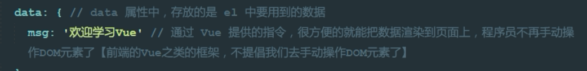
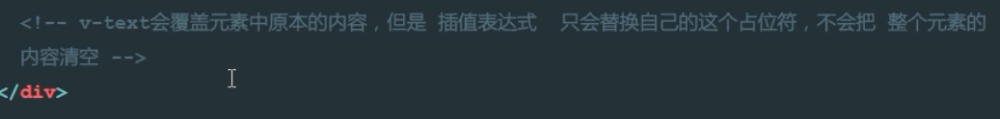
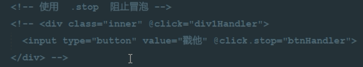
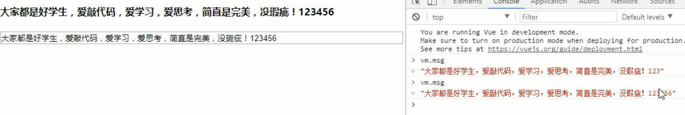
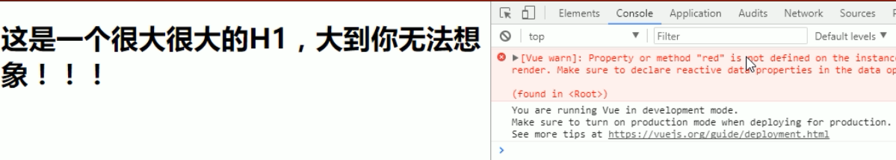

# 1、Day01

## 课程介绍
前5天： 都在学习Vue基本的语法和概念；打包工具 Webpack , Gulp
后5天： 以项目驱动教学；


### 什么是Vue.js

+ Vue.js 是目前最火的一个前端框架，React是最流行的一个前端框架（React除了开发网站，还可以开发手机App， Vue语法也是可以用于进行手机App开发的，需要借助于Weex）

+ Vue.js 是前端的**主流框架之一**，和Angular.js、React.js 一起，并成为前端三大主流框架！

+ Vue.js 是一套构建用户界面的框架，**只关注视图层**，它不仅易于上手，还便于与第三方库或既有项目整合。（Vue有配套的第三方类库，可以整合起来做大型项目的开发）

+ 前端的主要工作？主要负责MVC中的V这一层；主要工作就是和界面打交道，来制作前端页面效果；


## 为什么要学习流行框架
 + 企业为了提高开发效率：在企业中，时间就是效率，效率就是金钱；
  - 企业中，使用框架，能够提高开发的效率；


 + 提高开发效率的发展历程：原生JS -> Jquery之类的类库 -> 前端模板引擎 -> Angular.js / Vue.js（能够帮助我们减少不必要的DOM操作；提高渲染效率；双向数据绑定的概念【通过框架提供的指令，我们前端程序员只需要关心数据的业务逻辑，不再关心DOM是如何渲染的了】）
 + 在Vue中，一个核心的概念，就是让用户不再操作DOM元素，解放了用户的双手，让程序员可以更多的时间去关注业务逻辑；


 + 增强自己就业时候的竞争力
  - 人无我有，人有我优
  - 你平时不忙的时候，都在干嘛？

## 框架和库的区别


 + 框架：是一套完整的解决方案；对项目的侵入性较大，项目如果需要更换框架，则需要重新架构整个项目。

  - node 中的 express；


 + 库（插件）：提供某一个小功能，对项目的侵入性较小，如果某个库无法完成某些需求，可以很容易切换到其它库实现需求。
  - 1. 从Jquery 切换到 Zepto
  - 2. 从 EJS 切换到 art-template


## Node（后端）中的 MVC 与 前端中的 MVVM 之间的区别

 + MVC 是后端的分层开发概念；
 + MVVM是前端视图层的概念，主要关注于 视图层分离，也就是说：MVVM把前端的视图层，分为了 三部分 Model, View , VM ViewModel

 + 为什么有了MVC还要有MVVM


## Vue.js 基本代码 和 MVVM 之间的对应关系





### MVVM之V


### MVVM之MV


## MVVM之M


## Vue之 - `基本的代码结构`和`插值表达式`、`v-cloak`


## Vue指令之`v-text`和`v-html`

### `v-text`


**v-text和{{msg}}的效果是一样的**，区别在于网络较慢时页面不会显示插值，如下图


如果网络较慢，会直接显示插值表达式，而不会显示v-text（v-text是没有闪烁问题的）。


可以在插值前后插入其他值，而v-text则会替换标签的内容，效果如下图所示




### `v-html`


***可见msg2内部的<h1>标签被替换了***


v-html将h2解析为HTML标签了


## Vue指令之`v-bind`的三种用法

1. 直接使用指令`v-bind`，v-bind是vue中用于给属性绑定内容的指令。

   

2. 使用简化指令`:`，冒号后面是要绑定的属性。


1. 在绑定的时候，拼接绑定内容：`:title="btnTitle + ', 这是追加的内容'"`，可以写合法的JS表达式


## Vue指令之`v-on`和`跑马灯效果`

### v-on事件绑定机制


alert并没有定义在Vue中

### methods定义当前Vue实例可用的方法


**其他事件**


### 跑马灯效果

1. HTML结构：

```

<div id="app">

    <p>{{info}}</p>

    <input type="button" value="开启" v-on:click="go">

    <input type="button" value="停止" v-on:click="stop">

  </div>

```

2. Vue实例：

```

	// 创建 Vue 实例，得到 ViewModel

    var vm = new Vue({

      el: '#app',

      data: {

        info: '猥琐发育，别浪~！',

        intervalId: null

      },

      methods: {

        go() {

          // 如果当前有定时器在运行，则直接return

          if (this.intervalId != null) {

            return;

          }

          // 开始定时器

          this.intervalId = setInterval(() => {

            this.info = this.info.substring(1) + this.info.substring(0, 1);

          }, 500);

        },

        stop() {

          clearInterval(this.intervalId);
          this.intervalId = null;

        }

      }

    });

```


**注意this指向问题**


ES6中的箭头函数则不存在此问题**


改造为箭头函数的方法

1. 删除function。
2. 在() 与 {之间加一个  => 。
3. 注意：**=和>之间不可以有空格**。
4. 改成ES6语法后内部this就和外部this都指向外部对象了（当前为vm实例）。

### setInterval()开启定时器


### clearInterval()删除定时器


## Vue指令之`v-on的缩写`和`事件修饰符`

### 事件修饰符：

+ .stop       阻止冒泡


**点击按钮后事件会向外冒泡传递。**@click.stop可以阻止冒泡传递




+ .prevent    阻止默认事件


+ .capture    添加事件侦听器时使用事件捕获模式


先捕获了div的点击事件，后触发了按钮的click事件


+ .self       只当事件在该元素本身（比如不是子元素）触发时触发回调


只有点击div（当前元素）的时候才会触发自己的事件处理函数，通过冒泡传递的事件将不被捕获。

+ .once       事件只触发一次


**事件修饰符可以串联**

### .stop和.self的区别


事件会依次从内向外传递


**由于button使用了.stop，则不会冒泡传递事件了**


**.self表示只响应自己的事件，可以传递其他事件，点击按钮后事件是可以传递到outer的**


## Vue指令之`v-model`和`双向数据绑定`

**只有此指令可以实现数据的双向绑定**


修改了数据自动渲染视图


### v-bind将数据绑定到当前元素


### v-model双向数据绑定



 


## 简易计算器案例

1. HTML 代码结构

```

  <div id="app">

    <input type="text" v-model="n1">

    <select v-model="opt">

      <option value="0">+</option>

      <option value="1">-</option>

      <option value="2">*</option>

      <option value="3">÷</option>

    </select>

    <input type="text" v-model="n2">

    <input type="button" value="=" v-on:click="getResult">

    <input type="text" v-model="result">

  </div>

```

2. Vue实例代码：

```

	// 创建 Vue 实例，得到 ViewModel

    var vm = new Vue({

      el: '#app',

      data: {

        n1: 0,

        n2: 0,

        result: 0,

        opt: '0'

      },

      methods: {

        getResult() {

          switch (this.opt) {

            case '0':

              this.result = parseInt(this.n1) + parseInt(this.n2);

              break;

            case '1':

              this.result = parseInt(this.n1) - parseInt(this.n2);

              break;

            case '2':

              this.result = parseInt(this.n1) * parseInt(this.n2);

              break;

            case '3':

              this.result = parseInt(this.n1) / parseInt(this.n2);

              break;

          }

        }

      }

    });

```

投机取巧的一个方式，正式开发中尽量少用。


## 在Vue中使用样式


### 使用class样式

1. 数组
```
<h1 :class="['red', 'thin']">这是一个邪恶的H1</h1>
```


无法直接使用v-bind绑定css




**注意：css名称必须使用英文单引号括起来**

2. 数组中使用三元表达式
```
<h1 :class="['red', 'thin', isactive?'active':'']">这是一个邪恶的H1</h1>
```


3. 数组中嵌套对象
```
<h1 :class="['red', 'thin', {'active': isactive}]">这是一个邪恶的H1</h1>
```

比使用三元运算符更有可读性


4. 直接使用对象
```
<h1 :class="{red:true, italic:true, active:true, thin:true}">这是一个邪恶的H1</h1>
```


### 使用内联样式

1. 直接在元素上通过 `:style` 的形式，书写样式对象
```
<h1 :style="{color: 'red', 'font-size': '40px'}">这是一个善良的H1</h1>
```


2. 将样式对象，定义到 `data` 中，并直接引用到 `:style` 中
 + 在data上定义样式：
```
data: {
        h1StyleObj: { color: 'red', 'font-size': '40px', 'font-weight': '200' }
}
```
 + 在元素中，通过属性绑定的形式，将样式对象应用到元素中：
```
<h1 :style="h1StyleObj">这是一个善良的H1</h1>
```

3. 在 `:style` 中通过数组，引用多个 `data` 上的样式对象
 + 在data上定义样式：
```
data: {
        h1StyleObj: { color: 'red', 'font-size': '40px', 'font-weight': '200' },
        h1StyleObj2: { fontStyle: 'italic' }
}
```
 + 在元素中，通过属性绑定的形式，将样式对象应用到元素中：
```
<h1 :style="[h1StyleObj, h1StyleObj2]">这是一个善良的H1</h1>
```


## Vue指令之`v-for`和`key`属性

1. 迭代数组

```
<ul>
  <li v-for="(item, i) in list">索引：{{i}} --- 姓名：{{item.name}} --- 年龄：{{item.age}}</li>
</ul>
```

2. 迭代对象中的属性

```

	<!-- 循环遍历对象身上的属性 -->

    <div v-for="(val, key, i) in userInfo">{{val}} --- {{key}} --- {{i}}</div>

```


3. 迭代数字

```
<p v-for="i in 10">这是第 {{i}} 个P标签</p>
```


> 2.2.0+ 的版本里，**当在组件中使用** v-for 时，key 现在是必须的。


当 Vue.js 用 v-for 正在更新已渲染过的元素列表时，它默认用 “**就地复用**” 策略。如果数据项的顺序被改变，Vue将**不是移动 DOM 元素来匹配数据项的顺序**， 而是**简单复用此处每个元素**，并且确保它在特定索引下显示已被渲染过的每个元素。


为了给 Vue 一个提示，**以便它能跟踪每个节点的身份，从而重用和重新排序现有元素**，你需要为每项提供一个唯一 key 属性。


## Vue指令之`v-if`和`v-show`

### v-if


### v-show


> 一般来说，v-if 有更高的切换消耗而 v-show 有更高的初始渲染消耗。因此，如果需要频繁切换 v-show 较好，如果在运行时条件不大可能改变 v-if 较好。


## 品牌管理案例


### 添加新品牌


### 删除品牌


### 根据条件筛选品牌

1. 1.x 版本中的filterBy指令，在2.x中已经被废除：

[filterBy - 指令](https://v1-cn.vuejs.org/api/#filterBy)

```

<tr v-for="item in list | filterBy searchName in 'name'">

  <td>{{item.id}}</td>

  <td>{{item.name}}</td>

  <td>{{item.ctime}}</td>

  <td>

    <a href="#" @click.prevent="del(item.id)">删除</a>

  </td>

</tr>

```

2. 在2.x版本中[手动实现筛选的方式](https://cn.vuejs.org/v2/guide/list.html#显示过滤-排序结果)：

+ 筛选框绑定到 VM 实例中的 `searchName` 属性：

```

<hr> 输入筛选名称：

<input type="text" v-model="searchName">

```

+ 在使用 `v-for` 指令循环每一行数据的时候，不再直接 `item in list`，而是 `in` 一个 过滤的methods 方法，同时，把过滤条件`searchName`传递进去：

```

<tbody>

      <tr v-for="item in search(searchName)">

        <td>{{item.id}}</td>

        <td>{{item.name}}</td>

        <td>{{item.ctime}}</td>

        <td>

          <a href="#" @click.prevent="del(item.id)">删除</a>

        </td>

      </tr>

    </tbody>

```

+ `search` 过滤方法中，使用 数组的 `filter` 方法进行过滤：

```

search(name) {

  return this.list.filter(x => {

    return x.name.indexOf(name) != -1;

  });

}

```


## Vue调试工具`vue-devtools`的安装步骤和使用

[Vue.js devtools - 翻墙安装方式 - 推荐](https://chrome.google.com/webstore/detail/vuejs-devtools/nhdogjmejiglipccpnnnanhbledajbpd?hl=zh-CN)


## 过滤器

概念：Vue.js 允许你自定义过滤器，**可被用作一些常见的文本格式化**。过滤器可以用在两个地方：**mustache 插值和 v-bind 表达式**。过滤器应该被添加在 JavaScript 表达式的尾部，由“管道”符指示；

### 私有过滤器

1. HTML元素：

```

<td>{{item.ctime | dataFormat('yyyy-mm-dd')}}</td>

```

2. 私有 `filters` 定义方式：

```

filters: { // 私有局部过滤器，只能在 当前 VM 对象所控制的 View 区域进行使用

    dataFormat(input, pattern = "") { // 在参数列表中 通过 pattern="" 来指定形参默认值，防止报错

      var dt = new Date(input);

      // 获取年月日

      var y = dt.getFullYear();

      var m = (dt.getMonth() + 1).toString().padStart(2, '0');

      var d = dt.getDate().toString().padStart(2, '0');


      // 如果 传递进来的字符串类型，转为小写之后，等于 yyyy-mm-dd，那么就返回 年-月-日

      // 否则，就返回  年-月-日 时：分：秒

      if (pattern.toLowerCase() === 'yyyy-mm-dd') {

        return `${y}-${m}-${d}`;

      } else {

        // 获取时分秒

        var hh = dt.getHours().toString().padStart(2, '0');

        var mm = dt.getMinutes().toString().padStart(2, '0');

        var ss = dt.getSeconds().toString().padStart(2, '0');


        return `${y}-${m}-${d} ${hh}:${mm}:${ss}`;

      }

    }

  }

```


> 使用ES6中的字符串新方法 String.prototype.padStart(maxLength, fillString='') 或 String.prototype.padEnd(maxLength, fillString='')来填充字符串；


### 全局过滤器

```

// 定义一个全局过滤器

Vue.filter('dataFormat', function (input, pattern = '') {

  var dt = new Date(input);

  // 获取年月日

  var y = dt.getFullYear();

  var m = (dt.getMonth() + 1).toString().padStart(2, '0');

  var d = dt.getDate().toString().padStart(2, '0');


  // 如果 传递进来的字符串类型，转为小写之后，等于 yyyy-mm-dd，那么就返回 年-月-日

  // 否则，就返回  年-月-日 时：分：秒

  if (pattern.toLowerCase() === 'yyyy-mm-dd') {

    return `${y}-${m}-${d}`;

  } else {

    // 获取时分秒

    var hh = dt.getHours().toString().padStart(2, '0');

    var mm = dt.getMinutes().toString().padStart(2, '0');

    var ss = dt.getSeconds().toString().padStart(2, '0');


    return `${y}-${m}-${d} ${hh}:${mm}:${ss}`;

  }

});

```


> 注意：当有局部和全局两个名称相同的过滤器时候，会以就近原则进行调用，即：局部过滤器优先于全局过滤器被调用！


## 键盘修饰符以及自定义键盘修饰符

### 1.x中自定义键盘修饰符【了解即可】

```

Vue.directive('on').keyCodes.f2 = 113;

```

### [2.x中自定义键盘修饰符](https://cn.vuejs.org/v2/guide/events.html#键值修饰符)

1. 通过`Vue.config.keyCodes.名称 = 按键值`来自定义案件修饰符的别名：

```

Vue.config.keyCodes.f2 = 113;

```

2. 使用自定义的按键修饰符：

```

<input type="text" v-model="name" @keyup.f2="add">

```


## [自定义指令](https://cn.vuejs.org/v2/guide/custom-directive.html)

1. 自定义全局和局部的 自定义指令：

```

    // 自定义全局指令 v-focus，为绑定的元素自动获取焦点：

    Vue.directive('focus', {

      inserted: function (el) { // inserted 表示被绑定元素插入父节点时调用

        el.focus();

      }

    });


    // 自定义局部指令 v-color 和 v-font-weight，为绑定的元素设置指定的字体颜色 和 字体粗细：

      directives: {

        color: { // 为元素设置指定的字体颜色

          bind(el, binding) {

            el.style.color = binding.value;

          }

        },

        'font-weight': function (el, binding2) { // 自定义指令的简写形式，等同于定义了 bind 和 update 两个钩子函数

          el.style.fontWeight = binding2.value;

        }

      }

```

2. 自定义指令的使用方式：

```

<input type="text" v-model="searchName" v-focus v-color="'red'" v-font-weight="900">

```


## Vue 1.x 中 自定义元素指令【已废弃,了解即可】
```
Vue.elementDirective('red-color', {
  bind: function () {
    this.el.style.color = 'red';
  }
});
```
使用方式：
```
<red-color>1232</red-color>
```

## 相关文章
1. [vue.js 1.x 文档](https://v1-cn.vuejs.org/)
2. [vue.js 2.x 文档](https://cn.vuejs.org/)
3. [String.prototype.padStart(maxLength, fillString)](http://www.css88.com/archives/7715)
4. [js 里面的键盘事件对应的键码](http://www.cnblogs.com/wuhua1/p/6686237.html)
5. [Vue.js双向绑定的实现原理](http://www.cnblogs.com/kidney/p/6052935.html)