# Day2

# 1、验证码生成策略


# 2、品牌管理案例

## 2.1、添加新品牌

> 无需jQuery，因为vue不建议操作DOM。
>
> jQuery方便于操作DOM

### 2.1.1、table


### 2.1.2、data


### 2.1.3、v-for（注意:key属性的绑定只能为数字或字符串）

> 一个错误示例


v-for循环中，不可以在v-text中使用{{}}插值取值。


### 2.1.4、添加


**添加双向数据绑定以及点击事件**


> 方法可以带()调用


**添加逻辑**


## 2.2、删除品牌

### 2.2.1、根据ID查找数据Array.some()

> Array.some(args)找到了匹配项，就会停止遍历


## 2.2.2、删除找到的数据Array.splice(index,length)

> Array.splice(index,length)


### 2.2.3、Array.findIndex(function(){})

> Array.findIndex(function(){})


# 3、搜索关键字


根据条件筛选品牌

## 3.1、1.x 版本中的filterBy指令，在2.x中已经被废除：

[filterBy - 指令](https://v1-cn.vuejs.org/api/#filterBy)

```
<tr v-for="item in list | filterBy searchName in 'name'">

  <td>{{item.id}}</td>

  <td>{{item.name}}</td>

  <td>{{item.ctime}}</td>

  <td>

    <a href="#" @click.prevent="del(item.id)">删除</a>

  </td>

</tr>

```

## 3.2、在2.x版本中[手动实现筛选的方式](https://cn.vuejs.org/v2/guide/list.html#显示过滤-排序结果)：

- 筛选框绑定到 VM 实例中的 `searchName` 属性：

```html
<hr> 输入筛选名称：

<input type="text" v-model="searchName">

```

- 在使用 `v-for` 指令循环每一行数据的时候，不再直接 `item in list`，而是 `in` 一个 过滤的methods 方法，同时，把过滤条件`searchName`传递进去：

```html
<tbody>

      <tr v-for="item in search(searchName)">

        <td>{{item.id}}</td>

        <td>{{item.name}}</td>

        <td>{{item.ctime}}</td>

        <td>

          <a href="#" @click.prevent="del(item.id)">删除</a>

        </td>

      </tr>

    </tbody>

```

- `search` 过滤方法中，使用 数组的 `filter` 方法（返回新数组）进行过滤：

```javascript
search(name) {

  return this.list.filter(x => {

    return x.name.indexOf(name) != -1;

  });

}

```


**字符串种中indexof空字符，返回位置为0**


## 3.3、常用函数

### 3.3.1、forEach

遍历时，不会被终止

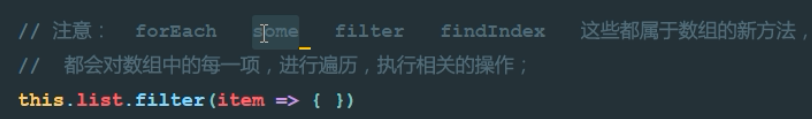

### 3.3.2、some

通过返回true停止遍历

### 3.3.3、filter

进行过滤，得到新数组

### 3.3.4、findIndex

找到对象的索引

### 3.3.5、String.prototype.includes


### 3.3.6、contains

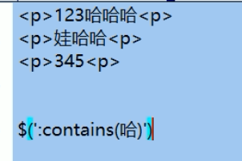

返回包含“哈”的标签

### 3.3.7、padStart(length,fillString)填充字符串


## 3.4、Vue调试工具`vue-devtools`的安装步骤和使用

[Vue.js devtools - 翻墙安装方式 - 推荐](https://chrome.google.com/webstore/detail/vuejs-devtools/nhdogjmejiglipccpnnnanhbledajbpd?hl=zh-CN)

第二种方式


**将扩展包放到一个不会移动的目录**


**打开扩展程序**


**打开开发者模式**


**加载已解压的扩展程序**


**找到扩展程序**

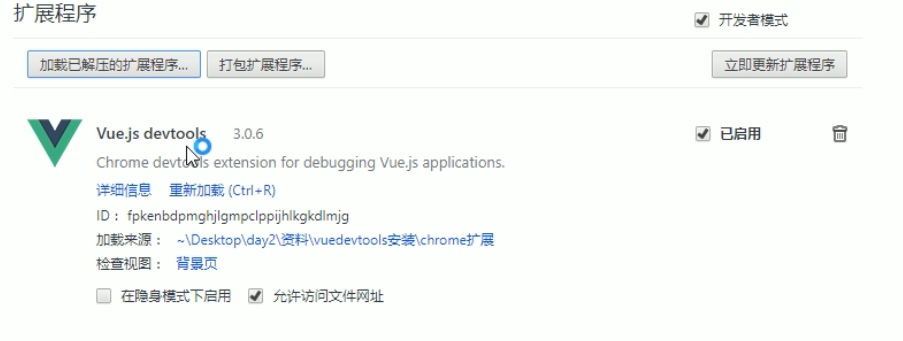


**可见加载来源**


**确保勾选了选项**


# 5filter(只可在插值和v-bind表达式中使用)

> 概念：Vue.js 允许你自定义过滤器，**可被用作一些常见的文本格式化**。
>
> 过滤器可以用在两个地方：**mustache 插值和 v-bind 表达式**。过滤器应该被添加在 JavaScript 表达式的尾部，由“管道”符指示；

## 5.1、私有过滤器

1. HTML元素：

```
<td>{{item.ctime | dataFormat('yyyy-mm-dd')}}</td>

```

1. 私有 `filters` 定义方式：

```
filters: { // 私有局部过滤器，只能在 当前 VM 对象所控制的 View 区域进行使用
    dataFormat(input, pattern = "") { // 在参数列表中 通过 pattern="" 来指定形参默认值，防止报错
      var dt = new Date(input);
      // 获取年月日
      var y = dt.getFullYear();
      var m = (dt.getMonth() + 1).toString().padStart(2, '0');
      var d = dt.getDate().toString().padStart(2, '0');

      // 如果 传递进来的字符串类型，转为小写之后，等于 yyyy-mm-dd，那么就返回 年-月-日
      // 否则，就返回  年-月-日 时：分：秒
      if (pattern.toLowerCase() === 'yyyy-mm-dd') {
        return `${y}-${m}-${d}`;
      } else {
        // 获取时分秒
        var hh = dt.getHours().toString().padStart(2, '0');
        var mm = dt.getMinutes().toString().padStart(2, '0');
        var ss = dt.getSeconds().toString().padStart(2, '0');
        return `${y}-${m}-${d} ${hh}:${mm}:${ss}`;
      }
    }
  }
```


> 使用ES6中的字符串新方法 String.prototype.padStart(maxLength, fillString='') 或 String.prototype.padEnd(maxLength, fillString='')来填充字符串；


**可以定义多个过滤器**


## 5.2、全局过滤器

```javascript
// 定义一个全局过滤器
//input为管道符传递过来的数据
Vue.filter('dataFormat', function (input, pattern = '') {
  var dt = new Date(input);
  // 获取年月日
  var y = dt.getFullYear();
  var m = (dt.getMonth() + 1).toString().padStart(2, '0');
  var d = dt.getDate().toString().padStart(2, '0');

  // 如果 传递进来的字符串类型，转为小写之后，等于 yyyy-mm-dd，那么就返回 年-月-日
  // 否则，就返回  年-月-日 时：分：秒
  if (pattern.toLowerCase() === 'yyyy-mm-dd') {
    return `${y}-${m}-${d}`;
  } else {
    // 获取时分秒
    var hh = dt.getHours().toString().padStart(2, '0');
    var mm = dt.getMinutes().toString().padStart(2, '0');
    var ss = dt.getSeconds().toString().padStart(2, '0');
    return `${y}-${m}-${d} ${hh}:${mm}:${ss}`;
  }
});
```


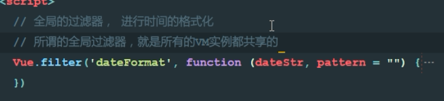

> **注意：当有局部和全局两个名称相同的过滤器时候，会以就近原则进行调用，即：局部过滤器优先于全局过滤器被调用！**


**msg为管道符传递过来的数据**


**字符串替换，上述方式只是替换了第一匹配的字符串**


**使用正则替换**


## 5.3、filter传递参数


5.4、传递多个参数


## 5.5、多次调用过滤器


## 5.6、时间过滤器


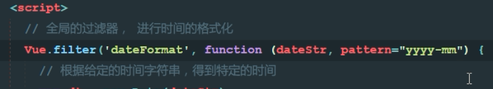


**给形参设置默认值，防止出现undefined的错误**


# 6、键盘指令@keyup修饰符以及自定义键盘修饰符

## 6.1、1.x中自定义键盘修饰符【了解即可】

```
Vue.directive('on').keyCodes.f2 = 113;

```


## 6.2、[2.x中自定义键盘修饰符](https://cn.vuejs.org/v2/guide/events.html#键值修饰符)

1. 通过`Vue.config.keyCodes.名称 = 按键值`来自定义案件修饰符的别名：

```javascript
Vue.config.keyCodes.f2 = 113;

```

1. 使用自定义的按键修饰符：

```html
<input type="text" v-model="name" @keyup.f2="add">

```

## 6.3、@keyup键盘事件


## 6.4、按键修饰符.enter


## 6.5、使用码值替换修饰符


**F2的码值为 113**

## 6.6、自定义全局按键修饰符 keyCodes

> Vue.config.keyCodes.f2 = 113;


## 6.7、@on鼠标点击指令


## 8、[自定义指令:directive](https://cn.vuejs.org/v2/guide/custom-directive.html)

1. 自定义全局和局部的 自定义指令：

```javascript
    // 自定义全局指令 v-focus，为绑定的元素自动获取焦点：
    Vue.directive('focus', {
      inserted: function (el) { // inserted 表示被绑定元素插入父节点时调用
        el.focus();
      }
    });
    // 自定义局部指令 v-color 和 v-font-weight，为绑定的元素设置指定的字体颜色 和 字体粗细：
      directives: {
        color: { // 为元素设置指定的字体颜色
          bind(el, binding) {
            el.style.color = binding.value;
          }
        },
        'font-weight': function (el, binding2) { // 自定义指令的简写形式，等同于定义了 bind 和 update 两个钩子函数
          el.style.fontWeight = binding2.value;
        }
      }
```

1. 自定义指令的使用方式：

```
<input type="text" v-model="searchName" v-focus v-color="'red'" v-font-weight="900">

```


## 8.1、自定义指令的钩子函数


##  8.2、bind钩子函数


## 8.3、inserted钩子函数


## 8.4、注意js事件与style样式插入DOM的时机


**例如focus事件，只有插入DOM以后调用才有意义**

> 内存中调用bind函数，页面中调用inserted


## 8.5、指令传参


## 8.6、私有（局部）指令


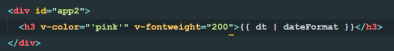

## 8.7、函数简写


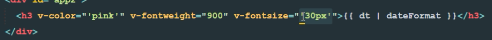


## Vue 1.x 中 自定义元素指令【已废弃,了解即可】

```
Vue.elementDirective('red-color', {
  bind: function () {
    this.el.style.color = 'red';
  }
});
```

使用方式：

```
<red-color>1232</red-color>
```

# 9、[vue实例的生命周期](https://cn.vuejs.org/v2/guide/instance.html#实例生命周期)

- 什么是生命周期：从Vue实例创建、运行、到销毁期间，总是伴随着各种各样的事件，这些事件，统称为生命周期！
- [生命周期钩子](https://cn.vuejs.org/v2/api/#选项-生命周期钩子)：就是生命周期事件的别名而已；
- 生命周期钩子 = 生命周期函数 = 生命周期事件
- 主要的生命周期函数分类：
- 创建期间的生命周期函数：
  - beforeCreate：实例刚在内存中被创建出来，此时，还没有初始化好 data 和 methods 属性
  - created：实例已经在内存中创建OK，此时 data 和 methods 已经创建OK，此时还没有开始 编译模板
  - beforeMount：此时已经完成了模板的编译，但是还没有挂载到页面中
  - mounted：此时，已经将编译好的模板，挂载到了页面指定的容器中显示
- 运行期间的生命周期函数：
  - beforeUpdate：状态更新之前执行此函数， 此时 data 中的状态值是最新的，但是界面上显示的 数据还是旧的，因为此时还没有开始重新渲染DOM节点
  - updated：实例更新完毕之后调用此函数，此时 data 中的状态值 和 界面上显示的数据，都已经完成了更新，界面已经被重新渲染好了！
- 销毁期间的生命周期函数：
  - beforeDestroy：实例销毁之前调用。在这一步，实例仍然完全可用。
  - destroyed：Vue 实例销毁后调用。调用后，Vue 实例指示的所有东西都会解绑定，所有的事件监听器会被移除，所有的子实例也会被销毁。

## 9.1、new Vue()


## 9.2、Init Events&LifeCycle


## 9.3、beforeCreate()


***此时是拿不到data里面的数据的。***


***此时是拿不到methods里面的方法的。***


## 9.4、Init Injections & reactivity


## 9.5、created()


**最早在这个钩子函数中操作data中数据或访问methods中的方法**

## 9.6、模板编译过程


**此时还在内存中，没有挂载到页面**


## 9.7、beforeMount()


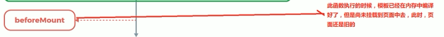

## 9.8、将模板渲染到页面


## 9.9、mounted()


## 9.10、回顾


## 9.11、beforeUpdate()

	

> When data changes，当数据改变时触发此事件
>
> 最少触发0次


> 关注内存中数据更新后，VM有么有做数据同步，将数据同步到页面


> 触发事件

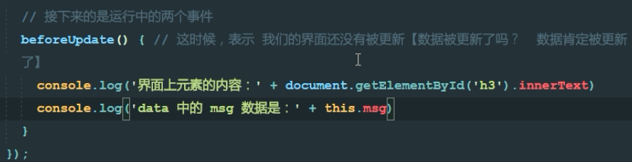


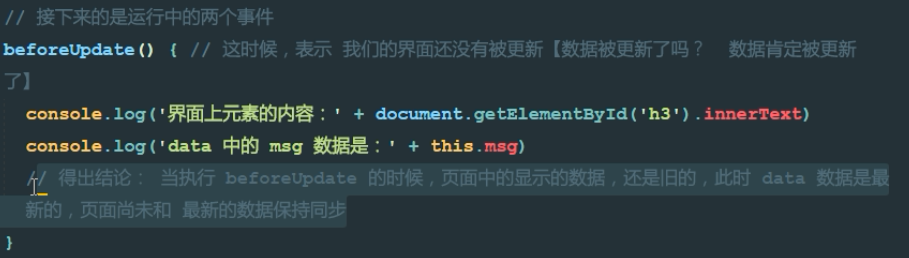


调用此方法后进入虚拟DOM的重新渲染和挂载

## 9.12、Virtual DOM re-render and patch


## 9.13、updated()


## 9.14、beforeDestroy()

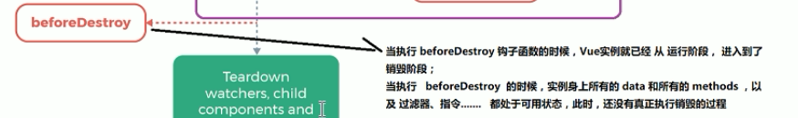

## 9.15、destroyed()


# 4、[vue-resource 实现 get, post, jsonp请求](https://github.com/pagekit/vue-resource)

除了 vue-resource 之外，还可以使用 `axios` 的第三方包实现实现数据的请求

1. 之前的学习中，如何发起数据请求？
2. 常见的数据请求类型？  get  post jsonp
3. 测试的URL请求资源地址：

- get请求地址： http://vue.studyit.io/api/getlunbo
- post请求地址：http://vue.studyit.io/api/post
- jsonp请求地址：http://vue.studyit.io/api/jsonp

1. JSONP的实现原理

- 由于浏览器的安全性限制，不允许AJAX访问 协议不同、域名不同、端口号不同的 数据接口，浏览器认为这种访问不安全；
- 可以通过动态创建script标签的形式，把script标签的src属性，指向数据接口的地址，因为script标签不存在跨域限制，这种数据获取方式，称作JSONP（注意：根据JSONP的实现原理，知晓，JSONP只支持Get请求）；
- 具体实现过程：

- 先在客户端定义一个回调方法，预定义对数据的操作；
- 再把这个回调方法的名称，通过URL传参的形式，提交到服务器的数据接口；
- 服务器数据接口组织好要发送给客户端的数据，再拿着客户端传递过来的回调方法名称，拼接出一个调用这个方法的字符串，发送给客户端去解析执行；
- 客户端拿到服务器返回的字符串之后，当作Script脚本去解析执行，这样就能够拿到JSONP的数据了；

- 带大家通过 Node.js ，来手动实现一个JSONP的请求例子；

```
    const http = require('http');
    // 导入解析 URL 地址的核心模块
    const urlModule = require('url');

    const server = http.createServer();
    // 监听 服务器的 request 请求事件，处理每个请求
    server.on('request', (req, res) => {
      const url = req.url;

      // 解析客户端请求的URL地址
      var info = urlModule.parse(url, true);

      // 如果请求的 URL 地址是 /getjsonp ，则表示要获取JSONP类型的数据
      if (info.pathname === '/getjsonp') {
        // 获取客户端指定的回调函数的名称
        var cbName = info.query.callback;
        // 手动拼接要返回给客户端的数据对象
        var data = {
          name: 'zs',
          age: 22,
          gender: '男',
          hobby: ['吃饭', '睡觉', '运动']
        }
        // 拼接出一个方法的调用，在调用这个方法的时候，把要发送给客户端的数据，序列化为字符串，作为参数传递给这个调用的方法：
        var result = `${cbName}(${JSON.stringify(data)})`;
        // 将拼接好的方法的调用，返回给客户端去解析执行
        res.end(result);
      } else {
        res.end('404');
      }
    });

    server.listen(3000, () => {
      console.log('server running at http://127.0.0.1:3000');
    });
```

1. vue-resource 的配置步骤：

- 直接在页面中，通过`script`标签，引入 `vue-resource` 的脚本文件；
- 注意：引用的先后顺序是：先引用 `Vue` 的脚本文件，再引用 `vue-resource` 的脚本文件；

1. 发送get请求：

```
getInfo() { // get 方式获取数据
  this.$http.get('http://127.0.0.1:8899/api/getlunbo').then(res => {
    console.log(res.body);
  })
}
```

1. 发送post请求：

```
postInfo() {
  var url = 'http://127.0.0.1:8899/api/post';
  // post 方法接收三个参数：
  // 参数1： 要请求的URL地址
  // 参数2： 要发送的数据对象
  // 参数3： 指定post提交的编码类型为 application/x-www-form-urlencoded
  this.$http.post(url, { name: 'zs' }, { emulateJSON: true }).then(res => {
    console.log(res.body);
  });
}
```

1. 发送JSONP请求获取数据：

```
jsonpInfo() { // JSONP形式从服务器获取数据
  var url = 'http://127.0.0.1:8899/api/jsonp';
  this.$http.jsonp(url).then(res => {
    console.log(res.body);
  });
}
```

## 配置本地数据库和数据接口API

1. 先解压安装 `PHPStudy`;
2. 解压安装 `Navicat` 这个数据库可视化工具，并激活；
3. 打开 `Navicat` 工具，新建空白数据库，名为 `dtcmsdb4`;
4. 双击新建的数据库，连接上这个空白数据库，在新建的数据库上`右键` -> `运行SQL文件`，选择并执行 `dtcmsdb4.sql` 这个数据库脚本文件；如果执行不报错，则数据库导入完成；
5. 进入文件夹 `vuecms3_nodejsapi` 内部，执行 `npm i` 安装所有的依赖项；
6. 先确保本机安装了 `nodemon`, 没有安装，则运行 `npm i nodemon -g` 进行全局安装，安装完毕后，进入到 `vuecms3_nodejsapi`目录 -> `src`目录 -> 双击运行 `start.bat`
7. 如果API启动失败，请检查 PHPStudy 是否正常开启，同时，检查 `app.js` 中第 `14行` 中数据库连接配置字符串是否正确；PHPStudy 中默认的 用户名是root，默认的密码也是root

## 品牌管理改造

### 展示品牌列表

### 添加品牌数据

### 删除品牌数据

## [Vue中的动画](https://cn.vuejs.org/v2/guide/transitions.html)

为什么要有动画：动画能够提高用户的体验，帮助用户更好的理解页面中的功能；

### 使用过渡类名

1. HTML结构：

```
<div id="app">
    <input type="button" value="动起来" @click="myAnimate">
    <!-- 使用 transition 将需要过渡的元素包裹起来 -->
    <transition name="fade">
      <div v-show="isshow">动画哦</div>
    </transition>
  </div>
```

1. VM 实例：

```
// 创建 Vue 实例，得到 ViewModel
var vm = new Vue({
  el: '#app',
  data: {
    isshow: false
  },
  methods: {
    myAnimate() {
      this.isshow = !this.isshow;
    }
  }
});
```

1. 定义两组类样式：

```
/* 定义进入和离开时候的过渡状态 */
    .fade-enter-active,
    .fade-leave-active {
      transition: all 0.2s ease;
      position: absolute;
    }

    /* 定义进入过渡的开始状态 和 离开过渡的结束状态 */
    .fade-enter,
    .fade-leave-to {
      opacity: 0;
      transform: translateX(100px);
    }
```

### [使用第三方 CSS 动画库](https://cn.vuejs.org/v2/guide/transitions.html#自定义过渡类名)

1. 导入动画类库：

```
<link rel="stylesheet" type="text/css" href="./lib/animate.css">
```

1. 定义 transition 及属性：

```
<transition
	enter-active-class="fadeInRight"
    leave-active-class="fadeOutRight"
    :duration="{ enter: 500, leave: 800 }">
  	<div class="animated" v-show="isshow">动画哦</div>
</transition>
```

### 使用动画钩子函数

1. 定义 transition 组件以及三个钩子函数：

```
<div id="app">
    <input type="button" value="切换动画" @click="isshow = !isshow">
    <transition
    @before-enter="beforeEnter"
    @enter="enter"
    @after-enter="afterEnter">
      <div v-if="isshow" class="show">OK</div>
    </transition>
  </div>
```

1. 定义三个 methods 钩子方法：

```
methods: {
        beforeEnter(el) { // 动画进入之前的回调
          el.style.transform = 'translateX(500px)';
        },
        enter(el, done) { // 动画进入完成时候的回调
          el.offsetWidth;
          el.style.transform = 'translateX(0px)';
          done();
        },
        afterEnter(el) { // 动画进入完成之后的回调
          this.isshow = !this.isshow;
        }
      }
```

1. 定义动画过渡时长和样式：

```
.show{
      transition: all 0.4s ease;
    }
```

### [v-for 的列表过渡](https://cn.vuejs.org/v2/guide/transitions.html#列表的进入和离开过渡)

1. 定义过渡样式：

```
<style>
    .list-enter,
    .list-leave-to {
      opacity: 0;
      transform: translateY(10px);
    }

    .list-enter-active,
    .list-leave-active {
      transition: all 0.3s ease;
    }
</style>
```

1. 定义DOM结构，其中，需要使用 transition-group 组件把v-for循环的列表包裹起来：

```
  <div id="app">
    <input type="text" v-model="txt" @keyup.enter="add">

    <transition-group tag="ul" name="list">
      <li v-for="(item, i) in list" :key="i">{{item}}</li>
    </transition-group>
  </div>
```

1. 定义 VM中的结构：

```
    // 创建 Vue 实例，得到 ViewModel
    var vm = new Vue({
      el: '#app',
      data: {
        txt: '',
        list: [1, 2, 3, 4]
      },
      methods: {
        add() {
          this.list.push(this.txt);
          this.txt = '';
        }
      }
    });
```

### 列表的排序过渡

`<transition-group>` 组件还有一个特殊之处。不仅可以进入和离开动画，**还可以改变定位**。要使用这个新功能只需了解新增的 `v-move` 特性，**它会在元素的改变定位的过程中应用**。

- `v-move` 和 `v-leave-active` 结合使用，能够让列表的过渡更加平缓柔和：

```
.v-move{
  transition: all 0.8s ease;
}
.v-leave-active{
  position: absolute;
}
```


## 相关文章

1. [vue.js 1.x 文档](https://v1-cn.vuejs.org/)
2. [vue.js 2.x 文档](https://cn.vuejs.org/)
3. [String.prototype.padStart(maxLength, fillString)](http://www.css88.com/archives/7715)
4. [js 里面的键盘事件对应的键码](http://www.cnblogs.com/wuhua1/p/6686237.html)
5. [pagekit/vue-resource](https://github.com/pagekit/vue-resource)
6. [navicat如何导入sql文件和导出sql文件](https://jingyan.baidu.com/article/a65957f4976aad24e67f9b9b.html)
7. [贝塞尔在线生成器](http://cubic-bezier.com/#.4,-0.3,1,.33)