#  1、定义Vue组件

什么是组件： 组件的出现，就是为了拆分Vue实例的代码量的，能够让我们以不同的组件，来划分不同的功能模块，将来我们需要什么样的功能，就可以去调用对应的组件即可；
组件化和模块化的不同：

- 模块化： 是从代码逻辑的角度进行划分的；方便代码分层开发，保证每个功能模块的职能单一；
- 组件化： 是从UI界面的角度进行划分的；前端的组件化，方便UI组件的重用；

## 1.1、全局组件定义的三种方式

### 1.1.1、使用 Vue.extend 配合 Vue.component 方法：

```
var login = Vue.extend({
	template: '<h1>登录</h1>'
});
Vue.component('login', login);
```


**注意：此时存在问题，不可以使用驼峰命名法调用组件**


### 1.1.2、直接使用 Vue.component 方法：

```
Vue.component('register', {
      template: '<h1>注册</h1>'
    });
```


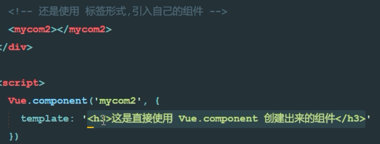

不方便书写，也没有提示


### 1.1.3、template标签


方便引用，使用#即可访问


### 1.1.4、将模板字符串，定义到script标签种：

```
<script id="tmpl" type="x-template">
      <div><a href="#">登录</a> | <a href="#">注册</a></div>
    </script>
```

同时，需要使用 Vue.component 来定义组件：

```
Vue.component('account', {
      template: '#tmpl'
    });
```

> 注意： 组件中的DOM结构，**有且只能有唯一的根元素（Root Element）来进行包裹**！


## 1.2、VM的解构


新加一个components元素


## 1.3、私有组件


也可以引用外部的template


# 2、组件中展示数据和响应事件

1. 在组件中，`data`需要被定义为一个方法，例如：

```
Vue.component('account', {
      template: '#tmpl',
      data() {
        return {
          msg: '大家好！'
        }
      },
      methods:{
        login(){
          alert('点击了登录按钮');
        }
      }
    });
```

1. 在子组件中，如果将模板字符串，定义到了script标签中，那么，要访问子组件身上的`data`属性中的值，需要使用`this`来访问；


## 2.1【重点】为什么组件中的data属性必须定义为一个方法并返回一个对象


1. 通过计数器案例演示


此时的dataObje是一个公用的对象


共享了dataObj


解决了共享问题


## 2.2、使用`components`属性定义局部子组件

1. 组件实例定义方式：

```
<script>
    // 创建 Vue 实例，得到 ViewModel
    var vm = new Vue({
      el: '#app',
      data: {},
      methods: {},
      components: { // 定义子组件
        account: { // account 组件
          template: '<div><h1>这是Account组件{{name}}</h1><login></login></div>', // 在这里使用定义的子组件
          components: { // 定义子组件的子组件
            login: { // login 组件
              template: "<h3>这是登录组件</h3>"
            }
          }
        }
      }
    });
  </script>
```

1. 引用组件：

```
<div id="app">
    <account></account>
  </div>
```

## 2.3、使用`flag`标识符结合`v-if`和`v-else`切换组件

1. 页面结构：

```
<div id="app">
    <input type="button" value="toggle" @click="flag=!flag">
    <my-com1 v-if="flag"></my-com1>
    <my-com2 v-else="flag"></my-com2>
  </div>
```

1. Vue实例定义：

```
<script>
    Vue.component('myCom1', {
      template: '<h3>奔波霸</h3>'
    })

    Vue.component('myCom2', {
      template: '<h3>霸波奔</h3>'
    })

    // 创建 Vue 实例，得到 ViewModel
    var vm = new Vue({
      el: '#app',
      data: {
        flag: true
      },
      methods: {}
    });
  </script>
```


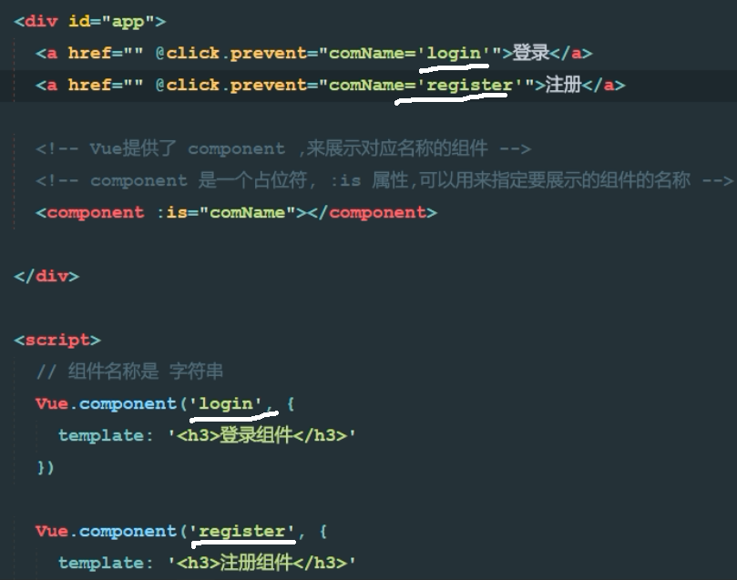

​	通过:is属性双向绑定了data中的comName属性

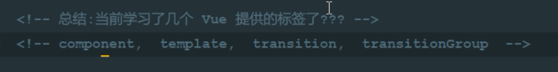


## 2.4、使用`:is`属性来切换不同的子组件,并添加切换动画


1. 组件实例定义方式：

```
  // 登录组件
    const login = Vue.extend({
      template: `<div>
        <h3>登录组件</h3>
      </div>`
    });
    Vue.component('login', login);

    // 注册组件
    const register = Vue.extend({
      template: `<div>
        <h3>注册组件</h3>
      </div>`
    });
    Vue.component('register', register);

    // 创建 Vue 实例，得到 ViewModel
    var vm = new Vue({
      el: '#app',
      data: { comName: 'login' },
      methods: {}
    });
```

1. 使用`component`标签，来引用组件，并通过`:is`属性来指定要加载的组件：

```
  <div id="app">
    <a href="#" @click.prevent="comName='login'">登录</a>
    <a href="#" @click.prevent="comName='register'">注册</a>
    <hr>
    <transition mode="out-in">
      <component :is="comName"></component>
    </transition>
  </div>
```

1. 添加切换样式：

```
  <style>
    .v-enter,
    .v-leave-to {
      opacity: 0;
      transform: translateX(30px);
    }

    .v-enter-active,
    .v-leave-active {
      position: absolute;
      transition: all 0.3s ease;
    }

    h3{
      margin: 0;
    }
  </style>
```


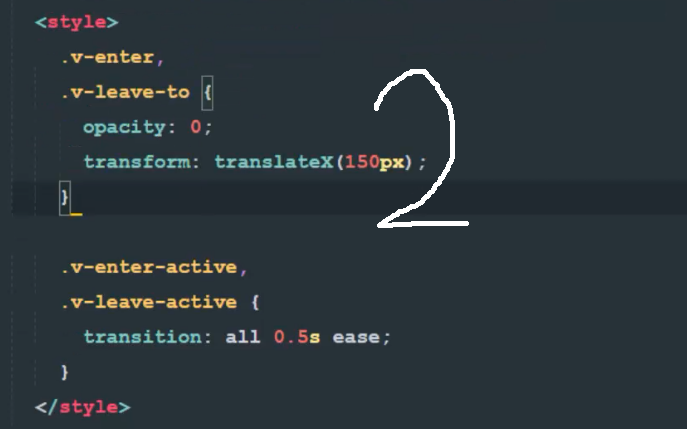

设置动画模式


# 3、传值

## 3.1、父组件向子组件传值

1. 组件实例定义方式，注意：一定要使用`props`属性来定义父组件传递过来的数据


```javascript
<script>
    // 创建 Vue 实例，得到 ViewModel
    var vm = new Vue({
      el: '#app',
      data: {
        msg: '这是父组件中的消息'
      },
      components: {
        son: {
          template: '<h1>这是子组件 --- {{finfo}}</h1>',
          props: ['finfo']
        }
      }
    });
  </script>
```

1. 使用`v-bind`或简化指令，将数据传递到子组件中：

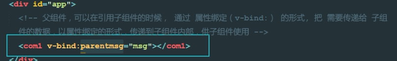

```
<div id="app">
    <son :finfo="msg"></son>
  </div>
```


## 3.2、子组件向父组件传值

1. 原理：父组件将方法的引用，传递到子组件内部，子组件在内部调用父组件传递过来的方法，同时把要发送给父组件的数据，在调用方法的时候当作参数传递进去；
2. 父组件将方法的引用传递给子组件，其中，`getMsg`是父组件中`methods`中定义的方法名称，`func`是子组件调用传递过来方法时候的方法名称

```
<son @func="getMsg"></son>
```

1. 子组件内部通过`this.$emit('方法名', 要传递的数据)`方式，来调用父组件中的方法，同时把数据传递给父组件使用

```
<div id="app">
    <!-- 引用父组件 -->
    <son @func="getMsg"></son>

    <!-- 组件模板定义 -->
    <script type="x-template" id="son">
      <div>
        <input type="button" value="向父组件传值" @click="sendMsg" />
      </div>
    </script>
  </div>

  <script>
    // 子组件的定义方式
    Vue.component('son', {
      template: '#son', // 组件模板Id
      methods: {
        sendMsg() { // 按钮的点击事件
          this.$emit('func', 'OK'); // 调用父组件传递过来的方法，同时把数据传递出去
        }
      }
    });

    // 创建 Vue 实例，得到 ViewModel
    var vm = new Vue({
      el: '#app',
      data: {},
      methods: {
        getMsg(val){ // 子组件中，通过 this.$emit() 实际调用的方法，在此进行定义
          alert(val);
        }
      }
    });
  </script>
```


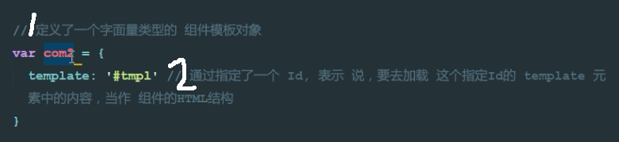


简写引入组件com2


> @func="show" ——>func:自定义的方法名称，show指父组件的方法名称
>
> @func="show()"——>表示将show()方法返回的值赋给func


传递对象

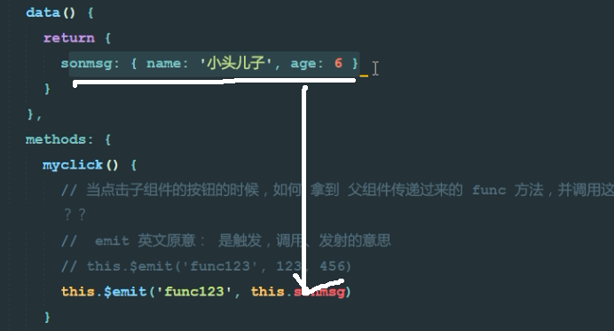


# 4、评论列表案例

目标：主要练习父子组件之间传值

## 4.1、使用 `this.$refs` 来获取元素和组件

```html
  <div id="app">
    <div>
      <input type="button" value="获取元素内容" @click="getElement" />
      <!-- 使用 ref 获取元素 -->
      <h1 ref="myh1">这是一个大大的H1</h1>

      <hr>
      <!-- 使用 ref 获取子组件 -->
      <my-com ref="mycom"></my-com>
    </div>
  </div>

  <script>
    Vue.component('my-com', {
      template: '<h5>这是一个子组件</h5>',
      data() {
        return {
          name: '子组件'
        }
      }
    });

    // 创建 Vue 实例，得到 ViewModel
    var vm = new Vue({
      el: '#app',
      data: {},
      methods: {
        getElement() {
          // 通过 this.$refs 来获取元素
          console.log(this.$refs.myh1.innerText);
          // 通过 this.$refs 来获取组件
          console.log(this.$refs.mycom.name);
        }
      }
    });
  </script>
```

### 

### 4.1.1、ref引用类型


## 4.2、定义子组件


## 4.3、显示主组件的信息


# 5、什么是路由

1. 对于普通的网站，所有的超链接都是URL地址，所有的URL地址都对应服务器上对应的资源；
2. 对于单页面应用程序来说，主要通过URL中的hash(#号)来实现不同页面之间的切换，同时，hash有一个特点：HTTP请求中不会包含hash相关的内容；所以，单页面程序中的页面跳转主要用hash实现；
3. 在单页面应用程序中，这种通过hash改变来切换页面的方式，称作前端路由（区别于后端路由）；

## 5.1、在 vue 中使用 vue-router

### 5.1.1、导入 vue-router 组件类库：

```
<!-- 1. 导入 vue-router 组件类库 -->
  <script src="./lib/vue-router-2.7.0.js"></script>
```


### 5.1.2、使用 router-link 组件来导航


```
<!-- 2. 使用 router-link 组件来导航 -->
<router-link to="/login">登录</router-link>
<router-link to="/register">注册</router-link>
```


### 5.1.3、使用 router-view 组件来显示匹配到的组件


```
<!-- 3. 使用 router-view 组件来显示匹配到的组件 -->
<router-view></router-view>
```

### 5.1.4、创建使用`Vue.extend`创建组件


```
    // 4.1 使用 Vue.extend 来创建登录组件
    var login = Vue.extend({
      template: '<h1>登录组件</h1>'
    });

    // 4.2 使用 Vue.extend 来创建注册组件
    var register = Vue.extend({
      template: '<h1>注册组件</h1>'
    });
```

### 5.1.5、创建一个路由 router 实例，通过 routers 属性来定义路由匹配规则

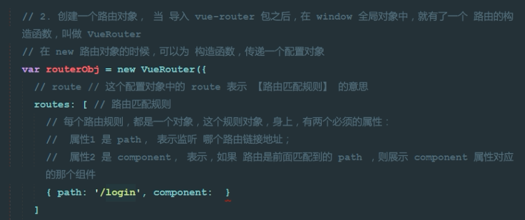


```
// 5. 创建一个路由 router 实例，通过 routers 属性来定义路由匹配规则
    var router = new VueRouter({
      routes: [
        { path: '/login', component: login },
        { path: '/register', component: register }
      ]
    });
```

### 5.1.6、使用 router 属性来使用路由规则


```
// 6. 创建 Vue 实例，得到 ViewModel
    var vm = new Vue({
      el: '#app',
      router: router // 使用 router 属性来使用路由规则
    });
```

## 5.2、redirect


## 5.3、设置路由高亮


### 5.3.1、使用第三方css


## 5.4、设置路由切换动效


## 5.5、在路由规则中定义参数

### 5.5.1、方式一


1. 在规则中定义参数：

```
{ path: '/register/:id', component: register }
```


​	


### 5.1.2、方式二


> 通过 `this.$route.params`来获取路由中的参数：


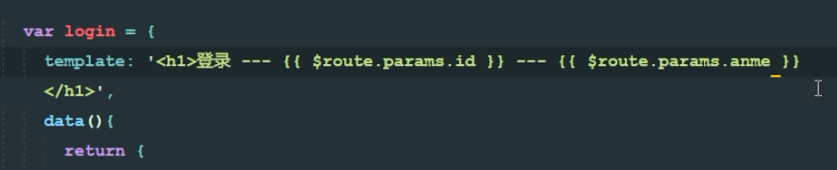


```
var register = Vue.extend({
      template: '<h1>注册组件 --- {{this.$route.params.id}}</h1>'
    });
```


## 5.6、使用 `children` 属性实现路由嵌套


​		


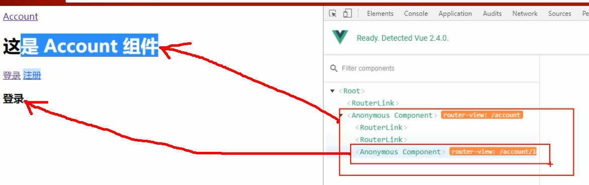


```
  <div id="app">
    <router-link to="/account">Account</router-link>

    <router-view></router-view>
  </div>

  <script>
    // 父路由中的组件
    const account = Vue.extend({
      template: `<div>
        这是account组件
        <router-link to="/account/login">login</router-link> | 
        <router-link to="/account/register">register</router-link>
        <router-view></router-view>
      </div>`
    });

    // 子路由中的 login 组件
    const login = Vue.extend({
      template: '<div>登录组件</div>'
    });

    // 子路由中的 register 组件
    const register = Vue.extend({
      template: '<div>注册组件</div>'
    });

    // 路由实例
    var router = new VueRouter({
      routes: [
        { path: '/', redirect: '/account/login' }, // 使用 redirect 实现路由重定向
        {
          path: '/account',
          component: account,
          children: [ // 通过 children 数组属性，来实现路由的嵌套
            { path: 'login', component: login }, // 注意，子路由的开头位置，不要加 / 路径符
            { path: 'register', component: register }
          ]
        }
      ]
    });

    // 创建 Vue 实例，得到 ViewModel
    var vm = new Vue({
      el: '#app',
      data: {},
      methods: {},
      components: {
        account
      },
      router: router
    });
  </script>
```


## 5.7、命名视图实现经典布局


1. 标签代码结构：

```
<div id="app">
    <router-view></router-view>
    <div class="content">
      <router-view name="a"></router-view>
      <router-view name="b"></router-view>
    </div>
  </div>
```

1. JS代码：

```
<script>
    var header = Vue.component('header', {
      template: '<div class="header">header</div>'
    });

    var sidebar = Vue.component('sidebar', {
      template: '<div class="sidebar">sidebar</div>'
    });

    var mainbox = Vue.component('mainbox', {
      template: '<div class="mainbox">mainbox</div>'
    });

    // 创建路由对象
    var router = new VueRouter({
      routes: [
        {
          path: '/', components: {
            default: header,
            a: sidebar,
            b: mainbox
          }
        }
      ]
    });

    // 创建 Vue 实例，得到 ViewModel
    var vm = new Vue({
      el: '#app',
      data: {},
      methods: {},
      router
    });
  </script>
```

1. CSS 样式：

```
  <style>
    .header {
      border: 1px solid red;
    }

    .content{
      display: flex;
    }
    .sidebar {
      flex: 2;
      border: 1px solid green;
      height: 500px;
    }
    .mainbox{
      flex: 8;
      border: 1px solid blue;
      height: 500px;
    }
  </style>
```


# 6、复习

## 6.1、父组件给子组件传值


## 6.2、子组件给父组件传值


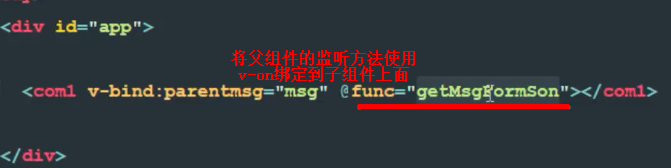


## 6.3、基本路由的使用


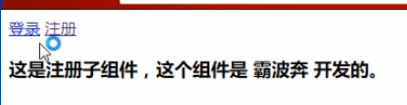


## 6.4、keyup


## 6.5、`watch`属性的使用


考虑一个问题：想要实现 `名` 和 `姓` 两个文本框的内容改变，则全名的文本框中的值也跟着改变；（用以前的知识如何实现？？？）

1. 监听`data`中属性的改变：

```
<div id="app">
    <input type="text" v-model="firstName"> +
    <input type="text" v-model="lastName"> =
    <span>{{fullName}}</span>
  </div>

  <script>
    // 创建 Vue 实例，得到 ViewModel
    var vm = new Vue({
      el: '#app',
      data: {
        firstName: 'jack',
        lastName: 'chen',
        fullName: 'jack - chen'
      },
      methods: {},
      watch: {
        'firstName': function (newVal, oldVal) { // 第一个参数是新数据，第二个参数是旧数据
          this.fullName = newVal + ' - ' + this.lastName;
        },
        'lastName': function (newVal, oldVal) {
          this.fullName = this.firstName + ' - ' + newVal;
        }
      }
    });
  </script>
```

1. 监听路由对象的改变：


```
<div id="app">
    <router-link to="/login">登录</router-link>
    <router-link to="/register">注册</router-link>

    <router-view></router-view>
  </div>

  <script>
    var login = Vue.extend({
      template: '<h1>登录组件</h1>'
    });

    var register = Vue.extend({
      template: '<h1>注册组件</h1>'
    });

    var router = new VueRouter({
      routes: [
        { path: "/login", component: login },
        { path: "/register", component: register }
      ]
    });

    // 创建 Vue 实例，得到 ViewModel
    var vm = new Vue({
      el: '#app',
      data: {},
      methods: {},
      router: router,
      watch: {
        '$route': function (newVal, oldVal) {
          if (newVal.path === '/login') {
            console.log('这是登录组件');
          }
        }
      }
    });
  </script>

```


## 6.6、`computed`计算属性的使用


1. 默认只有`getter`的计算属性：

```
<div id="app">
    <input type="text" v-model="firstName"> +
    <input type="text" v-model="lastName"> =
    <span>{{fullName}}</span>
  </div>

  <script>
    // 创建 Vue 实例，得到 ViewModel
    var vm = new Vue({
      el: '#app',
      data: {
        firstName: 'jack',
        lastName: 'chen'
      },
      methods: {},
      computed: { // 计算属性； 特点：当计算属性中所以来的任何一个 data 属性改变之后，都会重新触发 本计算属性 的重新计算，从而更新 fullName 的值
        fullName() {
          return this.firstName + ' - ' + this.lastName;
        }
      }
    });
  </script>

```

1. 定义有`getter`和`setter`的计算属性：

```
<div id="app">
    <input type="text" v-model="firstName">
    <input type="text" v-model="lastName">
    <!-- 点击按钮重新为 计算属性 fullName 赋值 -->
    <input type="button" value="修改fullName" @click="changeName">

    <span>{{fullName}}</span>
  </div>

  <script>
    // 创建 Vue 实例，得到 ViewModel
    var vm = new Vue({
      el: '#app',
      data: {
        firstName: 'jack',
        lastName: 'chen'
      },
      methods: {
        changeName() {
          this.fullName = 'TOM - chen2';
        }
      },
      computed: {
        fullName: {
          get: function () {
            return this.firstName + ' - ' + this.lastName;
          },
          set: function (newVal) {
            var parts = newVal.split(' - ');
            this.firstName = parts[0];
            this.lastName = parts[1];
          }
        }
      }
    });
  </script>

```

## `watch`、`computed`和`methods`之间的对比

1. `computed`属性的结果会被缓存，除非依赖的响应式属性变化才会重新计算。主要当作属性来使用；
2. `methods`方法表示一个具体的操作，主要书写业务逻辑；
3. `watch`一个对象，键是需要观察的表达式，值是对应回调函数。主要用来监听某些特定数据的变化，从而进行某些具体的业务逻辑操作；可以看作是`computed`和`methods`的结合体；适合监控虚拟数据

## `nrm`的安装使用

作用：提供了一些最常用的NPM包镜像地址，能够让我们快速的切换安装包时候的服务器地址；
什么是镜像：原来包刚一开始是只存在于国外的NPM服务器，但是由于网络原因，经常访问不到，这时候，我们可以在国内，创建一个和官网完全一样的NPM服务器，只不过，数据都是从人家那里拿过来的，除此之外，使用方式完全一样；


1. 运行`npm i nrm -g`全局安装`nrm`包；
2. 使用`nrm ls`查看当前所有可用的镜像源地址以及当前所使用的镜像源地址；
3. 使用`nrm use npm`或`nrm use taobao`切换不同的镜像源地址；


## 相关文件

1. [URL中的hash（井号）](http://www.cnblogs.com/joyho/articles/4430148.html)