# 1、Webpack

## 1.1、在网页中会引用哪些常见的静态资源？

- JS

- .js  .jsx  .coffee  .ts（TypeScript  类 C# 语言）

- CSS

- .css  .less   .sass  .scss

- Images

- .jpg   .png   .gif   .bmp   .svg

- 字体文件（Fonts）

- .svg   .ttf   .eot   .woff   .woff2

- 模板文件

- .ejs   .jade  .vue【这是在webpack中定义组件的方式，推荐这么用】

## 1.2、网页中引入的静态资源多了以后有什么问题？？？

1. 网页加载速度慢， 因为 我们要发起很多的二次请求；
2. 要处理错综复杂的依赖关系

## 1.3、如何解决上述两个问题

1. 合并、压缩、精灵图、图片的Base64编码
2. 可以使用之前学过的requireJS、也可以使用webpack可以解决各个包之间的复杂依赖关系；

## 1.4、什么是webpack?

webpack 是前端的一个项目构建工具，它是基于 Node.js 开发出来的一个前端工具；

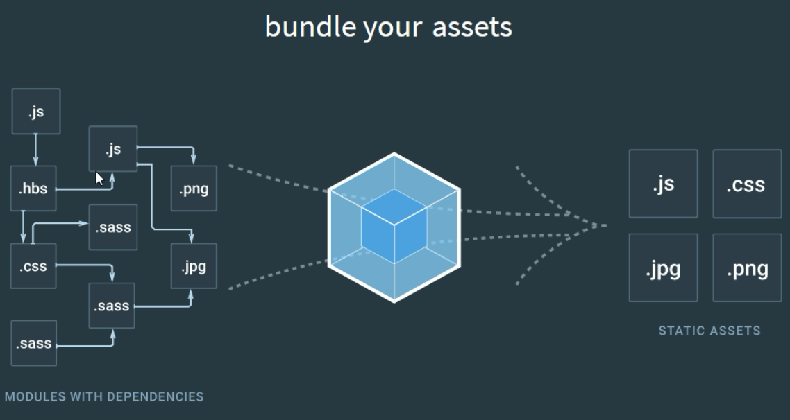


## 1.5、如何完美实现上述的2种解决方案

1. 使用Gulp， 是基于 task 任务的；
2. 使用Webpack， 是基于整个项目进行构建的；

- 借助于webpack这个前端自动化构建工具，可以完美实现资源的合并、打包、压缩、混淆等诸多功能。
- 根据官网的图片介绍webpack打包的过程
- [webpack官网](http://webpack.github.io/)

## 1.6、webpack安装的两种方式

1. 运行`npm i webpack -g`全局安装webpack，这样就能在全局使用webpack的命令
2. 在项目根目录中运行`npm i webpack --save-dev`安装到项目依赖中

## 1.7、初步使用webpack打包构建列表隔行变色案例

1. > 创建项目基本的目录结构
   >
   > 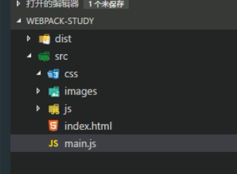
   >
   >
   >
   > 创建项目基本目录
   >
   > dist为项目输出目录
   >
   > main.js是项目的js入口文件
   >
   > index.html是项目首页。
2. > 运行`npm init`初始化项目，使用npm管理项目中的依赖包
   >
   > 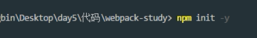
   >
   > 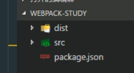
   >
   > 生成了package.json文件

3. > 使用`cnpm i jquery --save`安装jquery类库
   >
   > 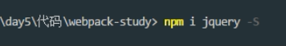
   >
   > 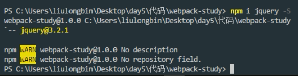

4. 创建`main.js`并书写各行变色的代码逻辑：

```
	// 导入jquery类库
    import $ from 'jquery'

    // 设置偶数行背景色，索引从0开始，0是偶数
    $('#list li:even').css('backgroundColor','lightblue');
    // 设置奇数行背景色
    $('#list li:odd').css('backgroundColor','pink');
```

1. 直接在页面上引用`main.js`会报错，因为浏览器不认识`import`这种高级的JS语法，需要使用webpack进行处理，webpack默认会把这种高级的语法转换为低级的浏览器能识别的语法；
2. 运行`webpack 入口文件路径 输出文件路径`对`main.js`进行处理：

```
webpack src/js/main.js dist/bundle.js
```

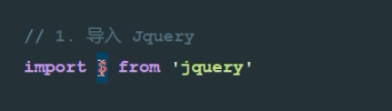

从modules中引入jQuery包	 

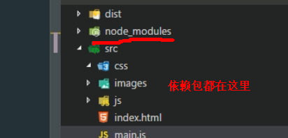

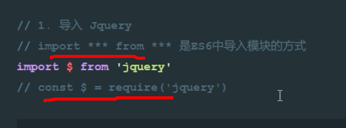

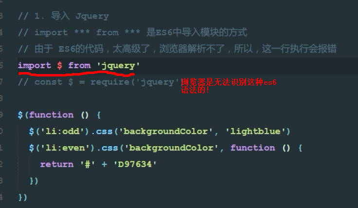

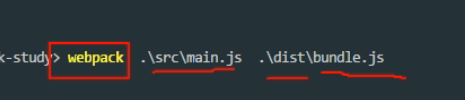

使用webpack命令对main.js进行编译处理，输出到bundle.js文件中。

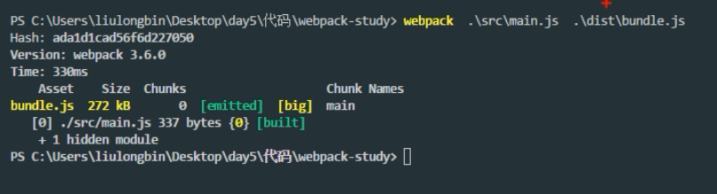	

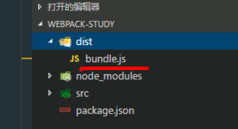

生成指定文件

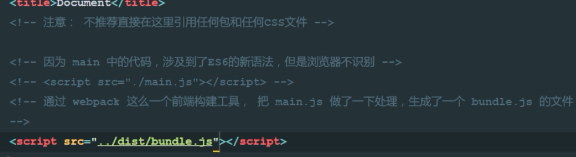

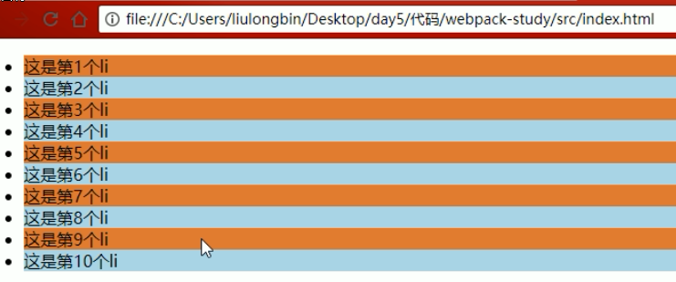

实现了效果

总结：


## 1.8、使用webpack的配置文件简化打包时候的命令

1. > 在项目根目录中创建`webpack.config.js`
   >
   > 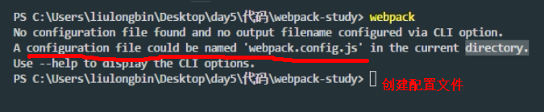
   >
   > 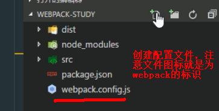
   >
   >
2. > 由于运行webpack命令的时候，webpack需要指定入口文件和输出文件的路径，所以，我们需要在`webpack.config.js`中配置这两个路径：
   >
   > 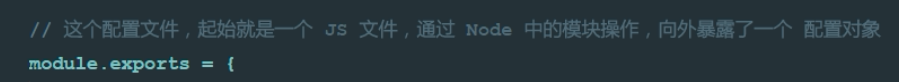
   >
   > 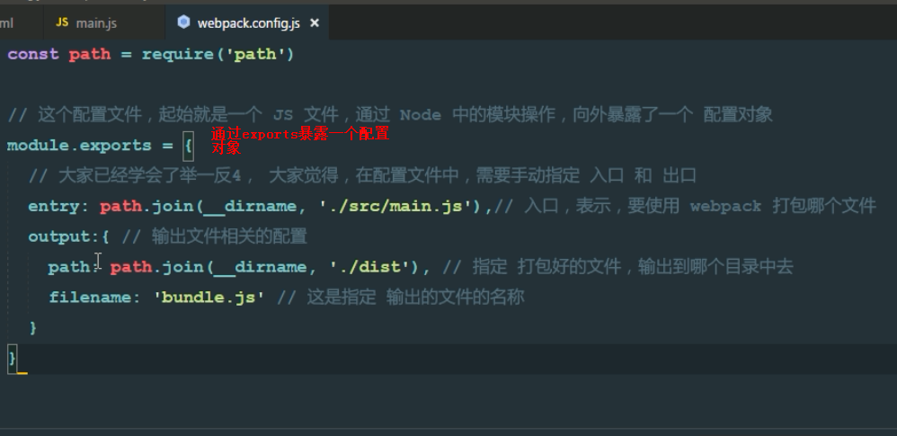
   >
   > 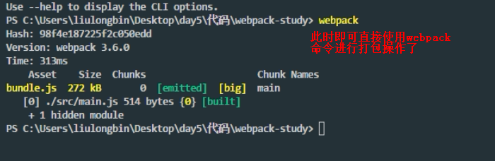
   >
   > 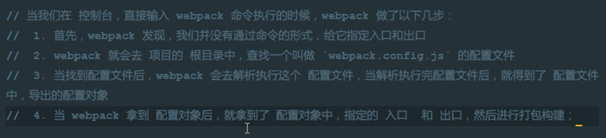
   >
   >

```
    // 导入处理路径的模块
    var path = require('path');

    // 导出一个配置对象，将来webpack在启动的时候，会默认来查找webpack.config.js，并读取这个文件中导出的配置对象，来进行打包处理
    module.exports = {
        entry: path.resolve(__dirname, 'src/js/main.js'), // 项目入口文件
        output: { // 配置输出选项
            path: path.resolve(__dirname, 'dist'), // 配置输出的路径
            filename: 'bundle.js' // 配置输出的文件名
        }
    }
```

## 1.9、实现webpack的实时打包构建

1. 由于每次重新修改代码之后，都需要手动运行webpack打包的命令，比较麻烦，所以使用`webpack-dev-server`来实现代码实时打包编译，当修改代码之后，会自动进行打包构建。
2. > ### 运行`cnpm i webpack-dev-server --save-dev`安装到开发依赖
   >
   > 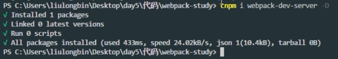
   >
   > 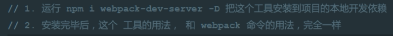
   >
   >
3. > 安装完成之后，在命令行直接运行`webpack-dev-server`来进行打包，发现报错，
   >
   > 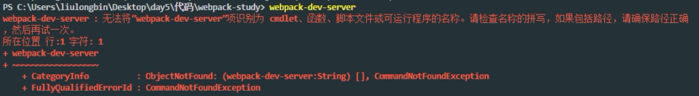
   >
   > 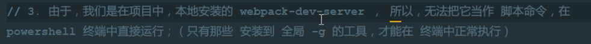
   >
   > 此时需要借助于`package.json`文件中的指令，来进行运行`webpack-dev-server`命令，在`scripts`节点下新增`"dev": "webpack-dev-server"`指令，
   >
   > 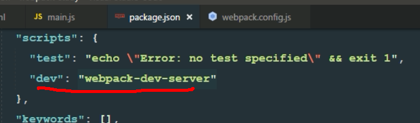
   >
   > 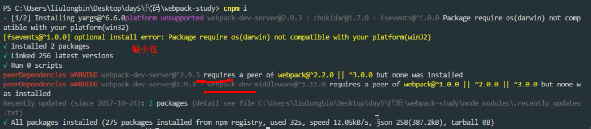
   >
   > 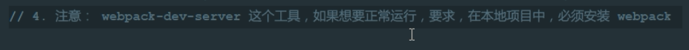
   >
   > 发现可以进行实时打包，但是dist目录下并没有生成`bundle.js`文件，这是因为`webpack-dev-server`将打包好的文件放在了内存中
   >
   > 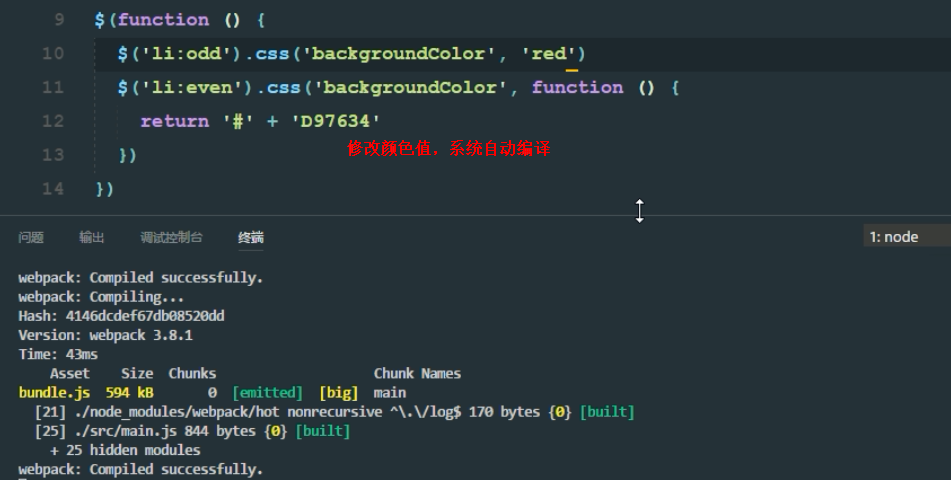
   >
   > 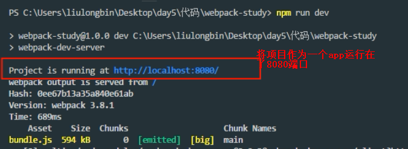
   >
   > 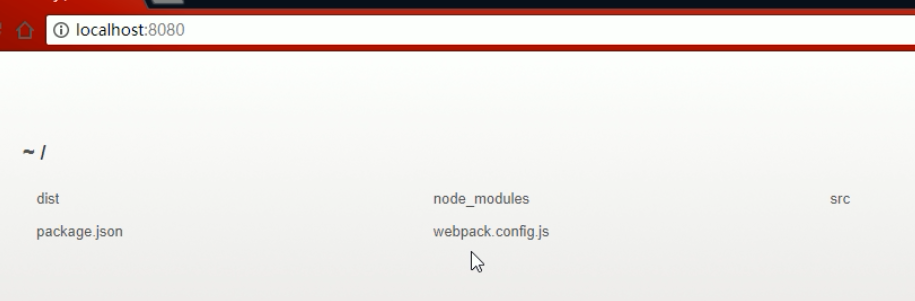
   >
   > 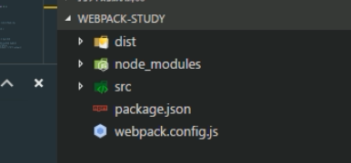
   >
   > 可见默认托管的目录，就是项目的根目录！
   >
   > 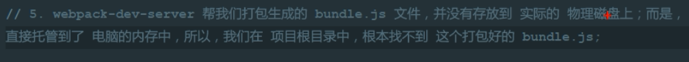
   >
   > 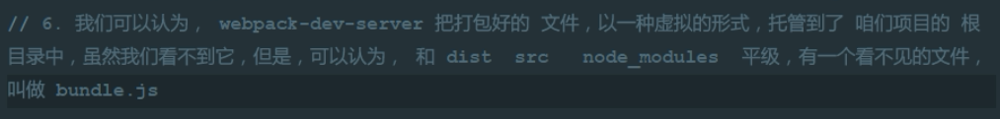


- 把`bundle.js`放在内存中的好处是：**由于需要实时打包编译，所以放在内存中速度会非常快**
- 这个时候访问webpack-dev-server启动的`http://localhost:8080/`网站，发现是一个文件夹的面板，需要点击到src目录下，才能打开我们的index首页，此时引用不到bundle.js文件，需要修改index.html中script的src属性为:`<script src="../bundle.js"></script>`
- 为了能在访问`http://localhost:8080/`的时候直接访问到index首页，可以使用`--contentBase src`指令来修改dev指令，指定启动的根目录：

```
 "dev": "webpack-dev-server --contentBase src"
```

 同时修改index页面中script的src属性为`<script src="bundle.js"></script>`

### 1.9.1、webpack命令的相关参数

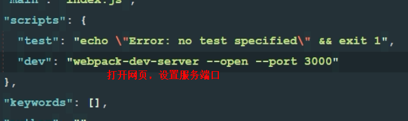

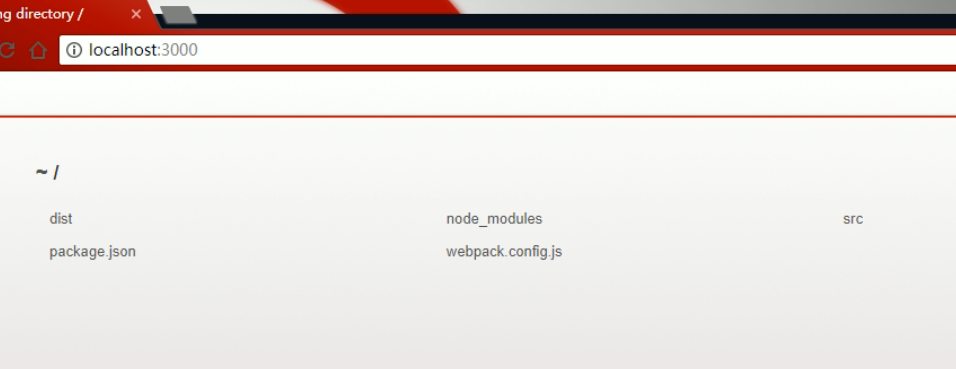

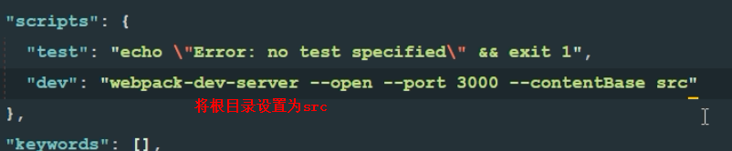


​	

## 1.10、使用`html-webpack-plugin`插件配置启动页面

由于使用`--contentBase`指令的过程比较繁琐，需要指定启动的目录，同时还需要修改index.html中script标签的src属性，所以推荐大家使用`html-webpack-plugin`插件配置启动页面.

1. 运行`cnpm i html-webpack-plugin --save-dev`安装到开发依赖
2. 修改`webpack.config.js`配置文件如下：

```
    // 导入处理路径的模块
    var path = require('path');
    // 导入自动生成HTMl文件的插件
    var htmlWebpackPlugin = require('html-webpack-plugin');

    module.exports = {
        entry: path.resolve(__dirname, 'src/js/main.js'), // 项目入口文件
        output: { // 配置输出选项
            path: path.resolve(__dirname, 'dist'), // 配置输出的路径
            filename: 'bundle.js' // 配置输出的文件名
        },
        plugins:[ // 添加plugins节点配置插件
            new htmlWebpackPlugin({
                template:path.resolve(__dirname, 'src/index.html'),//模板路径
                filename:'index.html'//自动生成的HTML文件的名称
            })
        ]
    }
```

1. 修改`package.json`中`script`节点中的dev指令如下：

```
"dev": "webpack-dev-server"
```

1. 将index.html中script标签注释掉，因为`html-webpack-plugin`插件会自动把bundle.js注入到index.html页面中！

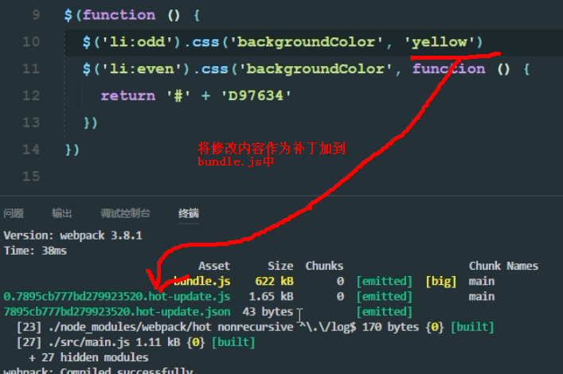


## 1.11、实现自动打开浏览器、热更新和配置浏览器的默认端口号

**注意：热更新在JS中表现的不明显，可以从一会儿要讲到的CSS身上进行介绍说明！**

### 1.11.1、方式1（推荐）：

- 修改`package.json`的script节点如下，其中`--open`表示自动打开浏览器，`--port 4321`表示打开的端口号为4321，`--hot`表示启用浏览器热更新：

```
"dev": "webpack-dev-server --hot --port 4321 --open"
```

### 1.11.2、方式2：

1. 修改`webpack.config.js`文件，新增`devServer`节点如下：

```
devServer:{
        hot:true,
        open:true,
        port:4321
    }
```

1. 在头部引入`webpack`模块：

```
var webpack = require('webpack');
```

1. 在`plugins`节点下新增：

```
new webpack.HotModuleReplacementPlugin()
```

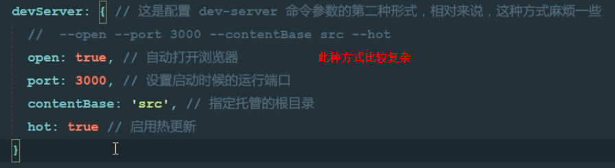

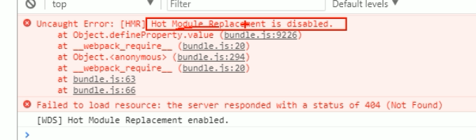

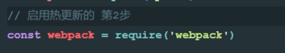


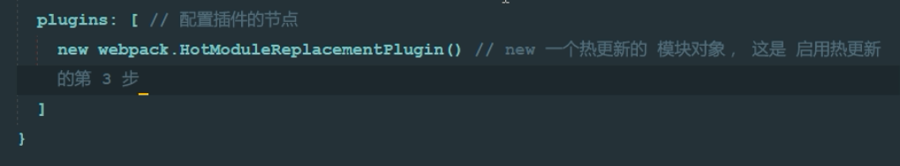


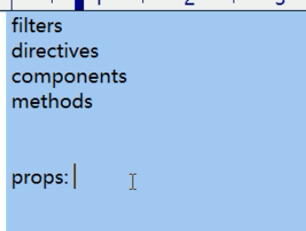

vue中只有props是数组


### 1.11.3、内存加载页面


 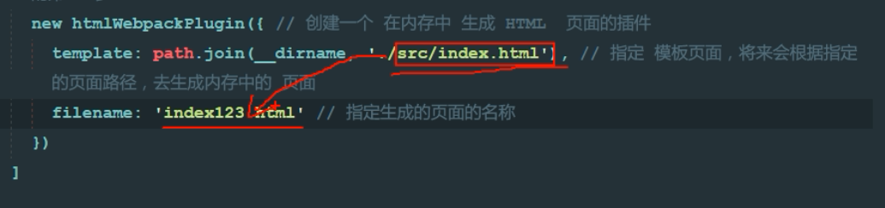

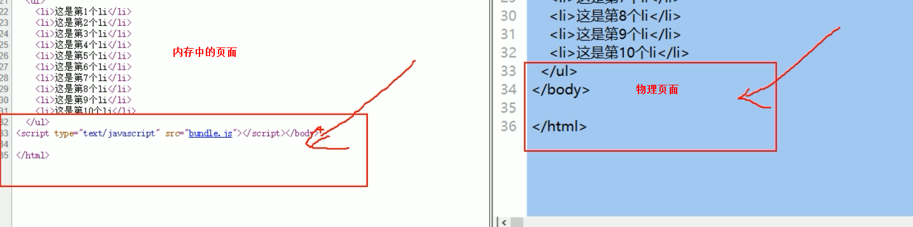


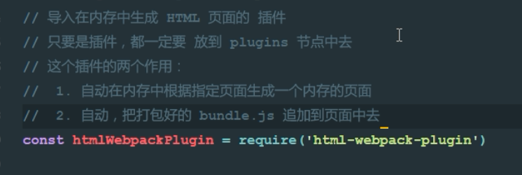


## 1.12、使用webpack打包css文件

1. 运行`cnpm i style-loader css-loader --save-dev`
2. 修改`webpack.config.js`这个配置文件：

```
module: { // 用来配置第三方loader模块的
        rules: [ // 文件的匹配规则
            { test: /\.css$/, use: ['style-loader', 'css-loader'] }//处理css文件的规则
        ]
    }
```

1. 注意：`use`表示使用哪些模块来处理`test`所匹配到的文件；`use`中相关loader模块的调用顺序是从后向前调用的；

1. 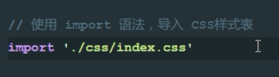

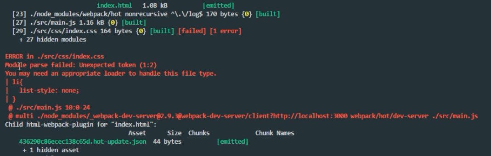

处理不了css这样的文件

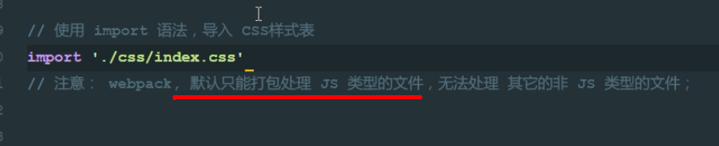


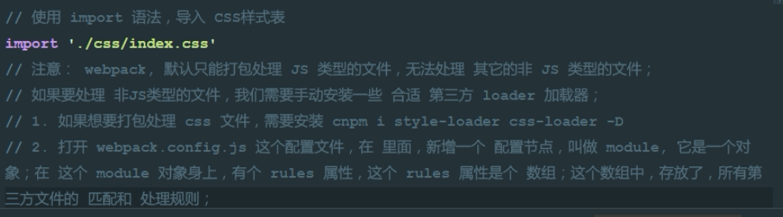


## 1.13、使用webpack打包less文件

1. 运行`cnpm i less-loader less -D`


2. 修改`webpack.config.js`这个配置文件：


```
{ test: /\.less$/, use: ['style-loader', 'css-loader', 'less-loader'] },
```

## 1.14、使用webpack打包sass文件

1. 运行`cnpm i sass-loader node-sass --save-dev`
2. 在`webpack.config.js`中添加处理sass文件的loader模块：

```
{ test: /\.scss$/, use: ['style-loader', 'css-loader', 'sass-loader'] }
```


## 1.15、使用webpack处理css中的路径

1. 运行`cnpm i url-loader file-loader --save-dev`
2. 在`webpack.config.js`中添加处理url路径的loader模块：

```
{ test: /\.(png|jpg|gif)$/, use: 'url-loader' }
```

1. 可以通过`limit`指定进行base64编码的图片大小；只有小于指定字节（byte）的图片才会进行base64编码：

```
{ test: /\.(png|jpg|gif)$/, use: 'url-loader?limit=43960' },
```


## 1.16、使用babel处理高级JS语法

1. 运行`cnpm i babel-core babel-loader babel-plugin-transform-runtime --save-dev`安装babel的相关loader包
2. 运行`cnpm i babel-preset-es2015 babel-preset-stage-0 --save-dev`安装babel转换的语法
3. 在`webpack.config.js`中添加相关loader模块，其中需要注意的是，一定要把`node_modules`文件夹添加到排除项：

```
{ test: /\.js$/, use: 'babel-loader', exclude: /node_modules/ }
```

1. 在项目根目录中添加`.babelrc`文件，并修改这个配置文件如下：

```
{
    "presets":["es2015", "stage-0"],
    "plugins":["transform-runtime"]
}
```

1. **注意：语法插件`babel-preset-es2015`可以更新为`babel-preset-env`，它包含了所有的ES相关的语法；**

## 相关文章

[babel-preset-env：你需要的唯一Babel插件](https://segmentfault.com/p/1210000008466178)
[Runtime transform 运行时编译es6](https://segmentfault.com/a/1190000009065987)


