## 1、复习：

## 1.1、无法安装依赖

有时候使用`npm i node-sass -D`装不上，这时候，就必须使用 `cnpm i node-sass -D`

## 1.2、npm init -y包管理文件

> 注意：如果创建的项目的根目录名称包含中文，此时不可使用-y命令
>
> npm init回车后，需要输入项目名称（当根目录包含中文的时候需要使用此命令，不可加-y参数）

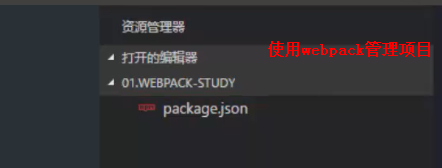

## 1.3、创建其他目录及文件

> src：源码
>
> dist：打包后生成的文件
>
> index.html：项目首页
>
> main.js：项目的js入口文件


## 1.4、打包webpack  src  des


**注意：如果不创建dist目录，webpack命令也会自动创建此目录**


## 1.5、打包测试


**后台输出了  ok**

## 1.6、自动打包webpack-dev-server

帮助系统实时打包

### 1.6.1、安装依赖包

> npm i webpack-dev-server -D


### 1.6.2、创建webpack.config.js配置文件

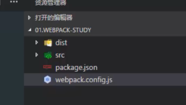

### 1.6.3、安装webpack（当前目录安装）


**提示依赖webpack**


## 1.7、配置webpack

**由于webpack是基于Node进行构建的，所以，webpack的配置文件中，任何合法的Node代码都是支持的**


**注意：此时并不没有实现自动构建**


## 1.8、开启实时构建package.json

> 查看webpack安装情况


> 配置实时更新、热更新、自动打开网页


> webpack托管的目录为  /  根目录下没有对应的bundle.js
>
> 

## 1.9、html-webpack-plugin

**将网页加载到内存，并自动引用打包后的js文件**

### 1.9.1、安装插件

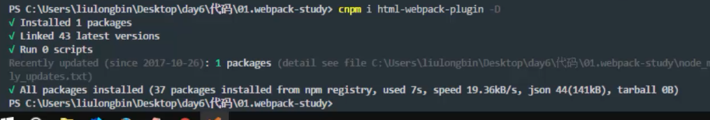

### 1.9.2、引入插件(webpack.config.js)

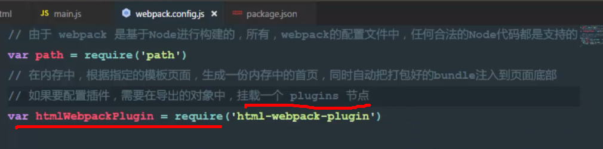


## 1.10、测试

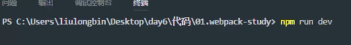


## 1.11、引入css

### 1.11.1、创建css相关目录


### 1.11.2、创建index.css文件


### 1.11.3、引用css

**在index.html中直接引用css，将导致多发送一次http请求**

**将css文件通过webpack进行打包，在main.js文件中引入css文件**


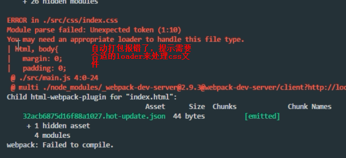

## 1.12、引入第三方loader（style-loader、css-loader）


## 1.13、配置第三方loader


## 1.14、支持less


## 1.15、支持sass


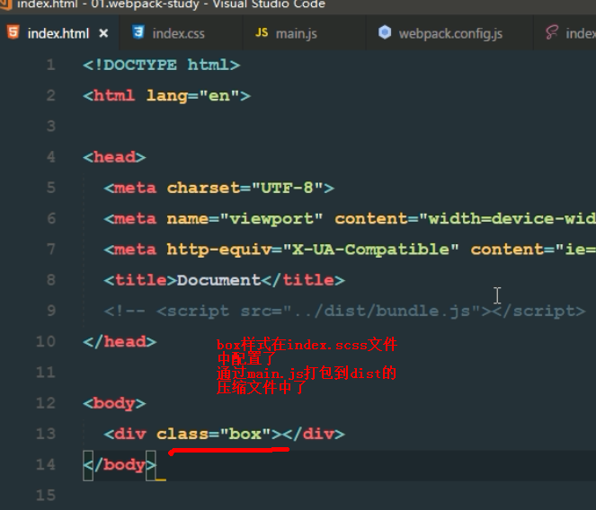


## 

# 2、webpack中url-loader的使用

## 2.1、创建图片目录


## 2.2、配置sass


## 2.3、测试


## 2.4、分析，引入第三方插件


> url-loader依赖file-loader，无需单独配置file-loader

## 2.5、测试


**减少图片的二次请求**

## 2.6、url-loader优化

**只对小图片进行base64处理，大图片不建议进行base64处理**

### 2.6.1、limit参数


### 2.6.2、name、ext参数


>name：name=[name]表示图片原名
>
>ext：name=[name].[ext]表示图片原名、扩展名保持不变


## 2.7、重名文件的问题


**不对文件重新命名**


## 2.8、引用字体图标

### 2.8.1、引入bootstrap样式库


### 2.8.2、引用红心图标


### 2.8.3、原始方法引入bootstrap


### 2.8.4、在main.js中引入bootstrap


### 2.8.5、配置字体处理loader


### 2.8.6、测试


# 3、总结webpack

## 3.1、json中不可以写注释

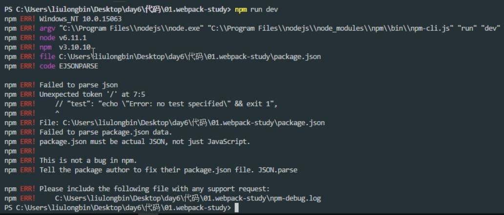

## 3.2、本地运行找不到包

> 全局安装了webpack是不够的，还需要在本地安装


**解决方法：npm i 重新安装相关包**


# 4、babel高级语法转换

## 4.1、class关键字


**之前定义对象的方式：**


### 4.1.1、静态属性


> 传统方式定义的静态属性


### 4.1.2、静态属性和实例属性挂载的地方完全不一样


### 4.1.3、无法解析class语法


**运行报错，无法处理es6高级语法**


## 4.2、安装以及配置babel

### 4.2.1、原理


### 4.2.2、安装包


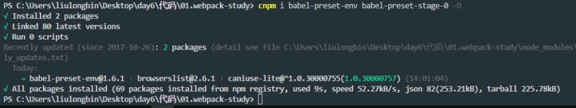

### 4.2.3、配置babel来转换高级的ES语法


## 4.3、.babelrc高级语法解析配置文件


## 4.4、说明


**第一套为转换器**

**第二套为语法对应关系**


# 5、render

## 5.1、在普通页面中渲染组件


> 将login组件放到div下面，不会删掉div	

## 5.2、render


## 5.3、优缺点


**传统component组件方式：类似于传值表达式，可以放很多的组件**


**render：方式是直接替换，一个vm中只能有一个render组件**


# 6、webpack项目中使用vue

## 6.1、复习，普通网页如何使用vue


## 6.2、webpack使用vue

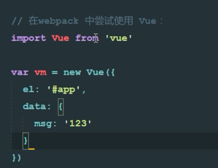


**无法正常运行**


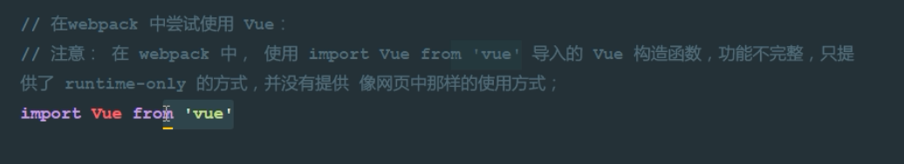

## 6.3、分析


**只是导入了：dist/vue.runtime.common.js**


## 6.4、解决方案

### 6.4.1、方案一


### 6.4.2、方案二


也可以正常运行了


# 7、在runtime-only的时候如何渲染组件

## 7.1、vue纯粹的组件，由三部分组成


## 7.2、将login.vue渲染到index.html


### 7.2.1、导入login组件


> webpack解析不了使用vue定义的模板
>
> 需要引入第三方包，将vue解析为js，然后交由webpack进行打包

### 7.2.2、安装第三方插件


### 7.2.3、配置第三方插件


### 7.2.4、使用render渲染vue组件

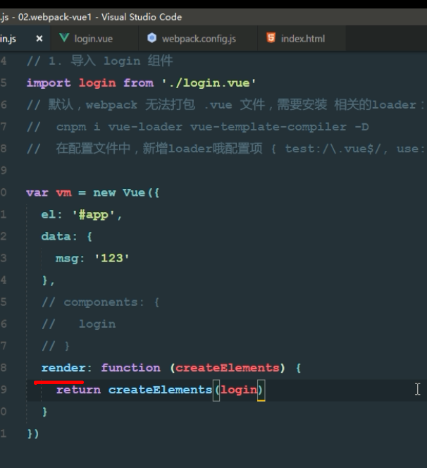


## 7.2、在webpack中配置.vue组件页面的总结


1. 运行`cnpm i vue -S`将vue安装为运行依赖；

2. 运行`cnpm i vue-loader vue-template-compiler -D`将解析转换vue的包安装为开发依赖；

3. 运行`cnpm i style-loader css-loader -D`将解析转换CSS的包安装为开发依赖，因为.vue文件中会写CSS样式；

4. 在`webpack.config.js`中，添加如下`module`规则：

```
module: {
    rules: [
      { test: /\.css$/, use: ['style-loader', 'css-loader'] },
      { test: /\.vue$/, use: 'vue-loader' }
    ]
  }
```

5. 创建`App.js`组件页面：

```
    <template>
      <!-- 注意：在 .vue 的组件中，template 中必须有且只有唯一的根元素进行包裹，一般都用 div 当作唯一的根元素 -->
      <div>
        <h1>这是APP组件 - {{msg}}</h1>
        <h3>我是h3</h3>
      </div>
    </template>
    <script>
    // 注意：在 .vue 的组件中，通过 script 标签来定义组件的行为，需要使用 ES6 中提供的 export default 方式，导出一个vue实例对象
    export default {
      data() {
        return {
          msg: 'OK'
        }
      }
    }
    </script>
    <style scoped>
    h1 {
      color: red;
    }
    </style>
```

6. 创建`main.js`入口文件：

```
    // 导入 Vue 组件
    import Vue from 'vue'
    // 导入 App组件
    import App from './components/App.vue'
    // 创建一个 Vue 实例，使用 render 函数，渲染指定的组件
    var vm = new Vue({
      el: '#app',
      render: c => c(App)
    });
```

## 7.3、在使用webpack构建的Vue项目中使用模板对象？

1. 在`webpack.config.js`中添加`resolve`属性：
```
resolve: {
    alias: {
      'vue$': 'vue/dist/vue.esm.js'
    }
  }
```


# 8、export default和export

> ES6中语法使用总结

1. 使用 `export default` 和 `export` 导出模块中的成员; 对应ES5中的 `module.exports` 和 `export`

2. 使用 `import ** from **` 和 `import '路径'` 还有 `import {a, b} from '模块标识'` 导入其他模块

3. 使用箭头函数：`(a, b)=> { return a-b; }`


## 8.1、vue组件中的data必须是function，且返回对象


## 8.2、export  default 和export的使用方式


> 注意：要么使用es6的导入、导出，要么使用node的导入、导出，配套使用，不可混用 

## 8.3、使用es6向外暴露一个对象


## 8.4、在main.js使用import导入上面的对象


## 8.5、注意


## 8.6、export var  


## 8.7、注意export var按需导出


> 1、按需导出
>
> 2、接收名称不可变
>
> 3、若想重命名，则可以使用as起别名


# 9、在vue组件页面中，集成vue-router路由模块

[vue-router官网](https://router.vuejs.org/)

1. 安装依赖

   ```
   npm i vue-router
   ```

2. 导入路由模块：

```

import VueRouter from 'vue-router'

```

2. 安装路由模块：

```

Vue.use(VueRouter);

```

3. 导入需要展示的组件:

```

import login from './components/account/login.vue'

import register from './components/account/register.vue'

```

4. 创建路由对象:

```

var router = new VueRouter({

  routes: [

    { path: '/', redirect: '/login' },

    { path: '/login', component: login },

    { path: '/register', component: register }

  ]

});

```

5. 将路由对象，挂载到 Vue 实例上:

```

var vm = new Vue({

  el: '#app',

  // render: c => { return c(App) }

  render(c) {

    return c(App);

  },

  router // 将路由对象，挂载到 Vue 实例上

});

```

6. 改造App.vue组件，在 template 中，添加`router-link`和`router-view`：

```

    <router-link to="/login">登录</router-link>

    <router-link to="/register">注册</router-link>


    <router-view></router-view>

```

## 9.1、初始化项目


 

## 9.2、安装vue-router


## 9.3、创建两个组件


## 9.4、导入组件、创建路由对象


## 9.5、将路由对象挂载到vm上

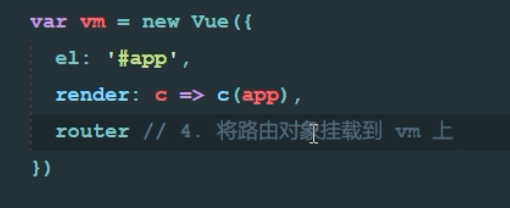

## 9.6、将路由挂载到index.html


> 由于render会替换被挂载组件上面的所有标签


# 10、子路由

## 10.1、创建子组件


## 10.2、推荐vscode插件


## 10.3、创建子组件内容


## 10.4、注册子组件


# 11、组件中的css作用域问题


	

## 11.1、全局样式


## 11.2、局部样式


##  11.3、scss或less


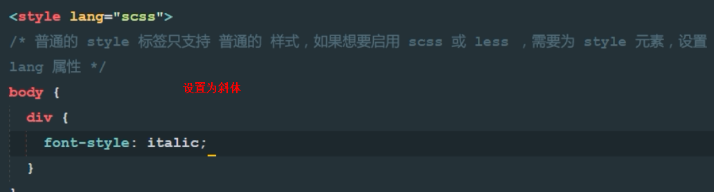

> 设置斜体


## 11.4、建议


# 12、抽离路由为单独的模块

## 12.1、创建router.js


## 12.2、将路由信息配置在router.js

> 注意router.js与引入组件的目录层级关系


## 12.3、把路由对象暴露出去


## 12.4、导入路由配置信息


## 使用 饿了么的 MintUI 组件

[Github 仓储地址](https://github.com/ElemeFE/mint-ui)

[Mint-UI官方文档](http://mint-ui.github.io/#!/zh-cn)

1. 导入所有MintUI组件：

```

import MintUI from 'mint-ui'

```

2. 导入样式表：

```

import 'mint-ui/lib/style.css'

```

3. 在 vue 中使用 MintUI：

```

Vue.use(MintUI)

```

4. 使用的例子：

```

<mt-button type="primary" size="large">primary</mt-button>

```


## 使用 MUI 组件

[官网首页](http://dev.dcloud.net.cn/mui/)

[文档地址](http://dev.dcloud.net.cn/mui/ui/)

1. 导入 MUI 的样式表：

```

import '../lib/mui/css/mui.min.css'

```

2. 在`webpack.config.js`中添加新的loader规则：

```

{ test: /\.(png|jpg|gif|ttf)$/, use: 'url-loader' }

```

3. 根据官方提供的文档和example，尝试使用相关的组件


## 将项目源码托管到oschina中

1. 点击头像 -> 修改资料 -> SSH公钥 [如何生成SSH公钥](http://git.mydoc.io/?t=154712)

2. 创建自己的空仓储，使用 `git config --global user.name "用户名"` 和 `git config --global user.email ***@**.com` 来全局配置提交时用户的名称和邮箱

3. 使用 `git init` 在本地初始化项目

4. 使用 `touch README.md` 和 `touch .gitignore` 来创建项目的说明文件和忽略文件；

5. 使用 `git add .` 将所有文件托管到 git 中

6. 使用 `git commit -m "init project"` 将项目进行本地提交

7. 使用 `git remote add origin 仓储地址`将本地项目和远程仓储连接，并使用origin最为远程仓储的别名

8. 使用 `git push -u origin master` 将本地代码push到仓储中


## App.vue 组件的基本设置

1. 头部的固定导航栏使用 `Mint-UI` 的 `Header` 组件；

2. 底部的页签使用 `mui` 的 `tabbar`;

3. 购物车的图标，使用 `icons-extra` 中的 `mui-icon-extra mui-icon-extra-cart`，同时，应该把其依赖的字体图标文件 `mui-icons-extra.ttf`，复制到 `fonts` 目录下！

4. 将底部的页签，改造成 `router-link` 来实现单页面的切换；

5. Tab Bar 路由激活时候设置高亮的两种方式：

 + 全局设置样式如下：

 ```

 	.router-link-active{

      	color:#007aff !important;

    }

 ```

 + 或者在 `new VueRouter` 的时候，通过 `linkActiveClass` 来指定高亮的类：

 ```

 	// 创建路由对象

    var router = new VueRouter({

      routes: [

        { path: '/', redirect: '/home' }

      ],

      linkActiveClass: 'mui-active'

    });

 ```


## 实现 tabbar 页签不同组件页面的切换

1. 将 tabbar 改造成 `router-link` 形式，并指定每个连接的 `to` 属性；

2. 在入口文件中导入需要展示的组件，并创建路由对象：

```

    // 导入需要展示的组件

    import Home from './components/home/home.vue'

    import Member from './components/member/member.vue'

    import Shopcar from './components/shopcar/shopcar.vue'

    import Search from './components/search/search.vue'


    // 创建路由对象

    var router = new VueRouter({

      routes: [

        { path: '/', redirect: '/home' },

        { path: '/home', component: Home },

        { path: '/member', component: Member },

        { path: '/shopcar', component: Shopcar },

        { path: '/search', component: Search }

      ],

      linkActiveClass: 'mui-active'

    });

```


## 使用 mt-swipe 轮播图组件

1. 假数据：

```

lunbo: [

        'http://www.itcast.cn/images/slidead/BEIJING/2017440109442800.jpg',

        'http://www.itcast.cn/images/slidead/BEIJING/2017511009514700.jpg',

        'http://www.itcast.cn/images/slidead/BEIJING/2017421414422600.jpg'

      ]

```

2. 引入轮播图组件：

```

<!-- Mint-UI 轮播图组件 -->

    <div class="home-swipe">

      <mt-swipe :auto="4000">

        <mt-swipe-item v-for="(item, i) in lunbo" :key="i">

          

        </mt-swipe-item>

      </mt-swipe>

    </div>

  </div>

```


## 在`.vue`组件中使用`vue-resource`获取数据

1. 运行`cnpm i vue-resource -S`安装模块

2. 导入 vue-resource 组件

```

import VueResource from 'vue-resource'

```

3. 在vue中使用 vue-resource 组件

```

Vue.use(VueResource);

```